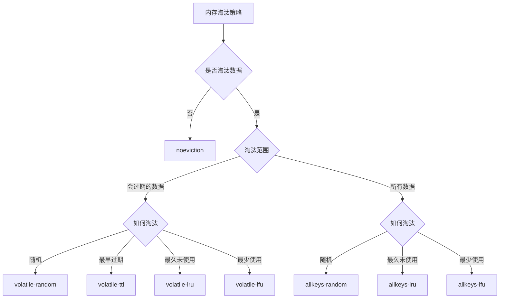

## 前言

本文将从 **内存持久化**、**内存清理**、**缓存崩溃**、**缓存一致性** 四个角度讨论 Redis 的内存管理。

本文参考 [小林coding - 图解Redis介绍](https://www.xiaolincoding.com/redis/)，此外探讨了 [LFU 的冷启动问题](#lfu-的冷启动问题与解决方案) 以及 [消息队列重试机制的潜在问题](#消息队列重试机制)。

## 内存持久化

redis 的数据都存储在 **内存** 中，从而实现高速读写。但为保障可靠性，我们需要将它持久化到 **磁盘** 中。

redis 的内存持久化有三种方式：
- **AOF 日志**：存储**命令**
- **RDB 日志**：存储**内存状态**
- 两者混合，RDB 日志负责存量、AOF 日志负责增量

其中，AOF 日志的写回和 RDB 快照的存储都用到了**写时复制**：子进程和父进程共用页表。只有当父进程进行了写入时，被写入的页表才在子进程的虚拟地址空间中复制一份。

## 内存清理

要减少 Redis 对内存的占用，主要有两点：
- **过期删除策略**：key 超过存活时长**被动**删除
- **内存淘汰策略**：占用超过最大内存时**主动**删除

### 过期删除策略

#### 三种过期删除策略

|              | 做法                    | 优点                      | 缺点                         |
| :----------- | :---------------------- | :------------------------ | :--------------------------- |
| **定时删除** | 创建定时事件来删除key   | 及时删除                  | 占用CPU                      |
| **惰性删除** | 只在访问时删除          | CPU时间友好               | 内存不友好                   |
| **定期删除** | 随机取出一定数量key检查 | 既不占用CPU，又不占用内存 | 效果折中，但难以确定检查频率 |

#### Redis 过期策略

**惰性删除** + **定期删除**
- 抽查频率：默认10hz，可修改
- 抽查数量：固定20个key

### 内存淘汰策略

#### Redis 使用的内存淘汰策略

noeviction 不会淘汰数据，而是禁止写入。

#### LRU 和 LFU 算法

从 LRU 到近似 LRU 再到近似 LFU，参考 [文档](https://redis.ac.cn/docs/latest/develop/reference/eviction/?utm_source=openai)

|              | 策略           | 实现                                                              | 缺点                                       |
| :----------- | :------------- | :---------------------------------------------------------------- | :----------------------------------------- |
| **LRU**      | 最久未使用     | 惰性链表                                                          | 链表空间开销 更新时链表修改耗时         |
| **近似 LRU** | 近似最久未使用 | 添加字段记录最后一次访问时间 每次随机取5个值，淘汰最久未使用的 | 缓存污染 （只读取一次的数据也存在很久） |
| **近似 LFU** | 最少使用       | 添加字段记录访问频次 访问频次随时间衰减 同样随机选取        | 新key冷启动问题（已解决）                  |

#### LFU 的冷启动问题与解决方案

**问题场景**：

当 Redis 内存接近上限时，如果有若干个 key 需要被重复读取，但这些 key 刚读进来时访问次数还很少，就会立即触发内存淘汰。由于访问次数少，这些 key 被 LFU 算法删除，接着又需要重新加载，导致缓存完全失效。

**Redis LFU 的优化机制**：

Redis 的 LFU 实现已经考虑到了这个问题，采用了智能的计数策略：

1. **计数器衰减机制**
   - 访问频次不是永久累加的，而是会**随时间衰减**
   - 通过 `lfu-decay-time` 参数控制衰减速度（默认 1 分钟）
   - 作用：让长期不访问的"热key"逐渐降低优先级，给新key腾出空间

2. **对数增长算法**
   - 访问次数不是简单的 +1，而是使用**概率对数增长**
   - 通过 `lfu-log-factor` 参数控制增长速度（默认 10）
   - 作用：访问次数越高，增长越慢；新key更容易快速积累计数

3. **新key初始计数**
   - 新加入的 key 会有一个初始计数值（通常是 5）
   - 作用：防止新key一进来就被淘汰

## 缓存崩溃

缓存崩溃主要有三种：

|              | 现象             | 影响范围     | 核心解决思路 |
| :----------- | :--------------- | :----------- | :----------- |
| **缓存雪崩** | 大量key同时过期  | 影响面广     | 分散过期时间 |
| **缓存击穿** | 单个热点key过期  | 影响单点     | 加锁重建     |
| **缓存穿透** | 查询不存在的数据 | 可能影响全局 | 过滤无效请求 |

### 缓存雪崩

**问题描述**：大量缓存在同一时间过期，导致所有请求直接落到数据库上，造成数据库压力骤增。

**产生原因**：
- 大量key设置了相同的过期时间
- Redis服务器宕机或重启

**解决方案**：
1. **过期时间随机化**：为key设置过期时间时加上随机值，避免同时过期
2. **设置缓存不过期**：通过后台服务来更新缓存数据，从而避免因为缓存失效造成的缓存雪崩，也可以在一定程度上避免缓存并发问题
3. **熔断降级**：当数据库负载过高时，暂时返回默认值或错误页面
4. **预热机制**：在系统启动或流量高峰前提前加载热点数据

### 缓存击穿

**问题描述**：某个热点key突然过期，而此时有大量并发请求访问这个key，导致瞬间大量请求直接打到数据库。

**产生原因**：
- 热点key过期时间到了
- 高并发访问同一个不存在的key

**解决方案**：
1. **互斥锁**：使用分布式锁，只允许一个线程去重建缓存
2. **热点数据永不过期**：对于极热点的数据，设置永不过期，通过后台异步更新

### 缓存穿透

**问题描述**：查询一个根本不存在的数据，缓存和数据库都没有，每次查询都会直接打到数据库。

**产生原因**：
- 恶意攻击，故意查询不存在的数据
- 业务逻辑设计缺陷，产生大量无效查询

**解决方案**：
1. **空值缓存**：将查询结果为空的情况也缓存起来，设置较短过期时间
2. **布隆过滤器**：在缓存前加一层布隆过滤器，快速判断数据是否可能存在
4. **限流降级**：对异常请求进行限流处理

## 缓存一致性

访问缓存的两种情况：
- 请求数据：先查询缓存，如果不存在再查询数据库
- 更新数据：更新数据库和缓存

为了保障缓存一致性，我们希望同时更新数据库和缓存，但这是不可能做到的。那么该按什么顺序进行更新呢？

> 缓存不一致一般由于 **并发问题** 导致。在接下来的实现方式中，你会发现大多数实现方式因为没有加锁而出现并发问题。不过，如果利用好 **缓存写入耗时远小于数据库写入耗时** 这个特性，也能在无锁的情况下保障一致性。
{: .prompt-tip }

### 缓存实现方式

以下针对每种策略给出极端情况，来看看是否会导致不一致性。

#### 先写数据库，再写缓存

线程 A 和 B 都更新数据

| 行为                                              | 数据库中的值                                        | 缓存中的值                                          |
| :------------------------------------------------ | :-------------------------------------------------- | :-------------------------------------------------- |
| 初始情况                                          | O                                                   | O                                                   |
| 线程 A 更新数据库  | O $$\rightarrow$$ A  | O                                                   |
| 线程 B 更新数据库 | A $$\rightarrow$$ B | O                                                   |
| 线程 B 更新缓存   | B                   | O $$\rightarrow$$ B |
| 线程 A 更新缓存    | B                   | B $$\rightarrow$$ A  |
| 最终情况                                          | B                   | A                    |

> 要解决这个问题有两种方式：
> - 修改前获取 **分布式锁**（影响性能）
> - 设置 **过期时间**，保障最终一致性
{: .prompt-info }

#### 先写缓存，再写数据库

线程 A 和 B 都更新数据

| 行为                                              | 数据库中的值                                        | 缓存中的值                                          |
| :------------------------------------------------ | :-------------------------------------------------- | :-------------------------------------------------- |
| 初始情况                                          | O                                                   | O                                                   |
| 线程 A 更新缓存    | O                                                   | O $$\rightarrow$$ A  |
| 线程 B 更新缓存   | O                                                   | A $$\rightarrow$$ B |
| 线程 B 更新数据库 | O $$\rightarrow$$ B | B                   |
| 线程 A 更新数据库  | B $$\rightarrow$$ A  | B                   |
| 最终情况                                          | A                    | B                   |

#### 先删缓存，再写数据库

线程 A 更新数据，线程 B 读取数据

| 行为                                                    | 数据库中的值                                       | 缓存中的值                                            |
| :------------------------------------------------------ | :------------------------------------------------- | :---------------------------------------------------- |
| 初始情况                                                | O                                                  | O                                                     |
| 线程 A 删除缓存          | O                                                  | O $$\rightarrow$$ nil  |
| 线程 B 读取数据库得到 O | O                                                  | nil                    |
| 线程 B 写回缓存         | O                                                  | nil $$\rightarrow$$ O |
| 线程 A 更新数据库        | O $$\rightarrow$$ A | O                     |
| 最终情况                                                | A                   | O                     |

> 可以通过 **延迟双删** 的方式解决：在写数据库后，睡眠一定时间再次删除缓存（时间需自行调整）
{: .prompt-info }

#### 先写数据库，再删缓存

线程 A 读取数据，线程 B 更新数据

| 行为                                                   | 数据库中的值                                        | 缓存中的值                                            |
| :----------------------------------------------------- | :-------------------------------------------------- | :---------------------------------------------------- |
| 初始情况                                               | O                                                   | O                                                     |
| 线程 A 读取数据库得到 O | O                                                   | O                                                     |
| 线程 B 更新数据库      | O $$\rightarrow$$ B | O                                                     |
| 线程 B 删除缓存        | B                   | O $$\rightarrow$$ nil |
| 线程 A 写回缓存         | B                   | nil $$\rightarrow$$ O  |
| 最终情况                                               | B                   | O                      |

这种情况极少出现，因为缓存写入远快于数据库写入。

> **先写数据库，再写缓存** 与 **先写数据库，再删缓存** 之间的差别： 
> &emsp;&emsp;在更新数据时，删除缓存可以看作写入相同的值，因此不会出现并发问题； 
> &emsp;&emsp;不过，在读取数据时，依然要把数据加载回缓存中，所以依然会出现缓存不一致的场景。只是这个场景因为缓存快速写入的特性极少出现。
{: .prompt-tip }

#### 总结

**先写数据库，再删缓存** 已经基本保障了缓存一致性。但如果 **缓存删除失败** 缓存还是会失去一致性，我们将在下一小节看到如何解决。

此外，如果对 **缓存命中率** 有很高的要求，可以采用 **先写数据库，再写缓存** 的方式。

### 缓存写入/删除失败

缓存失败有很多原因，从客户端到 Redis，都有可能出现问题：
- 客户端配置问题
- 数据格式问题
- 网络连接问题
- Redis 服务问题
- 权限问题

要避免缓存失败导致的一致性问题，有两种方式：
1. 消息队列重试机制
2. 订阅 MySQL binlog

#### 消息队列重试机制

将要更改（写入/删除）的数据放入 **消息队列**，由消费者来进行更改，不断重试直到缓存更改成功。

缺点：代码侵入性较强。

**潜在问题**：
消息队列的异步特性会导致缓存删除延迟，在延迟期间可能出现数据不一致。在多个服务间，这种延迟可以被允许（甚至进一步减少了并发问题的出现概率）；但是我们需要保证 **单个服务的时序性**。

**解决方案**：

1. **本地缓存 + 版本控制**
   - **实现原理**：在单个服务内维护本地缓存，结合版本号或时间戳机制
   - **具体做法**：
     - 数据更新时，立即更新本地缓存并标记版本号
     - 读取时优先从本地缓存获取最新版本数据
     - 异步队列处理完成后，清理本地缓存中的过期版本
   - **优势**：有效减少延迟期间的数据不一致，保证单服务内的数据一致性

2. **读写分离 + 最终一致性标记**
   - **实现原理**：在写操作后立即标记数据状态，读操作时进行状态检查
   - **具体做法**：
     - 写操作时在本地内存中标记该key为"待同步"状态
     - 读操作时检查标记，如果处于"待同步"状态则直接读取数据库
     - 队列处理完成后清除标记，恢复正常缓存读取
   - **优势**：确保在同步期间读取到最新数据，避免脏读

#### 订阅 MySQL binlog

binlog 日志中包含数据库更新信息，将它采集到消息队列中，通过一个缓存更新者根据日志更新缓存；通过 ACK 机制确认 log 已被处理