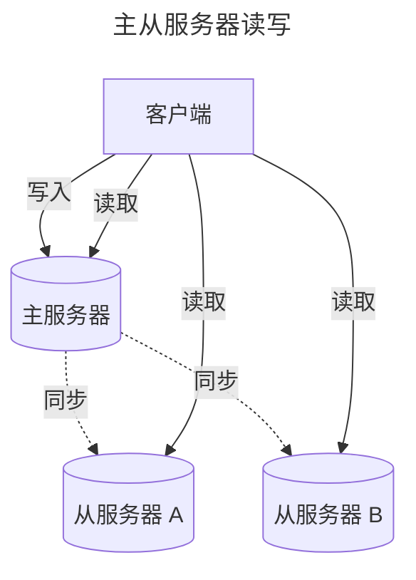
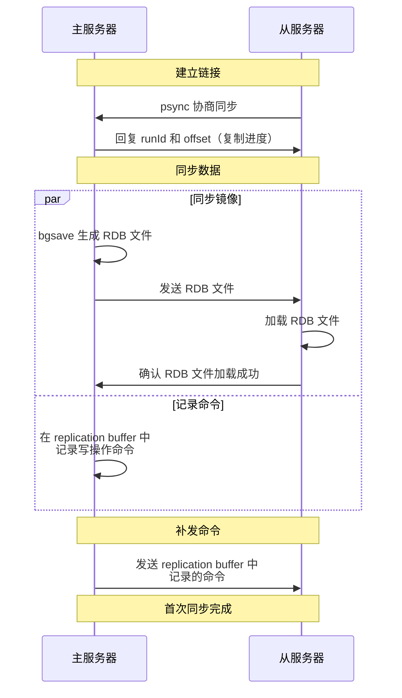
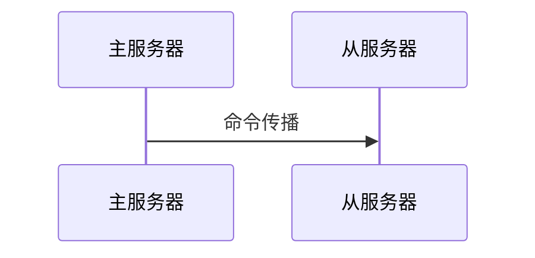
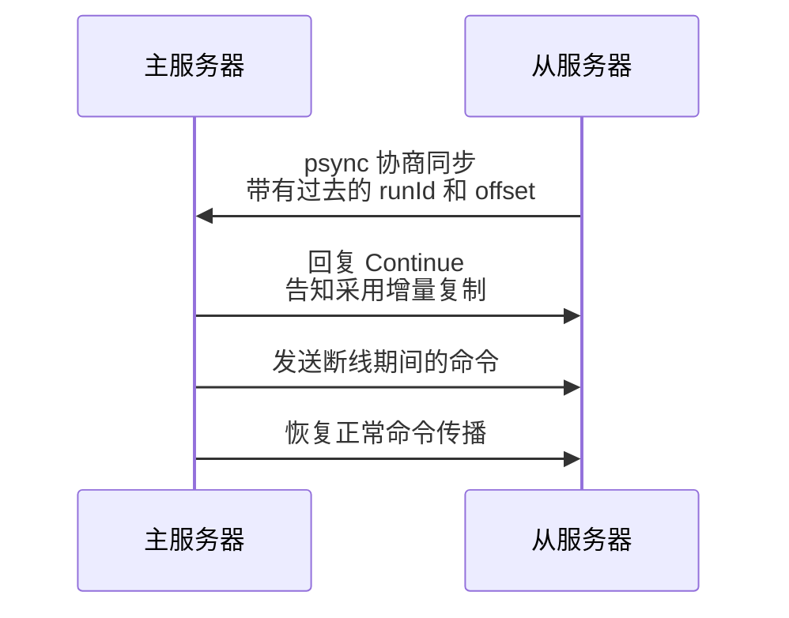
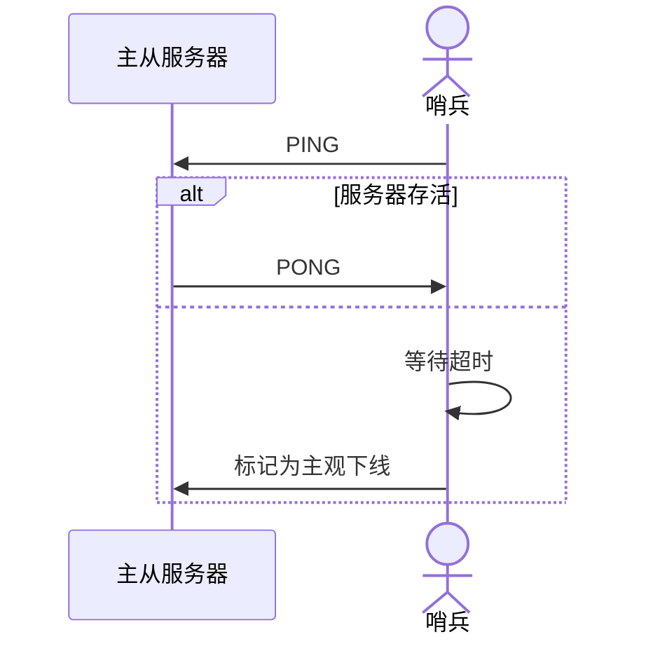
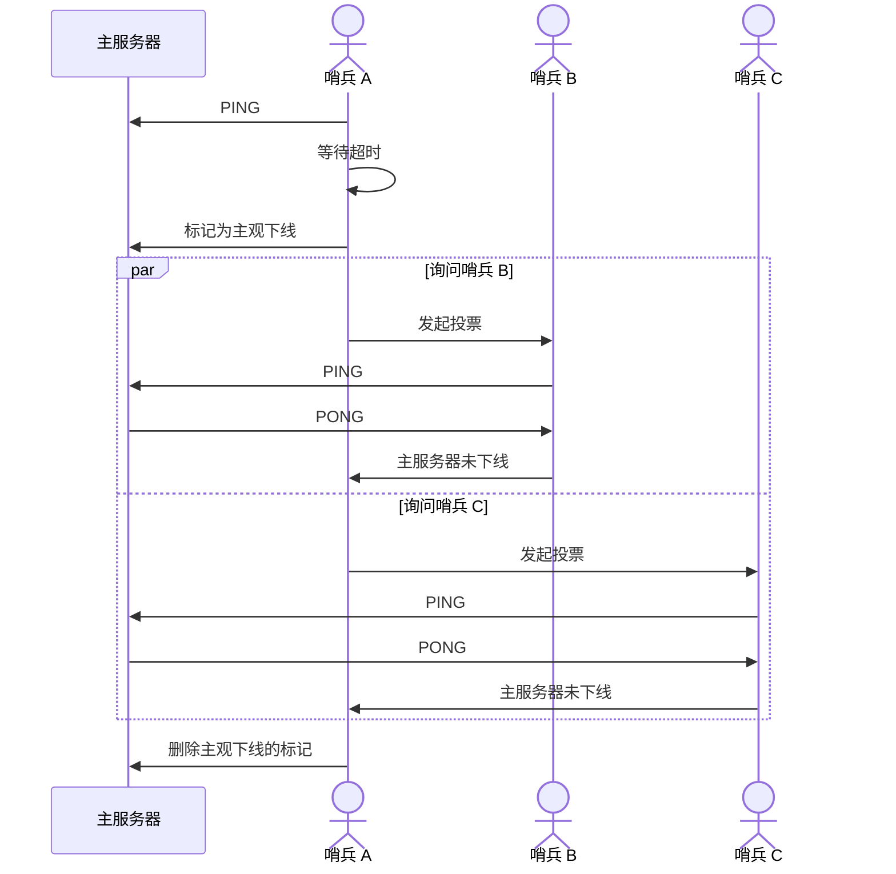
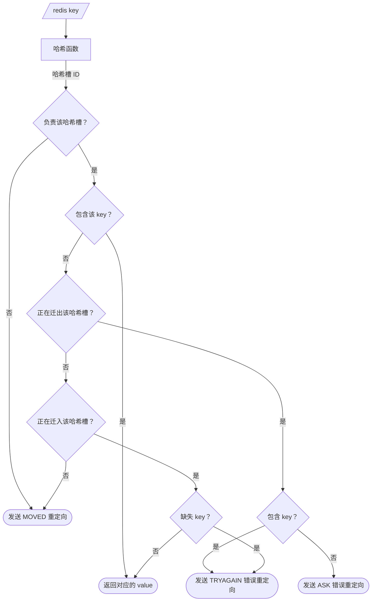
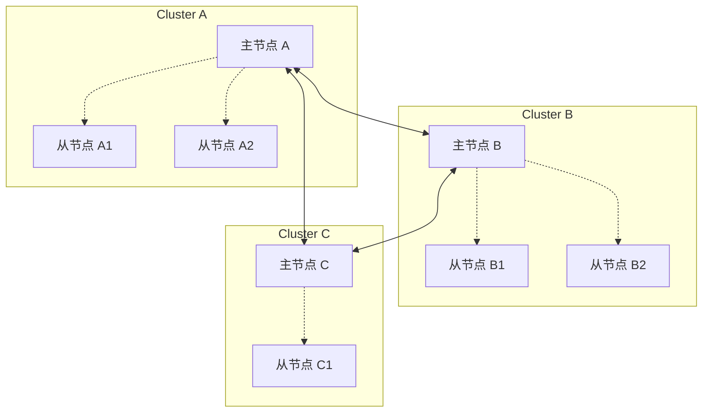
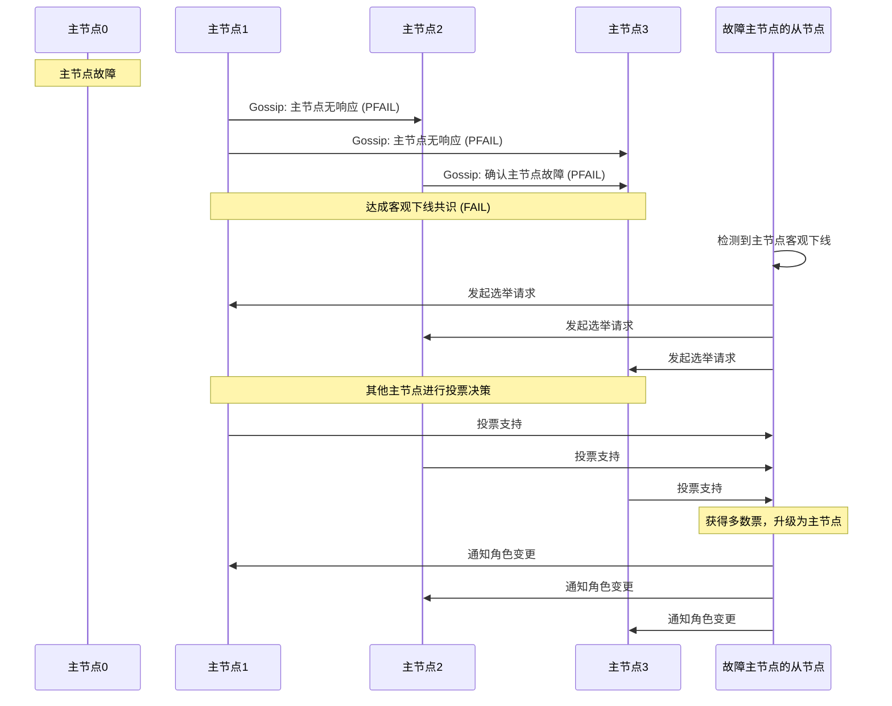

## 前言

本文将讨论以下两种保障 redis 的高可用性的方式以及它们的结合：
- **主从复制**：多个服务器保存相同的数据，以防单个服务器故障影响服务
- **Cluster 集群**：多个服务器存储不同数据，实现在线扩容和大量数据缓存

本文参考 [小林coding - 图解Redis介绍](https://www.xiaolincoding.com/redis/)，此外根据 **源码** 补充了一些细节。

## 主从复制

在主从复制中，多个服务器保存相同的数据，会遇到以下问题：

| 问题       | 解决方式 |
| :--------- | :------- |
| 数据不一致 | 读写分离 |
| 服务器故障 | 哨兵机制 |

这两个问题的解决是我们理解主从复制的重要部分，一起来看看吧。

### 读写分离

服务器分为 **主服务器** 和 **从服务器** ，所有数据以主服务器为准。客户端只向主服务器发送写入请求，接着数据被同步到从服务器；客户端对主从服务器都可以发送读取请求。



#### 同步实现

读写分离是如何保证 **一致性** 的？由三种同步来实现：
- 首次同步：redis 服务启动或是新的从服务器加入服务器网络后的首次同步
- 命令传播：主从服务器连接建立后，持续进行命令传输
- 增量复制：主从服务器连接断开后进行的一致性恢复

> 主服务器向从服务器不仅要同步 **写入命令**，当某个键被淘汰后，还需要同步对应的 **删除命令**，将从服务器中的内存也释放。
{: .prompt-tip }

##### **首次同步**

分为三个阶段：建立链接，同步数据，补发命令



##### **命令传播**

首次同步后，主从服务器之间维护一条 **长连接的tcp连接**，来进行 **命令传播**。



> 主服务器会先将命令写入缓冲区中，再由其他线程 **异步** 地传播给从服务器。
{: .prompt-info }

##### **增量复制**

此时，如果主从服务器之间的连接断开，我们可以通过从服务器中保存的 offset 定位到复制进度，从而进行 **增量复制**，而不用从头 **全量复制**。



> **主服务器中将写入命令保存在哪里，来帮助从服务器恢复？**<br>
> &emsp;&emsp;命令保存在 repl_backlog_buffer 这个 **环形缓冲区** 中（默认 1MB），其中包含一个指针 master_repl_offset 记录主服务器写到的位置。<br>
> &emsp;&emsp;如果需要同步的数据已经不在 repl_backlog_buffer 中，就会 **降级到全量复制**。
{: .prompt-info }

#### 数据丢失

尽管我们做了同步措施，还是可能存在数据丢失，主要发生在以下两种情况：
- 异步复制前 **主节点崩溃**，主节点中的数据全部丢失
- 主节点失联后恢复，产生两个主节点，导致 **脑裂**

> **脑裂** 发生后，redis 会将较新的主节点作为当前主节点，将它的数据 **全量复制** 给旧的主节点，因此旧的主节点 **在失联后写入的数据** 会全部丢失。
{: .prompt-info }

以上两种情况都不能避免丢失数据，但是可以尽可能减少数据丢失量。

##### **主节点崩溃**

当主节点同步异常时阻止客户端写入。具体而言，主节点通过 **从节点的延迟时长** 来判断未同步的数据量，当延迟时长超过某个阈值（参数 min-slaves-max-lag）后，拒绝新的写入请求。

> 客户端发现 Redis 不可写入后，可以降级为存入本地内存、kafka或数据库。
{: .prompt-tip }

##### **脑裂**

当主节点连接异常时阻止客户端写入。具体而言，主节点通过 **延迟的从节点数** 来判断网络状况，当延迟个数超过某个阈值（参数 min-slaves-to-write）后，拒绝新的写入请求。

### 哨兵模式

Redis 通过哨兵机制来解决 **服务器故障** 的问题。具体而言，当主服务器故障后，哨兵将自动选举一个从节点切换为主节点。

为了确保哨兵可靠性，一般使用哨兵集群，它们通过 **投票** 来进行决策。

哨兵之间通过 Redis 的 **发布者/订阅者机制** 来联络。它们依赖 **主节点** 上的一个频道 \__sentinel__:hello 来相互发现（类似比特网的全局广播）。之后，它们通过 info 命令从主节点获取 **从节点列表**，再去与从节点建立连接。

接下来，我们来看看 **主从切换** 的四个步骤：**监控下线**，**选择 leader 哨兵**，**选择新的主节点**，**通知其余节点**。

#### 监控下线

单个哨兵通过 PING 命令询问是否存活，主从节点通过 PONG 命令回复。如果回复超时，该哨兵标记该节点为 **主观下线**。



针对 **主节点**，哨兵还会额外确认它是否 **客观下线**（避免单个哨兵因为自身网络原因误判）。当主节点被一个哨兵标记为主观下线后，其他哨兵会对结果投票，当赞同票数超过 quorum 后，主节点才会被标记为客观下线。

> quorum 一般被设置为 #sentinels / 2 + 1
{: .prompt-tip }

以下是 **哨兵 A 误判主服务器下线** 的流程：



#### 选择 leader 哨兵

考虑到可能 **同时有多个哨兵标记主服务器为主观下线**，选择 leader 也需要多个哨兵同步。同样地，通过 **投票** 来选择 leader。

投票角色：
- 候选者：将主服务器标记为主观下线的哨兵（可能有多个），可以把投票自己或别人。
- 投票者：其余哨兵，只能把票投给别人。

票数需要 $$\geq \max\{quorum, \frac{\#sentinels}{2}\}$$ 才能成为 leader。

#### 选择新的主节点

哨兵机制会先通过 **主从断连次数** 筛选掉网络连接不佳的从节点，再按以下优先级选出最优从节点作为新的主节点：

| 指标           | 解释                                      |
| :------------- | :---------------------------------------- |
| 优先级最高     | slave-priority 这一配置项手动指定的优先级 |
| 复制进度最靠前 | 内存中的数据最新                          |
| ID最小         | 从节点标识 ID                             |

选出从节点后，哨兵通过 SLAVEOF no one 命令将它设置为主节点，并通过高频（1秒1次）的 info 命令查询确认设置成功。

#### 通知其余节点

| 通知对象   | 通知方式                        |
| :--------- | :------------------------------ |
| 其他从节点 | 发送 SLAVEOF 命令               |
| 客户端     | Redis 的 **发布者/订阅者机制**  |
| 旧主节点   | 等待重新上线后发送 SLVAEOF 命令 |

## Cluster 集群

Redis Cluster 采用 **切片集群** 的方案：多个服务器存储不同数据，实现在线扩容和大量数据缓存。

> **单个 Redis 服务器中存储过多数据的缺点**：
> - **内存限制**：单台服务器的内存容量有限，无法满足大规模数据存储需求
> - **性能下降**：数据量过大时，查找、插入、删除操作的时间复杂度增加，响应时间变长
> - **网络瓶颈**：大量数据的读写请求可能超出单台服务器的网络带宽处理能力
> - **备份压力**：数据量大时，RDB 快照和 AOF 日志文件会变得非常庞大，备份和传输困难
> - **故障恢复慢**：服务器宕机后，需要从持久化文件中恢复大量数据，恢复时间很长
> - **扩容困难**：无法通过简单地添加服务器来提升存储容量，只能通过升级硬件实现垂直扩展
{: .prompt-info }

我们将从以下几个角度理解 Cluster 集群：
- 切片方式
- 服务器重定向
- 节点间通信
- 故障转移

### 切片方式

为了实现在线扩容，我们要在数据切片时就确认 **数据范围**。一般通过哈希函数将数据压缩到一个较小的范围，再交给多个节点分别处理其中的一块。

Redis Cluster 选择将所有数据被映射到 16384 个 **哈希槽** 中，集群中每个节点负责一部分哈希槽。

> **为什么哈希槽的个数选择 16384 个？**
> - 不选择更多（65536）：redis 节点发送心跳包时需要包含所有槽，较少的哈希槽可以节约网络资源
> - 不选择更少（8192）：碰撞概率升高，反而不划算
{: .prompt-info }

### 服务器重定向

两种重定向场景：

| 场景                                  | 解决方案                                                          |
| :------------------------------------ | :---------------------------------------------------------------- |
| 客户端向错误的节点发送请求            | 返回 MOVED，指向 **正确节点**                                     |
| 客户端发送请求时 **该哈希槽正在扩容** | 返回 TRYAGAIN                                                     |
| 客户端发送请求时 **该哈希槽扩容完成** | **迁出节点** 返回 ASK，指向 **迁入节点**<br>**迁入节点** 返回结果 |

节点处理过程如下：



其中针对迁入迁出的判断逻辑源代码（定向的完整代码见 [附录](#cluster-定向)）：

```c
/* If we don't have all the keys and we are migrating the slot, send
* an ASK redirection or TRYAGAIN. */
if (migrating_slot && missing_keys) {
   /* If we have keys but we don't have all keys, we return TRYAGAIN */
   if (existing_keys) {
      if (error_code) *error_code = CLUSTER_REDIR_UNSTABLE;
      return NULL;
   } else {
      if (error_code) *error_code = CLUSTER_REDIR_ASK;
      return getMigratingSlotDest(slot);
   }
}

/* If we are receiving the slot, and the client correctly flagged the
* request as "ASKING", we can serve the request. However if the request
* involves multiple keys and we don't have them all, the only option is
* to send a TRYAGAIN error. */
if (importing_slot &&
   (c->flags & CLIENT_ASKING || cmd_flags & CMD_ASKING))
{
   if (multiple_keys && missing_keys) {
      if (error_code) *error_code = CLUSTER_REDIR_UNSTABLE;
      return NULL;
   } else {
      return myself;
   }
}
```

### 节点间通信

节点之间通过 **Gossip 协议** 进行通信：每个节点周期性的随机选择一些节点，并把信息传递给这些节点。包含以下消息：
- meet 消息：新节点加入
- ping 消息：自己已知的两个节点信息
- pong 消息：确认正常通信 + 已知的两个节点信息
- fail 消息：某节点下线

### 故障转移

之前我们看到，在主从模式中通过哨兵来进行故障转移；而在 cluster 中节点通过先前提到的 ping pong 消息 **相互判断是否下线**。

具体而言，当认定某个节点 **主观下线** 后，当前节点会按 Gossip 协议广播这一消息；当一个节点接收到主观下线的消息后，会尝试统计主观下线消息的数量，如果超过阈值就将该节点设置为 **客观下线**。

> 简单来说，**主观下线** 是 **谣言**，每个节点会统计谣言，超过阈值后将它视作 **真相** 传播，也就是 **客观下线**。
{: .prompt-tip }

## 主从复制 + Cluster 集群

实际使用中，往往将两种方案结合。Cluster 集群中的每个节点是主从复制中的 **主服务器**，下属众多从节点；在故障转移过程中，它们也起到哨兵的功能。

> **为什么 Cluster 模式不需要额外的哨兵？**  
> 因为 Redis Cluster 的主节点本身就具备了哨兵的所有功能：故障检测、投票选举、故障转移。这避免了部署额外哨兵节点的复杂性。
{: .prompt-info }



### 故障转移流程

Redis Cluster 中的故障转移流程完全由集群节点自动完成，无需哨兵参与：

| 阶段            | 执行者           | 具体操作                                              |
| :-------------- | :--------------- | :---------------------------------------------------- |
| **1. 故障检测** | 其他主节点       | 通过 Gossip 协议的 ping/pong 消息检测到某主节点无响应 |
| **2. 主观下线** | 单个主节点       | 将故障节点标记为主观下线（PFAIL）                     |
| **3. 谣言传播** | 所有主节点       | 通过 Gossip 协议传播主观下线信息                      |
| **4. 客观下线** | 集群             | 当大多数主节点确认故障时，标记为客观下线（FAIL）      |
| **5. 选举发起** | 故障节点的从节点 | 从节点检测到主节点客观下线，向其他主节点发起选举请求  |
| **6. 投票决策** | 其他主节点       | 接收选举请求并投票，选出新主节点                      |
| **7. 角色切换** | 当选从节点       | 获得多数票后升级为主节点，开始处理客户端请求          |
| **8. 更新路由** | 集群             | 更新槽位分配信息，通知所有节点和客户端                |



## 附录

### cluster 定向

redis cluster 中判断哈希槽位于哪个节点的函数：[src/cluster.c/getNodeByQuery (redis 8.4)](https://github.com/redis/redis/blob/8.4/src/cluster.c#L1146)

```c
/* Return the pointer to the cluster node that is able to serve the command.
 * For the function to succeed the command should only target either:
 *
 * 1) A single key (even multiple times like RPOPLPUSH mylist mylist).
 * 2) Multiple keys in the same hash slot, while the slot is stable (no
 *    resharding in progress).
 *
 * On success the function returns the node that is able to serve the request.
 * If the node is not 'myself' a redirection must be performed. The kind of
 * redirection is specified setting the integer passed by reference
 * 'error_code', which will be set to CLUSTER_REDIR_ASK or
 * CLUSTER_REDIR_MOVED.
 *
 * When the node is 'myself' 'error_code' is set to CLUSTER_REDIR_NONE.
 *
 * If the command fails NULL is returned, and the reason of the failure is
 * provided via 'error_code', which will be set to:
 *
 * CLUSTER_REDIR_CROSS_SLOT if the request contains multiple keys that
 * don't belong to the same hash slot.
 *
 * CLUSTER_REDIR_UNSTABLE if the request contains multiple keys
 * belonging to the same slot, but the slot is not stable (in migration or
 * importing state, likely because a resharding is in progress).
 *
 * CLUSTER_REDIR_DOWN_UNBOUND if the request addresses a slot which is
 * not bound to any node. In this case the cluster global state should be
 * already "down" but it is fragile to rely on the update of the global state,
 * so we also handle it here.
 *
 * CLUSTER_REDIR_DOWN_STATE and CLUSTER_REDIR_DOWN_RO_STATE if the cluster is
 * down but the user attempts to execute a command that addresses one or more keys. */
clusterNode *getNodeByQuery(client *c, struct redisCommand *cmd, robj **argv, int argc, int *hashslot,
    getKeysResult *keys_result, uint8_t read_error, uint64_t cmd_flags, int *error_code)
{
    clusterNode *myself = getMyClusterNode();
    clusterNode *n = NULL;
    robj *firstkey = NULL;
    int multiple_keys = 0;
    multiState *ms, _ms;
    pendingCommand mc;
    pendingCommand *mcp = &mc;
    int i, slot = 0, migrating_slot = 0, importing_slot = 0, missing_keys = 0,
            existing_keys = 0;
    int pubsubshard_included = 0; /* Flag to indicate if a pubsub shard cmd is included. */

    /* Allow any key to be set if a module disabled cluster redirections. */
    if (server.cluster_module_flags & CLUSTER_MODULE_FLAG_NO_REDIRECTION)
        return myself;

    /* Set error code optimistically for the base case. */
    if (error_code) *error_code = CLUSTER_REDIR_NONE;

    /* Modules can turn off Redis Cluster redirection: this is useful
     * when writing a module that implements a completely different
     * distributed system. */

    /* We handle all the cases as if they were EXEC commands, so we have
     * a common code path for everything */
    if (cmd->proc == execCommand) {
        /* If CLIENT_MULTI flag is not set EXEC is just going to return an
         * error. */
        if (!(c->flags & CLIENT_MULTI)) return myself;
        ms = &c->mstate;
    } else {
        /* In order to have a single codepath create a fake Multi State
         * structure if the client is not in MULTI/EXEC state, this way
         * we have a single codepath below. */
        ms = &_ms;
        _ms.commands = &mcp;
        _ms.count = 1;

        /* Properly initialize the fake pendingCommand */
        initPendingCommand(&mc);
        mc.argv = argv;
        mc.argc = argc;
        mc.cmd = cmd;
        mc.slot = hashslot ? *hashslot : INVALID_CLUSTER_SLOT;
        mc.read_error = read_error;
        if (keys_result) {
            mc.keys_result = *keys_result;
            mc.flags |= PENDING_CMD_KEYS_RESULT_VALID;
        }
    }

    /* Check that all the keys are in the same hash slot, and obtain this
     * slot and the node associated. */
    for (i = 0; i < ms->count; i++) {
        struct redisCommand *mcmd;
        robj **margv;
        int margc, j;
        keyReference *keyindex;

        pendingCommand *pcmd = ms->commands[i];

        mcmd = pcmd->cmd;
        margc = pcmd->argc;
        margv = pcmd->argv;

        /* Only valid for sharded pubsub as regular pubsub can operate on any node and bypasses this layer. */
        if (!pubsubshard_included &&
            doesCommandHaveChannelsWithFlags(mcmd, CMD_CHANNEL_PUBLISH | CMD_CHANNEL_SUBSCRIBE))
        {
            pubsubshard_included = 1;
        }

        /* If we have a cached keys result from preprocessCommand(), use it.
         * Otherwise, extract keys result. */
        int use_cache_keys_result = pcmd->flags & PENDING_CMD_KEYS_RESULT_VALID;
        getKeysResult result = GETKEYS_RESULT_INIT;
        if (use_cache_keys_result)
            result = pcmd->keys_result;
        else
            getKeysFromCommand(mcmd,margv,margc,&result);
        keyindex = result.keys;

        for (j = 0; j < result.numkeys; j++) {
            /* The command has keys and was checked for cross-slot between its keys in preprocessCommand() */
            if (pcmd->read_error == CLIENT_READ_CROSS_SLOT) {
                /* Error: multiple keys from different slots. */
                if (error_code)
                    *error_code = CLUSTER_REDIR_CROSS_SLOT;
                return NULL;
            }

            robj *thiskey = margv[keyindex[j].pos];
            int thisslot = pcmd->slot;
            if (thisslot == INVALID_CLUSTER_SLOT)
                thisslot = keyHashSlot((char*)thiskey->ptr, sdslen(thiskey->ptr));

            if (firstkey == NULL) {
                /* This is the first key we see. Check what is the slot
                 * and node. */
                firstkey = thiskey;
                slot = thisslot;
                n = getNodeBySlot(slot);

                /* Error: If a slot is not served, we are in "cluster down"
                 * state. However the state is yet to be updated, so this was
                 * not trapped earlier in processCommand(). Report the same
                 * error to the client. */
                if (n == NULL) {
                    if (!use_cache_keys_result) getKeysFreeResult(&result);
                    if (error_code)
                        *error_code = CLUSTER_REDIR_DOWN_UNBOUND;
                    return NULL;
                }

                /* If we are migrating or importing this slot, we need to check
                 * if we have all the keys in the request (the only way we
                 * can safely serve the request, otherwise we return a TRYAGAIN
                 * error). To do so we set the importing/migrating state and
                 * increment a counter for every missing key. */
                if (n == myself &&
                    getMigratingSlotDest(slot) != NULL)
                {
                    migrating_slot = 1;
                } else if (getImportingSlotSource(slot) != NULL) {
                    importing_slot = 1;
                }
            } else {
                /* If it is not the first key/channel, make sure it is exactly
                 * the same key/channel as the first we saw. */
                if (slot != thisslot) {
                    /* Error: multiple keys from different slots. */
                    if (!use_cache_keys_result) getKeysFreeResult(&result);
                    if (error_code)
                        *error_code = CLUSTER_REDIR_CROSS_SLOT;
                    return NULL;
                }
                if (importing_slot && !multiple_keys && !equalStringObjects(firstkey,thiskey)) {
                    /* Flag this request as one with multiple different
                     * keys/channels when the slot is in importing state. */
                    multiple_keys = 1;
                }
            }

            /* Migrating / Importing slot? Count keys we don't have.
             * If it is pubsubshard command, it isn't required to check
             * the channel being present or not in the node during the
             * slot migration, the channel will be served from the source
             * node until the migration completes with CLUSTER SETSLOT <slot>
             * NODE <node-id>. */
            int flags = LOOKUP_NOTOUCH | LOOKUP_NOSTATS | LOOKUP_NONOTIFY | LOOKUP_NOEXPIRE;
            if ((migrating_slot || importing_slot) && !pubsubshard_included)
            {
                if (lookupKeyReadWithFlags(&server.db[0], thiskey, flags) == NULL) missing_keys++;
                else existing_keys++;
            }
        }
        if (!use_cache_keys_result) getKeysFreeResult(&result);
    }

    /* No key at all in command? then we can serve the request
     * without redirections or errors in all the cases. */
    if (n == NULL) return myself;

    /* Cluster is globally down but we got keys? We only serve the request
     * if it is a read command and when allow_reads_when_down is enabled. */
    if (!isClusterHealthy()) {
        if (pubsubshard_included) {
            if (!server.cluster_allow_pubsubshard_when_down) {
                if (error_code) *error_code = CLUSTER_REDIR_DOWN_STATE;
                return NULL;
            }
        } else if (!server.cluster_allow_reads_when_down) {
            /* The cluster is configured to block commands when the
             * cluster is down. */
            if (error_code) *error_code = CLUSTER_REDIR_DOWN_STATE;
            return NULL;
        } else if (cmd_flags & CMD_WRITE) {
            /* The cluster is configured to allow read only commands */
            if (error_code) *error_code = CLUSTER_REDIR_DOWN_RO_STATE;
            return NULL;
        } else {
            /* Fall through and allow the command to be executed:
             * this happens when server.cluster_allow_reads_when_down is
             * true and the command is not a write command */
        }
    }

    /* Return the hashslot by reference. */
    if (hashslot) *hashslot = slot;

    /* MIGRATE always works in the context of the local node if the slot
     * is open (migrating or importing state). We need to be able to freely
     * move keys among instances in this case. */
    if ((migrating_slot || importing_slot) && cmd->proc == migrateCommand)
        return myself;

    /* If we don't have all the keys and we are migrating the slot, send
     * an ASK redirection or TRYAGAIN. */
    if (migrating_slot && missing_keys) {
        /* If we have keys but we don't have all keys, we return TRYAGAIN */
        if (existing_keys) {
            if (error_code) *error_code = CLUSTER_REDIR_UNSTABLE;
            return NULL;
        } else {
            if (error_code) *error_code = CLUSTER_REDIR_ASK;
            return getMigratingSlotDest(slot);
        }
    }

    /* If we are receiving the slot, and the client correctly flagged the
     * request as "ASKING", we can serve the request. However if the request
     * involves multiple keys and we don't have them all, the only option is
     * to send a TRYAGAIN error. */
    if (importing_slot &&
        (c->flags & CLIENT_ASKING || cmd_flags & CMD_ASKING))
    {
        if (multiple_keys && missing_keys) {
            if (error_code) *error_code = CLUSTER_REDIR_UNSTABLE;
            return NULL;
        } else {
            return myself;
        }
    }

    /* Handle the read-only client case reading from a slave: if this
     * node is a slave and the request is about a hash slot our master
     * is serving, we can reply without redirection. */
    int is_write_command = (cmd_flags & CMD_WRITE) ||
                           (c->cmd->proc == execCommand && (c->mstate.cmd_flags & CMD_WRITE));
    if (((c->flags & CLIENT_READONLY) || pubsubshard_included) &&
        !is_write_command &&
        clusterNodeIsSlave(myself) &&
        clusterNodeGetSlaveof(myself) == n)
    {
        return myself;
    }

    /* Base case: just return the right node. However, if this node is not
     * myself, set error_code to MOVED since we need to issue a redirection. */
    if (n != myself && error_code) *error_code = CLUSTER_REDIR_MOVED;
    return n;
}
```