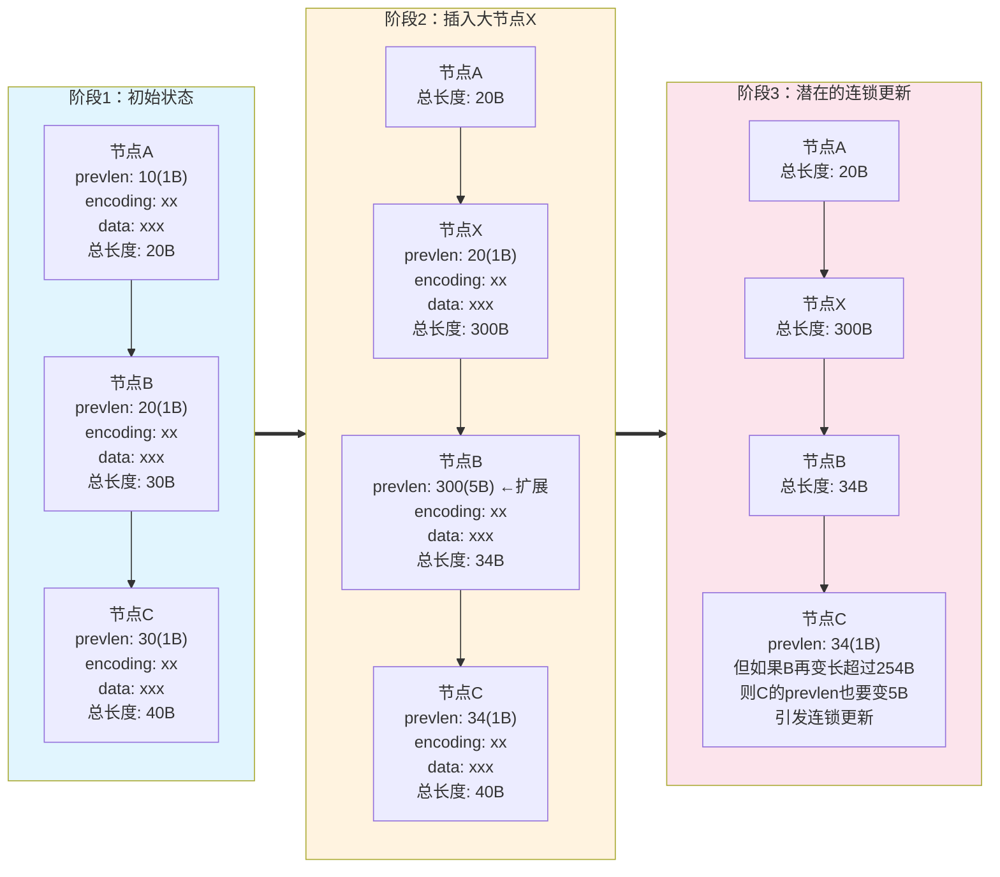
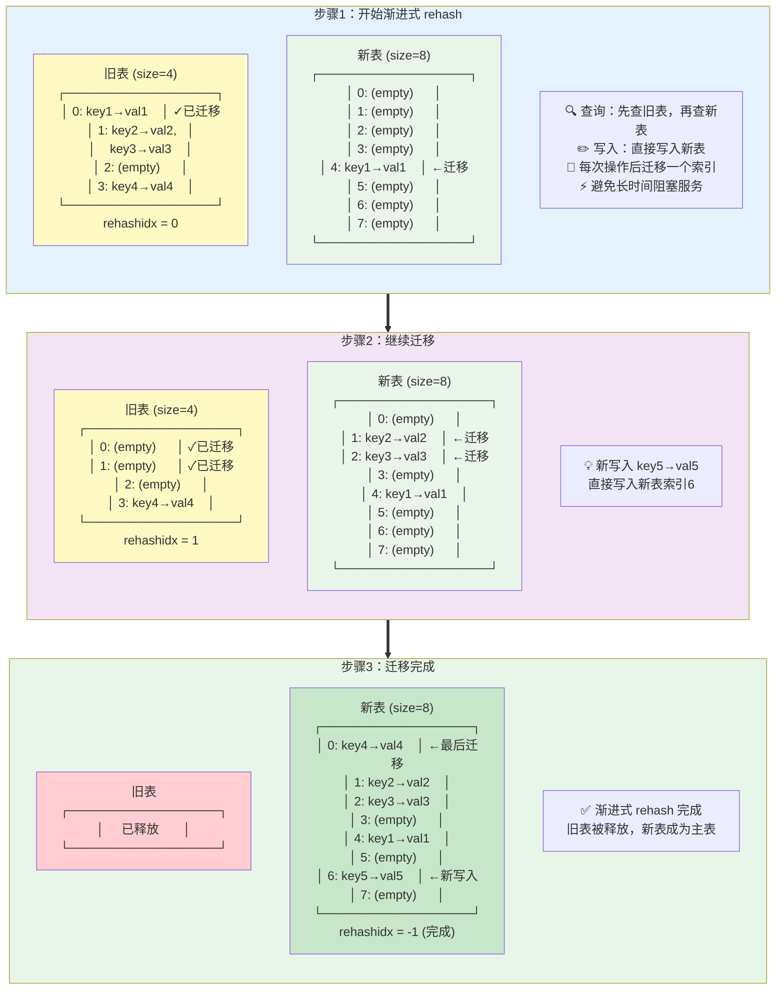
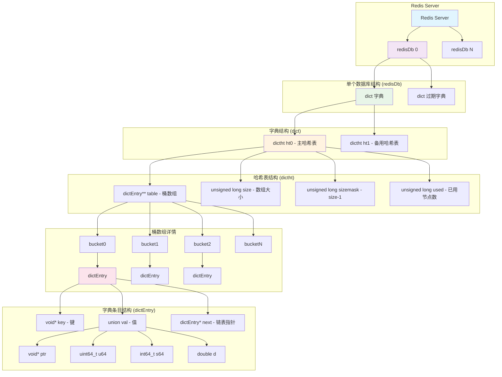

## 前言

Redis 中包含多种 <span style="color:red">数据类型</span>，对应于多种 <span style="color:blue">数据结构</span>。<span style="color:red">数据类型</span> 取决于具体业务场景，而 <span style="color:blue">数据结构</span> 指的是 Redis 底层如何实现某种 <span style="color:red">数据类型</span>。

我们将先从 <span style="color:blue">数据结构</span> 说起，再谈到每种 <span style="color:red">数据类型</span> 适用于哪些业务。

本文参考 [小林coding - 图解Redis介绍](https://www.xiaolincoding.com/redis/)，此外根据 **源码** 补充了一些细节以及 **listpack** 如何进行遍历。

## 数据结构

### SDS

SDS 即 simple dynamic string，由 Redis 自己封装来实现 **字符串**，与 c 的 `char*` 实现不同。

>`char*` 实现字符串有以下缺点：<br>
>- 不额外保存长度，计算长度的时间复杂度为 $$O(n)$$<br>
>- 通过 `\0` 来标注结尾，无法在字符串中存储 `\0`<br>
>- 不保证字符串操作的安全性，可能发生缓冲区溢出
{: .prompt-info }

SDS 中包含四部分：

| 名称  | 含义           | 功能                                 |
| :---- | :------------- |
| len   | 当前长度       | 直接得到长度                         |
| alloc | 分配空间的长度 | 修改时判断是否要扩容，防止缓冲区溢出 |
| flags | 类型           | 节省内存空间                         |
| buf[] | 字节数组       | 不仅能保存字符，还能保存二进制数据   |

SDS 扩容规则（[源码](#sds-扩容)）：`newlen = (newlen < 1MB) ? (newlen * 2) : (newlen + 1MB)`，其中 `newlen = (len+addlen)`

SDS 节省内存空间（[源码](#sds-结构)）：
- flags 分为 sdshdr5、sdshdr8、sdshdr16、sdshdr32 和 sdshdr64 类型，每个 len 和 alloc 不同（`uint16_t`, `uint32_t` 等等），根据字符串大小不同灵活分配。
- struct 声明 `__attribute__ ((packed))`，告诉编译器取消结构体在编译过程中的优化对齐，按照实际占用字节数进行对齐（会影响内存读写效率，但主要瓶颈在网络I/O）。

### 链表

Redis 使用 **双向链表**，并在此外封装了 list，包含 head，tail 和 len。特别地，链表节点存储的值都是 `void*`，也就是支持任意类型的值。

> 链表的劣势：<br>
> - 链表节点占用空间大<br>
> - 缓存不友好
{: .prompt-info }

虽然链表插入节点时间复杂度为 $$O(1)$$，但大部分场景搜索到插入位置也需要时间，因此链表的实际性能表现并不好。Redis 对 **list** 实现中，在数据量较小的情况下会选择 **压缩列表**，其余情况在 3.2 替换为了 **quicklist**，在 5.0 替换为了 **listpack**。

### 压缩列表

**压缩列表** 类似数组，在内存中连续存储，但是其中每一项 **大小不固定**。其存储结构（以从头到尾的顺序）：

| 字段    | 含义                   |
| :------ | :--------------------- |
| zlbytes | 整个压缩列表字节数     |
| zltail  | 压缩队列尾部偏移量     |
| zllen   | 内部节点数量           |
| entry1  | 节点1                  |
| entry2  | 节点2                  |
| ...     | ...                    |
| entryN  | 节点N                  |
| zlend   | 标识结尾，固定值`0xFF` |

> **为什么 zltail 必要？**<br>
> &emsp;&emsp;倒序遍历过程中，需要直接获取 entryN 的位置。通过 zlbytes 只能定位到 zlend，在不知道 entryN 大小的情况下，没有办法定位到 entryN。
{: .prompt-tip }

单个节点的构成：

| 字段     | 含义                      | 功能               |
| :------- | :------------------------ | :----------------- |
| prevlen  | 前一个节点的长度          | 倒序遍历           |
| encoding | 类型（字符串/整数）和长度 | 正序遍历、便于解析 |
| data     | 实际数据                  | 要存储的数据       |

从上面的实现中可以看到：压缩列表只适合存储少量数据，当插入节点后，所有后续节点都要移动，时间复杂度为 $$O(n)$$。更糟的是，可能出现 **连锁更新** 的问题。

**连锁更新** 发生在节点插入时。当节点插入后，所有后续节点移动，接着，插入的节点后继的节点需要更新 prevlen 字段。问题就出在这！当 prevlen 的值小于 254 时，只占用 1 Byte 的空间；但是当它更新后大于等于 254 时，将占用 5 Byte 的空间，导致这个后继节点长度增大，需要重新移动后续节点，并且再后面的节点也需要调整 prevlen。最终一连串的节点像多米诺骨牌一样地进入调整，导致时间复杂度达到 $$O(k*n)$$，其中 $$k$$ 为进入连锁更新的节点数。

下面用三个节点的例子演示连锁更新的过程：



### 哈希表

redis 的哈希表采用基础的 **链式哈希** 解决哈希冲突（数组 $$+$$ 链表）。

关键让我们来看看它是如何扩展哈希表大小的，也就是 **rehash**。

#### 阻塞式 rehash

在 redis 的实现中存在两张哈希表，正常工作时只读写其中一张。扩容时，为另一张哈希表申请双倍的空间，随后将工作哈希表中的值移动到新的哈希表中，最后释放旧表，扩容便完成了。这个期间是阻塞的，不能读写其中的数据。

#### 渐进式 rehash

在 rehash 的过程中，不阻塞正常节点操作，而是在操作后将这个索引的键值对迁移到新表上。

特别地，这个过程中，节点写入到新表；节点查询优先查询旧表，再查询新表。

> **Redis 单线程模型**<br>
> &emsp;&emsp;Redis 的主执行线程是 **单线程** 的，所以渐进式 rehash 的设计目的 **不是** 为了解决并发问题，而是为了 **避免阻塞**。如果采用阻塞式 rehash，当哈希表很大时，一次性迁移所有数据可能需要很长时间，在这段时间内 Redis 无法处理任何其他命令，导致服务暂停。<br>
> &emsp;&emsp;渐进式 rehash 通过 **分摊** 迁移工作到多个命令执行过程中，确保每次命令执行的延迟都在可控范围内。<br><br>
> **迁移操作顺序**<br>
> &emsp;&emsp;单个键值对的迁移过程：① 先将键值对复制到新表 → ② 再从旧表删除。这样保证数据不会丢失，因为单线程模型下这两步是原子的。
{: .prompt-info }



#### rehash 触发条件

| 条件               | 行为                                               |
| :----------------- | :------------------------------------------------- |
| 负载因子$$\geq 1$$ | 如果没有在备份（RDB 快照或 AOF 重写），进行 rehash |
| 负载因子$$\geq 5$$ | 立刻 rehash                                        |

{: .prompt-tip }
> **为什么在 RDB 快照或 AOF 重写时避免rehash？**
> 
> 在进行 RDB 快照或 AOF 重写期间进行 rehash 会带来以下缺点：
> 
> 1. **写时复制 (COW) 机制失效**：rehash 需要大量修改内存页面，导致 fork 出的子进程无法有效利用写时复制机制，父子进程需要复制更多内存页面
> 
> 2. **内存占用激增**：rehash 过程中新旧哈希表并存，加上 COW 机制的内存复制，可能导致内存使用量翻倍，增加 OOM 风险
> 
> 3. **性能影响**：大量内存页面复制和 rehash 操作会显著影响 Redis 性能，延长快照/重写时间
> 
> 4. **系统资源竞争**：rehash 与备份操作同时进行会加剧 CPU 和内存资源竞争，影响整体系统稳定性

### 整数集合

**整数集合** 也类似数组，并且每个元素的大小相同。它的结构：

| 字段       | 含义     |
| :--------- | :------- |
| encoding   | 编码方式 |
| length     | 元素数量 |
| contents[] | 数组     |

encoding 和 contents[] 的对应关系：

| encoding         | contents[] |
| :--------------- | :--------- |
| INTSET_ENC_INT16 | int16_t    |
| INTSET_ENC_INT32 | int32_t    |
| INTSET_ENC_INT64 | int64_t    |

整数集合会根据插入元素的类型 **自动升级**，从而 **节省内存**，升级过程：
1. 分配新空间
2. 从后到前将原始元素移动到扩容后位置
3. 添加导致自动升级的新元素

```
// 原始状态
[100][200]

// 插入 65540，分配新空间
[100][200][----][----][----][----]

// 开始移动
[100][----][---200---][----][----]
[---100---][---200---][----][----]

// 插入新元素
[---100---][---200---][--65540--]
```

### 跳表

**跳表** 就是多层链表，通过多层快速定位链表节点。让我们来看看 redis 的跳表节点设计：

| 字段     | 含义             |
| :------- | :--------------- |
| ele      | 元素（SDS 类型） |
| score    | 权重，排序依据   |
| backward | 后向指针         |
| level[]  | 每层的属性       |

其中 level 的结构：

| 字段    | 含义                                     |
| :------ | :--------------------------------------- |
| forward | 前向指针                                 |
| span    | 跨度，表示下一跳在 level0 跨越了多少节点 |

**跳表结构示意图：**

```
Redis跳表结构 (Skip List Implementation)

Level 3:  [Header] ───────────────────────────────────────────────────> [Tail]
            │                                                            │
            │                                                            │
Level 2:  [Header] ──────> [Node1:10] ─────────────────> [Node3:30] ──> [Tail]
            │                │                            │               │
            │                │                            │               │
Level 1:  [Header] ──────> [Node1:10] ──> [Node2:20] ──> [Node3:30] ──> [Tail]  
            │                │              │              │               │
            │                │              │              │               │
Level 0:  [Header] ──────> [Node1:10] ──> [Node2:20] ──> [Node3:30] ──> [Node4:40] ──> [Tail]
            │                │              │              │               │             │
            └<───────────────┴<─────────────┴<─────────────┴<──────────────┴<────────────┘
                          (backward指针，仅在Level 0)
```

此外，跳表整体结构中包含以下字段：

| 字段   | 含义                          |
| :----- | :---------------------------- |
| header | 头节点                        |
| tail   | 尾节点                        |
| length | 跳表长度（level0 的元素个数） |
| level  | 层级数                        |

接下来看看跳表的几种操作。

#### 查询

跳表的查询过程是从最高层开始，逐层向下查找的过程。具体步骤如下：

1. **从最高层的头节点开始**
2. **水平遍历**：在当前层比较节点的权重（score），找到第一个权重大于目标权重的节点
3. **向下跳跃**：跳到前一个节点的下一层继续查找
4. **重复步骤2-3**，直到到达最底层（level 0）
5. **最终定位**：在level 0进行最后的精确查找

时间复杂度：$$O(\log n)$$

#### 跳表层数设置

Redis 跳表使用 **概率随机算法** 来决定新节点的层数，这是跳表数据结构的核心设计。

**随机层数生成算法：**

```c
// 伪代码
int randomLevel() {
    int level = 1;
    while (random() < 0.25 && level < SKIPLIST_MAXLEVEL) {
        level++;
    }
    return level;
}
```

**关键设计原理：**

1. **$$p = \frac{1}{4}$$ 的选择**：
   - 理论研究表明，$$p = \frac{1}{2}$$ 时性能最优
   - Redis选择 $$p = \frac{1}{4}$$，在性能和内存之间取得平衡
   - 更小的p值意味着更少的高层节点，节省内存

2. **最大层数限制**：
   - Redis设置 `SKIPLIST_MAXLEVEL = 32`
   - 防止层数过高导致的内存浪费

#### 跳表 vs 平衡树

跳表的优势：
- 配置灵活：可以通过修改概率来决定每层节点数，轻松达到 k 叉平衡树的效果
- 范围查询：跳表天然支持范围查询，平衡树还需要维护一些别的信息
- 算法简单：平衡树调整很复杂

#### 跳表 vs B+ 树

跳表和 B+ 树相似之处很多：叶子节点的双向链表、类多叉树。但是他们也有一些差别，最终导致 redis 和 innodb 选用了不同的数据结构。

B+ 树比跳表 “重” 很多，当插入节点时，B+ 树仍旧需要多轮调整。但是，B+ 树对磁盘 IO 友好，并且一个非叶节点可以包含更多信息，层数更低，因此更适合数据库场景。

### quicklist

**quicklist** $$=$$ **双向链表** $$+$$ **压缩列表**

思想：享受到 **压缩列表** 的快速读取优势，同时通过 **双向链表** 来控制单个 **压缩列表** 的大小，抑制 **连锁更新** 的影响。

**双向链表** 中会保存 **压缩列表** 的字节大小和元素个数，从而快速判断插入当前列表中还是创建新的链表节点。

### listpack

**listpack** 是 **压缩列表** 的平替，因为不会存储前一项的长度，避免了 **连锁更新** 的问题。

**listpack** 中每个 entry 的二进制存储结构为 `[编码字节(encoding)][数据(data)][反向长度(backlen)]`。

> 源码中存在这样的片段，但只是为了方便数据处理，和 listpack 底层实现无关：
> 
> ```c
> /* Each entry in the listpack is either a string or an integer. */
> typedef struct {
>     /* When string is used, it is provided with the length (slen). */
>     unsigned char *sval;
>     uint32_t slen;
>     /* When integer is used, 'sval' is NULL, and lval holds the value. */
>     long long lval;
> } listpackEntry;
>```
{: .prompt-tip}

#### 正向遍历

首先我们需要计算出当前 entry 长度。

已有 entry 首指针，我们可以通过 encoding 计算出 `encoding + data` 的长度，[源码](https://github.com/redis/redis/blob/8.4/src/listpack.c#L434) 如下：

```c
/* Return the encoded length of the listpack element pointed by 'p'.
 * This includes the encoding byte, length bytes, and the element data itself.
 * If the element encoding is wrong then 0 is returned.
 * Note that this method may access additional bytes (in case of 12 and 32 bit
 * str), so should only be called when we know 'p' was already validated by
** * lpCurrentEncodedSizeBytes or ASSERT_INTEGRITY_LEN (possibly since 'p' is
 * a return value of another function that validated its return. */
static inline uint32_t lpCurrentEncodedSizeUnsafe(unsigned char *p) {
    if (LP_ENCODING_IS_7BIT_UINT(p[0])) return 1;
    if (LP_ENCODING_IS_6BIT_STR(p[0])) return 1+LP_ENCODING_6BIT_STR_LEN(p);
    if (LP_ENCODING_IS_13BIT_INT(p[0])) return 2;
    if (LP_ENCODING_IS_16BIT_INT(p[0])) return 3;
    if (LP_ENCODING_IS_24BIT_INT(p[0])) return 4;
    if (LP_ENCODING_IS_32BIT_INT(p[0])) return 5;
    if (LP_ENCODING_IS_64BIT_INT(p[0])) return 9;
    if (LP_ENCODING_IS_12BIT_STR(p[0])) return 2+LP_ENCODING_12BIT_STR_LEN(p);
    if (LP_ENCODING_IS_32BIT_STR(p[0])) return 5+LP_ENCODING_32BIT_STR_LEN(p);
    if (p[0] == LP_EOF) return 1;**
    return 0;
}
```
接着通过这个长度可以计算出 `backlen` 的长度（[源码](https://github.com/redis/redis/blob/8.4/src/listpack.c#L376)）：

```c
/* Calculate the number of bytes required to reverse-encode a variable length
 * field representing the length of the previous element of size 'l', ranging
 * from 1 to 5. */
static inline unsigned long lpEncodeBacklenBytes(uint64_t l) {
    if (l <= 127) {
        return 1;
    } else if (l < 16383) {
        return 2;
    } else if (l < 2097151) {
        return 3;
    } else if (l < 268435455) {
        return 4;
    } else {
        return 5;
    }
}
```

最后，借助上面两个函数，实现从一个 entry 跳转到后继 entry 的函数（[源码](https://github.com/redis/redis/blob/8.4/src/listpack.c#L470)）：

```c
/* Skip the current entry returning the next. It is invalid to call this
 * function if the current element is the EOF element at the end of the
 * listpack, however, while this function is used to implement lpNext(),
 * it does not return NULL when the EOF element is encountered. */
static inline unsigned char *lpSkip(unsigned char *p) {
    unsigned long entrylen = lpCurrentEncodedSizeUnsafe(p);
    entrylen += lpEncodeBacklenBytes(entrylen);
    p += entrylen;
    return p;
}
```

#### 反向遍历

同样地，反向遍历也需要求出前一个 entry 的长度。

我们已经把 prevlen 存在每一个 entry 的最后，redis 通过以下函数（输入指针指向 prevlen 的最后一个字节）还原出 prevlen 的长度（[源码](https://github.com/redis/redis/blob/8.4/src/listpack.c#L392)）：

```c
/* Decode the backlen and returns it. If the encoding looks invalid (more than
 * 5 bytes are used), UINT64_MAX is returned to report the problem. */
static inline uint64_t lpDecodeBacklen(unsigned char *p) {
    uint64_t val = 0;
    uint64_t shift = 0;
    do {
        val |= (uint64_t)(p[0] & 127) << shift;
        if (!(p[0] & 128)) break;
        shift += 7;
        p--;
        if (shift > 28) return UINT64_MAX;
    } while(1);
    return val;
}
```

prevlen 采用 **Varint 编码规则** 来实现：**每个字节最高位是继续位**，如果为 `0` 表示这是最后一个字节，所以你可以看到 `if (!(p[0] & 128)) break;`；此外，通过 `shift` 来记录偏移量，地址越小，位数越高，每个字节值除了继续位，剩余 7 位为数值位，于是有 `shift += 7;`。

于是，我们能实现从一个 entry 跳转到前驱 entry 的函数，注意 prevlen 不包含其本身的长度，所有还要通过 `lpEncodeBacklenBytes` 计算（[源码](https://github.com/redis/redis/blob/8.4/src/listpack.c#L500)）：
```c
/* If 'p' points to an element of the listpack, calling lpPrev() will return
 * the pointer to the previous element (the one on the left), or NULL if 'p'
 * already pointed to the first element of the listpack. */
unsigned char *lpPrev(unsigned char *lp, unsigned char *p) {
    assert(p);
    if (p-lp == LP_HDR_SIZE) return NULL;
    p--; /* Seek the first backlen byte of the last element. */
    uint64_t prevlen = lpDecodeBacklen(p);
    prevlen += lpEncodeBacklenBytes(prevlen);
    p -= prevlen-1; /* Seek the first byte of the previous entry. */
    lpAssertValidEntry(lp, lpBytes(lp), p);
    return p;
}
```

### 总结

我们可以看到这些数据结构的思路差不多，做个整理：

| 数据结构  | 直觉                | 简述                         |
| :-------- | :------------------ | :--------------------------- |
| SDS       | 动态数组            | 额外记录长度和申请空间大小   |
| 链表      | 双向链表            | 通过 `void*` 兼容所有类型    |
| 压缩列表  | 每项大小不同的数组  | 连锁更新问题                 |
| 哈希表    | 数组 $$+$$ 链表     | 阻塞式 rehash、渐进式 rehash |
| 整数集合  | 数组                | 自动升级                     |
| 跳表      | 自动生长的多叉树    | 随即层数生成算法             |
| quicklist | 双向链表 $$+$$ 数组 | 综合两者优势                 |
| listpack  | 数组                | 优化压缩列表                 |

## 数据类型

### Redis 服务

Redis 提供的 **键值对** 服务由 **哈希表** 实现，和上面说的相同，使用两张表，不过会稍微复杂一些。Redis 的键值对存储涉及多个层次的数据结构，形成了一个完整的存储体系。

#### Redis 键值对存储架构



#### 各层次结构说明

**redisDb（数据库）**：Redis 服务器的单个数据库实例，默认有16个数据库（0-15）

**dict（字典）**：Redis 的核心数据结构，实现键值对的存储和查找

**dictht（哈希表）**：具体的哈希表实现，使用链式哈希解决冲突
- **主要字段**：
  - `dictEntry **table`：哈希表数组，每个元素是链表头指针
  - `unsigned long size`：哈希表大小（必须是2的幂）
  - `unsigned long sizemask`：哈希表大小掩码，用于计算索引（size-1）
  - `unsigned long used`：已使用的节点数量

**dictEntry（字典条目）**：存储单个键值对的节点，通过链表解决哈希冲突
- **主要字段**：
  - `void *key`：键指针
  - `union val`：值的联合体，可存储指针、整数或浮点数
  - `struct dictEntry *next`：指向下一个节点的指针（处理哈希冲突）

### String

通过 **int** 或 **SDS** 存储：

| 情况                          | 存储方式                           |
| :---------------------------- | :--------------------------------- |
| String 是整数值               | 直接作为 int 存储在 redisObject 中 |
| String 长度 $$\leq 32 Bytes$$ | 简单 SDS 保存，采用 `embstr` 编码  |
| String 长度 $$> 32 Bytes$$    | SDS 保存                           |

> **`embstr` 编码**：分配一块连续的内存空间来保存 redisObject 和 SDS（只读）
{: .prompt-info }

**使用场景**：
- 计数
- 分布式锁
- 共享信息

### List

**实现方式**：
- 初始：按元素数量选择 **压缩列表** 或 **双向链表**
- 3.2 版本后：**quicklist**

**使用场景**：消息队列（**保序**、**去重**、**可靠**）

#### 保序

List 支持 **先入先出** 和 **先入后出**。

**问题**：消费者不会被通知新消息写入，只能通过 **轮询** 更新消息。

**redis 的解决方式**：提供 **阻塞式读取**，在接受到新消息后才返回。

#### 去重

维护 **全局 ID**，消费者记录每个 ID 是否被处理过来避免重复处理。

**全局 ID** 需要自行维护，redis 不提供支持。

#### 可靠

问题：消费者读取后 **宕机**，这条消息没有被成功处理，此时 List 已经删除这条消息，导致不可靠。

redis 的解决方式：提供 `BRPOPLPUSH` 命令，在消息被读取后插入 **备份 List** 中留存。

**备份 List 清理机制**

备份 List 中的项 **不会自动释放**，需要手动管理以避免内存泄漏：

1. **处理完成后手动删除**：消费者成功处理消息后，需要主动从备份 List 中删除对应项
   ```bash
   # 删除特定消息
   LREM backup_list 1 "processed_message"
   
   # 或从头部移除（按处理顺序）
   LPOP backup_list
   ```

2. **定期清理机制**：设置定时任务清理长时间未处理的消息
   ```bash
   # 批量清理已处理的消息
   RPOP backup_list
   ```

3. **设置过期时间**：为备份 List 设置合理的 TTL，防止无限增长
   ```bash
   EXPIRE backup_list 3600  # 1小时后过期
   ```

> **List 作为消费队列的缺陷**<br>
> - 不支持多个消费者消费同一条消息<br>
> - 不支持消费组实现（Stream 支持消费组）
{: .prompt-info }

### Hash

**实现方式**：
- 初始：按元素数量选择 **压缩列表** 或 **哈希表**
- 7.0 版本后：**压缩列表** 被 **listpack** 取代

**使用场景**：存储对象

> 我们一般将对象 **序列化** 来存储，只有当对象属性频繁变化才通过 Hash 存储。
{: .prompt-tip }

### Set

**实现方式**：按元素数量选择 **整数集合** 或 **哈希表**

**使用场景**：数据去重

> **集合运算** 可能导致 redis 阻塞，可以交给客户端来统计
{: .prompt-tip }

### Zset

Zset 相比 Set 多包涵属性 score 用来排序。

**实现方式**：
- 初始：按元素数量选择 **压缩列表** 或 **跳表**
- 7.0 版本后：**压缩列表** 被 **listpack** 取代

**使用场景**：排名、电话排序

### BitMap

**BitMap**（位图）就是一串二进制。

**实现方式**：和 String 相同，**int** 或 **SDS**

**使用场景**：二值统计（签到、登录态）

### HyperLogLog

**HyperLogLog** 提供 **不精确** 的 **去重计数**，占用空间 $$O(1)$$ 且很小。

**实现方式**：比较复杂，不做介绍

**使用场景**：网页 UV 计数

### GEO

**GEO** 负责存储地理位置信息，可以快速得到某个范围内的地理位置集合。

**实现方式**：和 Zset 相同

**使用场景**：查询附近的出租车

### Stream

**Stream** 是专为 **消息队列** 设计的数据类型，来看看它提供哪些命令：
- `XADD`：插入消息，自动生成全局 ID 并返回
- `XREAD`：读取下一条消息，可配置阻塞读
- `XGROUP`：创建消费组
- `XACK`：通知消息处理完成
- `XPENDING`：宕机后查看尚未处理完成的命令

> 同一个消费组里的多个消费者不能消费同一条消息。
{: .prompt-info }

**Stream** 的实现参考我的 [这篇文章](https://kyhsdjq.github.io/posts/Redis-Stream/)。

**Stream** 解决了 **List** 实现 **消息队列** 的一些问题，整理一下它的优点：
- 自动维护 **全局 ID**
- 支持 **消费组**
- 提供完善的 **PENDING List** 操作

不过，从 **消息队列** 的角度来看，Stream 依旧存在一些问题。

#### 消息丢失

消息队列包含三个环节：**消息生产**、**消息存储**、**消息消费**。

在 **消息生产** 环节，是否丢失主要取决于 **生产者**，只要能正常受到 redis 返回的 ack 确认，就代表生产成功。

在 **消息生产** 环节，**可能丢失消息**。单机情况下，因为 AOF 不一定是实时写入，宕机时可能丢失数据；主从复制情况下，节点同步异步，可能丢失数据。

> AOF 提供 3 种写回策略：always，everysec，no，安全性递减，后两者丢失数据风险较大。
{: .prompt-info }

在 **消息生产** 环节，Stream 提供了 PENDING List 留存信息，因此消费者宕机后还能够还原，**不会丢失消息**。

#### 消息堆积

为防止消息堆积导致 OOM (out of memory)，redis 可以指定消息队列的 **最大长度**。如果消息过多，旧消息会被删除，导致丢失消息。

> Kafka、RabbitMQ 等专业的消息队列中间件将数据存储在 **磁盘** 上，可以积压大量消息。
{: .prompt-info }

#### 应用场景

因为上面的问题，通过 stream 来实现消息队列适合以下业务场景：
- 对消息丢失不敏感
- 消息积压概率较小

> **为什么不用 Redis 发布/订阅机制来实现消息队列？**
> - 发布/订阅机制不支持持久化，宕机后消息全部丢失
> - 发布/订阅机制发后即忘，消费者短暂离线后过去的消息全部丢失
> - 消费者消息积压会直接断开连接
> 综上，Redis 发布/订阅机制只适合 **即时通讯**，例如哨兵集群中的通讯。
{: .prompt-tip }

## 附录

### SDS 源码

#### [SDS 扩容](https://github.com/redis/redis/blob/unstable/src/sds.c#L252)

```c
/* Enlarge the free space at the end of the sds string so that the caller
 * is sure that after calling this function can overwrite up to addlen
 * bytes after the end of the string, plus one more byte for nul term.
 * If there's already sufficient free space, this function returns without any
 * action, if there isn't sufficient free space, it'll allocate what's missing,
 * and possibly more:
 * When greedy is 1, enlarge more than needed, to avoid need for future reallocs
 * on incremental growth.
 * When greedy is 0, enlarge just enough so that there's free space for 'addlen'.
 *
 * Note: this does not change the *length* of the sds string as returned
 * by sdslen(), but only the free buffer space we have. */
sds _sdsMakeRoomFor(sds s, size_t addlen, int greedy) {
    void *sh, *newsh;
    size_t avail = sdsavail(s);
    size_t len, newlen, reqlen;
    char type, oldtype = sdsType(s);
    int hdrlen;
    size_t bufsize, usable;
    int use_realloc;

    /* Return ASAP if there is enough space left. */
    if (avail >= addlen) return s;

    len = sdslen(s);
    sh = (char*)s-sdsHdrSize(oldtype);
    reqlen = newlen = (len+addlen);
    assert(newlen > len);   /* Catch size_t overflow */
    if (greedy == 1) {
        if (newlen < SDS_MAX_PREALLOC)
            newlen *= 2;
        else
            newlen += SDS_MAX_PREALLOC;
    }

    type = sdsReqType(newlen);

    /* Don't use type 5: the user is appending to the string and type 5 is
     * not able to remember empty space, so sdsMakeRoomFor() must be called
     * at every appending operation. */
    if (type == SDS_TYPE_5) type = SDS_TYPE_8;

    hdrlen = sdsHdrSize(type);
    assert(hdrlen + newlen + 1 > reqlen);  /* Catch size_t overflow */
    use_realloc = (oldtype == type);
    if (use_realloc) {
        newsh = s_realloc_usable(sh, hdrlen + newlen + 1, &bufsize, NULL);
        if (newsh == NULL) return NULL;
        s = (char*)newsh + hdrlen;
        if (adjustTypeIfNeeded(&type, &hdrlen, bufsize)) {
            memmove((char *)newsh + hdrlen, s, len + 1);
            s = (char *)newsh + hdrlen;
            s[-1] = type;
            sdssetlen(s, len);
        }
    } else {
        /* Since the header size changes, need to move the string forward,
         * and can't use realloc */
        newsh = s_malloc_usable(hdrlen + newlen + 1, &bufsize);
        if (newsh == NULL) return NULL;
        adjustTypeIfNeeded(&type, &hdrlen, bufsize);
        memcpy((char*)newsh+hdrlen, s, len+1);
        s_free(sh);
        s = (char*)newsh+hdrlen;
        s[-1] = type;
        sdssetlen(s, len);
    }
    usable = bufsize - hdrlen - 1;
    assert(type == SDS_TYPE_5 || usable <= sdsTypeMaxSize(type));
    sdssetalloc(s, usable);
    return s;
}

```

#### [SDS 结构](https://github.com/redis/redis/blob/8.4/src/sds.h#L26)

```c
/* Note: sdshdr5 is never used, we just access the flags byte directly.
 * However is here to document the layout of type 5 SDS strings. */
struct __attribute__ ((__packed__)) sdshdr5 {
    unsigned char flags; /* 3 lsb of type, and 5 msb of string length */
    char buf[];
};
struct __attribute__ ((__packed__)) sdshdr8 {
    uint8_t len; /* used */
    uint8_t alloc; /* excluding the header and null terminator */
    unsigned char flags; /* 3 lsb of type, 5 unused bits */
    char buf[];
};
struct __attribute__ ((__packed__)) sdshdr16 {
    uint16_t len; /* used */
    uint16_t alloc; /* excluding the header and null terminator */
    unsigned char flags; /* 3 lsb of type, 5 unused bits */
    char buf[];
};
struct __attribute__ ((__packed__)) sdshdr32 {
    uint32_t len; /* used */
    uint32_t alloc; /* excluding the header and null terminator */
    unsigned char flags; /* 3 lsb of type, 5 unused bits */
    char buf[];
};
struct __attribute__ ((__packed__)) sdshdr64 {
    uint64_t len; /* used */
    uint64_t alloc; /* excluding the header and null terminator */
    unsigned char flags; /* 3 lsb of type, 5 unused bits */
    char buf[];
};
```