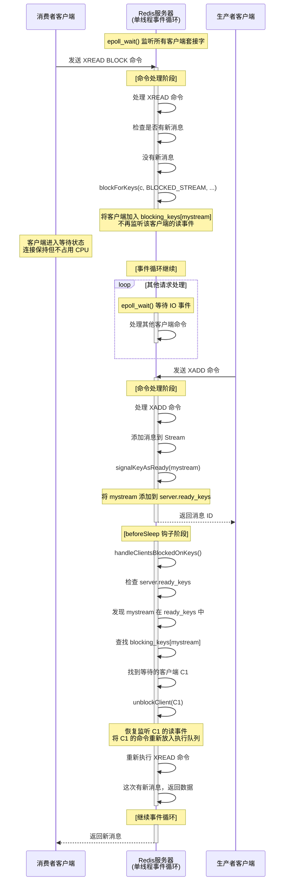

## 前言

**Redis Stream** 已经在 [Redis Data Structure](https://kyhsdjq.github.io/posts/Redis-Data-Structure/) 中初步介绍，本文针对它如何实现详细介绍。

## 介绍

**Stream** 是专为 **消息队列** 设计的数据类型，来看看它提供哪些命令：
- `XADD`：插入消息，自动生成全局 ID 并返回
- `XREAD`：读取下一条消息，可配置阻塞读
- `XGROUP`：创建消费组
- `XACK`：通知消息处理完成
- `XPENDING`：宕机后查看尚未处理完成的命令

**Stream** 解决了 **List** 实现 **消息队列** 的一些问题，整理一下它的优点：
- 自动维护 **全局 ID**
- 支持 **消费组**
- 提供完善的 **PENDING List** 操作

### 问题

#### 消息丢失

消息队列包含三个环节：**消息生产**、**消息存储**、**消息消费**。

在 **消息生产** 环节，是否丢失主要取决于 **生产者**，只要能正常受到 redis 返回的 ack 确认，就代表生产成功。

在 **消息生产** 环节，**可能丢失消息**。单机情况下，因为 AOF 不一定是实时写入，宕机时可能丢失数据；主从复制情况下，节点同步异步，可能丢失数据。

> AOF 提供 3 种写回策略：always，everysec，no，安全性递减，后两者丢失数据风险较大。
{: .prompt-info }

在 **消息生产** 环节，Stream 提供了 PENDING List 留存信息，因此消费者宕机后还能够还原，**不会丢失消息**。

#### 消息堆积

为防止消息堆积导致 OOM (out of memory)，redis 可以指定消息队列的 **最大长度**。如果消息过多，旧消息会被删除，导致丢失消息。

> Kafka、RabbitMQ 等专业的消息队列中间件将数据存储在 **磁盘** 上，可以积压大量消息。
{: .prompt-info }

### 应用场景

因为上面的问题，通过 stream 来实现消息队列适合以下业务场景：
- 对消息丢失不敏感
- 消息积压概率较小

> **为什么不用 Redis 发布/订阅机制来实现消息队列？**
> - 发布/订阅机制不支持持久化，宕机后消息全部丢失
> - 发布/订阅机制发后即忘，消费者短暂离线后过去的消息全部丢失
> - 消费者消息积压会直接断开连接
> 综上，Redis 发布/订阅机制只适合 **即时通讯**，例如哨兵集群中的通讯。
{: .prompt-tip }

## 生产与消费

### 核心数据结构

参考源码位置：[stream.h](https://github.com/redis/redis/blob/8.4/src/stream.h)

Stream 整体结构：

```c
typedef struct stream {
    rax *rax;               /* The radix tree holding the stream. */
    uint64_t length;        /* Current number of elements inside this stream. */
    streamID last_id;       /* Zero if there are yet no items. */
    streamID first_id;      /* The first non-tombstone entry, zero if empty. */
    streamID max_deleted_entry_id;  /* The maximal ID that was deleted. */
    uint64_t entries_added; /* All time count of elements added. */
    size_t alloc_size;      /* Total allocated memory (in bytes) by this stream. */
    rax *cgroups;           /* Consumer groups dictionary: name -> streamCG */
    rax *cgroups_ref;       /* Index mapping message IDs to their consumer groups. */
    streamID min_cgroup_last_id;  /* The minimum ID of consume group. */
    unsigned int min_cgroup_last_id_valid: 1;
} stream;
```

#### StreamID

StreamID 就是消息队列的全局 ID，它的源码：

```c
/* Stream item ID: a 128 bit number composed of a milliseconds time and
 * a sequence counter. IDs generated in the same millisecond (or in a past
 * millisecond if the clock jumped backward) will use the millisecond time
 * of the latest generated ID and an incremented sequence. */
typedef struct streamID {
    uint64_t ms;        /* Unix time in milliseconds. */
    uint64_t seq;       /* Sequence number. */
} streamID;
```

#### rax 数据结构

**rax**（Radix Tree）即 **压缩前缀树**，用来高速存储和检索 Stream 条目。来看看它的 [源码](https://github.com/redis/redis/blob/unstable/src/rax.h#L113)：

```c
/* Representation of a radix tree as implemented in this file, that contains
 * the strings "foo", "foobar" and "footer" after the insertion of each
 * word. When the node represents a key inside the radix tree, we write it
 * between [], otherwise it is written between ().
 *
 * This is the vanilla representation:
 *
 *              (f) ""
 *                \
 *                (o) "f"
 *                  \
 *                  (o) "fo"
 *                    \
 *                  [t   b] "foo"
 *                  /     \
 *         "foot" (e)     (a) "foob"
 *                /         \
 *      "foote" (r)         (r) "fooba"
 *              /             \
 *    "footer" []             [] "foobar"
 *
 * However, this implementation implements a very common optimization where
 * successive nodes having a single child are "compressed" into the node
 * itself as a string of characters, each representing a next-level child,
 * and only the link to the node representing the last character node is
 * provided inside the representation. So the above representation is turned
 * into:
 *
 *                  ["foo"] ""
 *                     |
 *                  [t   b] "foo"
 *                  /     \
 *        "foot" ("er")    ("ar") "foob"
 *                 /          \
 *       "footer" []          [] "foobar"
 *
 * However this optimization makes the implementation a bit more complex.
 * For instance if a key "first" is added in the above radix tree, a
 * "node splitting" operation is needed, since the "foo" prefix is no longer
 * composed of nodes having a single child one after the other. This is the
 * above tree and the resulting node splitting after this event happens:
 *
 *
 *                    (f) ""
 *                    /
 *                 (i o) "f"
 *                 /   \
 *    "firs"  ("rst")  (o) "fo"
 *              /        \
 *    "first" []       [t   b] "foo"
 *                     /     \
 *           "foot" ("er")    ("ar") "foob"
 *                    /          \
 *          "footer" []          [] "foobar"
 *
 * Similarly after deletion, if a new chain of nodes having a single child
 * is created (the chain must also not include nodes that represent keys),
 * it must be compressed back into a single node.
 *
 */

#define RAX_NODE_MAX_SIZE ((1<<29)-1)
typedef struct raxNode {
    uint32_t iskey:1;     /* Does this node contain a key? */
    uint32_t isnull:1;    /* Associated value is NULL (don't store it). */
    uint32_t iscompr:1;   /* Node is compressed. */
    uint32_t size:29;     /* Number of children, or compressed string len. */
    /* Data layout is as follows:
     *
     * If node is not compressed we have 'size' bytes, one for each children
     * character, and 'size' raxNode pointers, point to each child node.
     * Note how the character is not stored in the children but in the
     * edge of the parents:
     *
     * [header iscompr=0][abc][a-ptr][b-ptr][c-ptr](value-ptr?)
     *
     * if node is compressed (iscompr bit is 1) the node has 1 child.
     * In that case the 'size' bytes of the string stored immediately at
     * the start of the data section, represent a sequence of successive
     * nodes linked one after the other, for which only the last one in
     * the sequence is actually represented as a node, and pointed to by
     * the current compressed node.
     *
     * [header iscompr=1][xyz][z-ptr](value-ptr?)
     *
     * Both compressed and not compressed nodes can represent a key
     * with associated data in the radix tree at any level (not just terminal
     * nodes).
     *
     * If the node has an associated key (iskey=1) and is not NULL
     * (isnull=0), then after the raxNode pointers pointing to the
     * children, an additional value pointer is present (as you can see
     * in the representation above as "value-ptr" field).
     */
    unsigned char data[];
} raxNode;

typedef struct rax {
    raxNode *head;
    uint64_t numele;
    uint64_t numnodes;
    size_t *alloc_size;
    void *metadata[];
} rax;
```

可以看到，`raxNode` 的 `data` 可以存储一个 **值指针**（value-ptr），也就是说我们可以把 `rax` 作为 **字典**，将键值对存入其中。

Stream 中就包含这样的三个字典：`rax`，`cgroups`，`cgroups_ref`：

| name          | key        | value                                                     |
| :------------ | :--------- | :-------------------------------------------------------- |
| `rax`         | StreamID   | listpack（其中包含多条消息）                              |
| `cgroups`     | 消费组名称 | 消费组 (`streamCG`)                                       |
| `cgroups_ref` | StreamID   | `list` 链表（存储 `streamCG*`，即引用该消息的所有消费组） |

#### rax 表

以下信息参考 [t_stream.c](https://github.com/redis/redis/blob/8.4/src/t_stream.c) 中的注释。

Stream 中最重要的一张表是 `rax`，它维护了 StreamID 到 listpack 的映射，做了一些特殊的优化。

从上面 StreamID 的实现可以看出：添加时间越晚，StreamID 越大，因此查询最近添加的消息只需查看 `rax` 尾部。

`rax` 中的每个 listpack 中可能包含多条消息。每个 listpack 都有且仅有一个 **主条目**，用于 **优化存储**。

```
+-------+---------+------------+---------+--/--+---------+---------+-+
| count | deleted | num-fields | field_1 | field_2 | ... | field_N |0|
+-------+---------+------------+---------+--/--+---------+---------+-+
```

| 字段                           | 含义                           |
| :----------------------------- | :----------------------------- |
| count                          | 当前 listpack 中有效条目的数量 |
| deleted                        | 被标记为删除的条目数量         |
| num-fields                     | 字段数量                       |
| field_1, field_2, ..., field_N | 字段名列表                     |
| 0                              | 终止符                         |

主条目通过 **字段压缩** 的方式来优化存储，例子如下：

```
条目1: {name: "张三", age: "25", city: "北京"}
条目2: {name: "李四", age: "30", city: "上海"}  
条目3: {name: "王五", age: "28", city: "广州"}
```

压缩后：

```
主条目: {fields: ["name", "age", "city"]}
条目1: {flag: SAMEFIELDS, values: ["张三", "25", "北京"]}
条目2: {flag: SAMEFIELDS, values: ["李四", "30", "上海"]}
条目3: {flag: SAMEFIELDS, values: ["王五", "28", "广州"]}
```

此外，条目的 StreamID 也只会保存 ms（毫秒）和 seq（序列号），表示相对于 `rax` 中的 key 的偏移量。结构如下：

```
+-----+--------+-------+-/-+-------+--------+
|flags|entry-id|value-1|...|value-N|lp-count|
+-----+--------+-------+-/-+-------+--------+
```

| 字段                           | 含义                                                                                                    |
| :----------------------------- | :------------------------------------------------------------------------------------------------------ |
| flags                          | 编码，标识字段名是否完全相同                                                                            |
| entry-id                       | 上面提到的 ms 和 seq                                                                                    |
| value_1, value_2, ..., value_N | 字段值列表                                                                                              |
| lp-count                       | 放在字段末尾的长度，用处参考 [listpack](https://kyhsdjq.github.io/posts/Redis-Data-Structure/#listpack) |

#### cgroups_ref 表

`cgroups_ref` 是一个 **反向索引表**，用于快速查找哪些消费组还持有对某条消息的引用（即该消息在哪些消费组的 PEL 中）。

**Value**：一个 **链表**（`list*`），链表的每个节点存储一个 **消费组指针**（`streamCG*`）

##### 功能和作用

`cgroups_ref` 的核心功能是 **追踪消息引用关系**，主要用于：

1. **消息删除判断**：判断一条消息是否可以安全删除
   - 如果 `cgroups_ref` 中存在该消息的条目，说明还有消费组未确认该消息
   - 只有当消息不在任何消费组的 PEL 中时，才能被完全删除

2. **消息引用清理**：批量清理消息的所有消费组引用
   - 用于 `XDEL`、`XTRIM`、`XACKDEL` 等命令的 `DELREF` 选项
   - 可以一次性找到并删除所有消费组中对该消息的引用

3. **优化查询性能**：避免遍历所有消费组
   - 如果没有 `cgroups_ref`，要判断一条消息是否可删除，需要遍历所有消费组的 PEL
   - 有了 `cgroups_ref`，直接查询即可知道哪些消费组引用了该消息

### 添加条目

参考源码位置：[t_stream.c](https://github.com/redis/redis/blob/8.4/src/t_stream.c#L439)

函数描述：

```c
/* Adds a new item into the stream 's' having the specified number of
 * field-value pairs as specified in 'numfields' and stored into 'argv'.
 * Returns the new entry ID populating the 'added_id' structure.
 *
 * If 'use_id' is not NULL, the ID is not auto-generated by the function,
 * but instead the passed ID is used to add the new entry. In this case
 * adding the entry may fail as specified later in this comment.
 * 
 * When 'use_id' is used alongside with a zero 'seq-given', the sequence
 * part of the passed ID is ignored and the function will attempt to use an
 * auto-generated sequence.
 *
 * The function returns C_OK if the item was added, this is always true
 * if the ID was generated by the function. However the function may return
 * C_ERR in several cases:
 * 1. If an ID was given via 'use_id', but adding it failed since the
 *    current top ID is greater or equal. errno will be set to EDOM.
 * 2. If a size of a single element or the sum of the elements is too big to
 *    be stored into the stream. errno will be set to ERANGE. */
int streamAppendItem(stream *s, robj **argv, int64_t numfields, streamID *added_id, streamID *use_id, int seq_given);
```

其中介绍了很多 StreamID 生成的细节，我们只要关注：
- `s` 是要添加条目的流
- `argv` 和 `numfields` 存放条目的值
- 结果的 StreamID 存入 `added_id` 中
- 成功返回 `C_OK`，失败返回 `C_ERR`

接下来我们看看插入的核心逻辑：

1. 获取尾部 listpack（StreamId 字典序最大的，也就是最新的）
    ```c
    raxIterator ri;
    raxStart(&ri,s->rax);
    raxSeek(&ri,"$",NULL,0);
    size_t lp_bytes = 0;
    unsigned char *lp = NULL;
    if (!raxEOF(&ri)) {
        lp = ri.data;
        lp_bytes = lpBytes(lp);
    }
    raxStop(&ri);
    ```
2. 判断是否要创建新节点
    ```c
    if (lp != NULL) {
        int new_node = 0;
        size_t node_max_bytes = server.stream_node_max_bytes;
        // 检查字节数限制
        if (lp_bytes + totelelen >= node_max_bytes) {
            new_node = 1;
        } 
        // 检查条目数限制
        else if (server.stream_node_max_entries) {
            // 统计当前节点的条目数
            if (count >= server.stream_node_max_entries) new_node = 1;
        }
    }    
    ```
3. 处理 listpack 节点
    ```c
    if (lp == NULL) { // 创建新节点
        master_id = id;
        streamEncodeID(rax_key,&id);
        // 创建新listpack，包含主条目
        lp = lpNew(prealloc);
        lp = lpAppendInteger(lp,1); // 条目计数
        lp = lpAppendInteger(lp,0); // 删除计数
        lp = lpAppendInteger(lp,numfields); // 字段数
        // 添加字段名作为主条目
        for (int64_t i = 0; i < numfields; i++) {
            sds field = argv[i*2]->ptr;
            lp = lpAppend(lp,(unsigned char*)field,sdslen(field));
        }
        lp = lpAppendInteger(lp,0); // 主条目终止符
    }
    else { // 使用现有节点
        // 更新条目计数
        int64_t count = lpGetInteger(lp_ele);
        lp = lpReplaceInteger(lp,&lp_ele,count+1);
        // 检查字段是否与主条目相同
        if (numfields == master_fields_count) {
            // 比较每个字段名
            if (i == master_fields_count) flags |= STREAM_ITEM_FLAG_SAMEFIELDS;
        }
    }
    ```
4. 添加新条目
    ```c
    // 添加条目标志
    lp = lpAppendInteger(lp,flags);
    // 添加时间戳和序列号的差值（相对于主条目）
    lp = lpAppendInteger(lp,id.ms - master_id.ms);
    lp = lpAppendInteger(lp,id.seq - master_id.seq);

    // 如果字段不同于主条目，需要存储字段名
    if (!(flags & STREAM_ITEM_FLAG_SAMEFIELDS))
        lp = lpAppendInteger(lp,numfields);

    // 添加字段和值
    for (int64_t i = 0; i < numfields; i++) {
        sds field = argv[i*2]->ptr, value = argv[i*2+1]->ptr;
        if (!(flags & STREAM_ITEM_FLAG_SAMEFIELDS))
            lp = lpAppend(lp,(unsigned char*)field,sdslen(field));
        lp = lpAppend(lp,(unsigned char*)value,sdslen(value));
    }

    // 计算并存储lp-count字段
    int64_t lp_count = numfields + 3; // 值数量 + 3个固定字段
    if (!(flags & STREAM_ITEM_FLAG_SAMEFIELDS)) {
        lp_count += numfields + 1; // 字段名 + 字段数量字段
    }
    lp = lpAppendInteger(lp,lp_count);
    ```

最后看看函数整体执行流程：
1. 生成 StreamID
2. 验证新ID的有效性
3. 检查数据大小限制
4. 获取尾部 listpack
5. 判断是否需要创建新节点
6. 处理 listpack 节点
7. 编码并添加新条目
8. 更新流状
9. 返回成功

### 总结

Stream 通过 **rax + listpack** 的方式实现消息的存储，此外在 **listpack** 中 **抽取相同的字段名** 来节约存储空间。

## 消费组

### 核心数据结构

#### 消费组结构

```c
/* Consumer group. */
typedef struct streamCG {
    streamID last_id;       /* Last delivered (not acknowledged) ID for this
                               group. Consumers that will just ask for more
                               messages will served with IDs > than this. */
    long long entries_read; /* In a perfect world (CG starts at 0-0, no dels, no
                               XGROUP SETID, ...), this is the total number of
                               group reads. In the real world, the reasoning behind
                               this value is detailed at the top comment of
                               streamEstimateDistanceFromFirstEverEntry(). */
    rax *pel;               /* Pending entries list. This is a radix tree that
                               has every message delivered to consumers (without
                               the NOACK option) that was yet not acknowledged
                               as processed. The key of the radix tree is the
                               ID as a 64 bit big endian number, while the
                               associated value is a streamNACK structure.*/
    rax *pel_by_time;       /* A radix tree mapping delivery time to pending
                               entries, so that we can query faster PEL entries
                               by time. The key is a pelTimeKey structure containing
                               both delivery_time and stream ID. All information is
                               in the key; no value is stored. */
    rax *consumers;         /* A radix tree representing the consumers by name
                               and their associated representation in the form
                               of streamConsumer structures. */
} streamCG;
```

其中包含三个 `rax` 字典：

| name          | key                 | value                                           |
| :------------ | :------------------ | :---------------------------------------------- |
| `pel`         | StreamID            | `streamNACK` 结构（包含消费者信息、交付时间等） |
| `pel_by_time` | 交付时间 + StreamID | 无值存储（信息都在 key 中）                     |
| `consumers`   | 消费者名称          | `streamConsumer` 结构（消费者的相关信息）       |

##### 1. pel（Pending Entries List，待确认条目列表）

**作用**：存储消费组中所有已分配但尚未确认（ACK）的消息，确保 **至少一次传递** 语义。

**在主要命令中的操作**：

- **XREADGROUP**：
  - **写入**：当消费者读取新消息时（非 NOACK 模式），Redis 会创建 `streamNACK` 结构并插入到 `pel` 中
  - **读取**：当使用具体 ID（如 `0`）而非 `>` 时，从消费者的 PEL 中读取待确认消息
  
- **XACK**：
  - **删除**：确认消息后，从 `group->pel` 和 `consumer->pel` 中删除对应的 `streamNACK` 条目
  
- **XCLAIM/XAUTOCLAIM**：
  - **读取+修改**：查找指定消费者的待确认消息，将其重新分配给新消费者（更新 `streamNACK->consumer` 字段）

##### 2. pel_by_time（时间索引的待确认列表）

**作用**：提供基于 **交付时间** 的索引，用于快速查找空闲时间超过阈值的消息，支持消息重新分配（claim）。

**在主要命令中的操作**：

- **XREADGROUP（带 CLAIM 选项）**：
  - **扫描**：从头遍历 `pel_by_time`，查找 `idle_time >= min_idle_time` 的消息
  - 示例：`XREADGROUP GROUP mygroup consumer1 CLAIM 3600000 STREAMS mystream >` 会扫描空闲超过1小时的消息
  
- **XAUTOCLAIM**：
  - **扫描+修改**：自动扫描超时消息并将其声明给当前消费者
  - 相比手动 XCLAIM，XAUTOCLAIM 直接利用 `pel_by_time` 索引提高效率
  
- **XPENDING**：
  - **读取**：查询指定时间范围内的待确认消息
  - 示例：`XPENDING mystream mygroup - + 10` 可通过时间索引快速返回结果

##### 3. consumers（消费者字典）

**作用**：管理消费组内所有消费者的信息，包括消费者名称、最后活跃时间、以及各自的待确认消息列表。

**在主要命令中的操作**：

- **XREADGROUP**：
  - **查找/创建**：根据消费者名称在 `consumers` 中查找，不存在则自动创建
  - **更新**：更新消费者的 `seen_time`（最后可见时间）

##### 4. last_id（消费组最后交付的 ID）

**作用**：记录消费组最后一次分配给消费者的消息 ID，用于追踪消费进度，确保新消息不会被重复分配。

**在主要命令中的操作**：

- **XREADGROUP（使用 `>` 符号）**：
  - **读取**：将 `>` 替换为 `group->last_id`，从该位置之后读取新消息
  - **更新**：在 `streamReplyWithRange` 中，每分配一条消息就更新 `group->last_id`

- **XGROUP SETID**：
  - **写入**：手动设置 `group->last_id`，用于重置消费进度
  - 示例：`XGROUP SETID mystream mygroup 0` 将消费组重置到起始位置

- **XGROUP CREATE**：
  - **初始化**：创建消费组时设置初始 `last_id`
  - 示例：`XGROUP CREATE mystream mygroup $` 将 `last_id` 设置为当前流的最后一个 ID

##### 5. entries_read（消费组已读取条目计数）

**作用**：记录消费组从创建以来读取的消息总数，主要用于 **滞后量（lag）计算** 和监控。

> **滞后量**（Lag）是消息队列系统中的核心监控指标，表示 **消费组尚未消费的消息数量**。
> - **消费能力评估**：Lag 直接反映消费者组的处理能力是否跟得上生产者的生产速度
> - **性能瓶颈定位**：通过对比多个消费组的 lag，可以定位系统瓶颈
> - **告警与自动扩容**：Lag 是实现监控告警和自动扩容的关键指标
> - **SLA 保障**：在有时效性要求的业务中，lag 可以转换为消息延迟时间
{: .prompt-info }

**计算逻辑**：
- **理想情况**：消费组从 `0-0` 开始，无删除、无 SETID 操作，`entries_read` 就是准确的读取总数
- **实际情况**：由于可能存在消息删除、消费组重置等操作，`entries_read` 作为估算值，配合 `stream->entries_added` 来计算滞后量

**在主要命令中的操作**：

- **XREADGROUP**：
  - **更新**：在 `streamReplyWithRange` 中，每返回一条新消息（非历史消息）就递增 `entries_read`
  - 代码示例：
    ```c
    // streamReplyWithRange 函数中
    if (!serve_history) {  // 读取新消息时
        group->entries_read++;
        group->last_id = current_id;
    }
    ```

- **XINFO GROUPS**：
  - **读取**：返回消费组信息时，使用 `entries_read` 和 `stream->entries_added` 计算滞后量（lag）
  - 计算公式：`lag = stream->entries_added - group->entries_read - (已删除但未读取的消息数)`
    ```

#### streamNack

streamNack 是 **未确认消息相关数据** 存储的格式，结构如下：

```c
/* Pending (yet not acknowledged) message in a consumer group. */
typedef struct streamNACK {
    mstime_t delivery_time;     /* Last time this message was delivered. */
    uint64_t delivery_count;    /* Number of times this message was delivered.*/
    streamConsumer *consumer;   /* The consumer this message was delivered to
                                   in the last delivery. */
    listNode *cgroup_ref_node; /* Reference to this NACK in the cgroups_ref list. */
} streamNACK;
```

#### streamConsumer

```c
/* A specific consumer in a consumer group.  */
typedef struct streamConsumer {
    mstime_t seen_time;         /* Last time this consumer tried to perform an action (attempted reading/claiming). */
    mstime_t active_time;       /* Last time this consumer was active (successful reading/claiming). */
    sds name;                   /* Consumer name. This is how the consumer
                                   will be identified in the consumer group
                                   protocol. Case sensitive. */
    rax *pel;                   /* Consumer specific pending entries list: all
                                   the pending messages delivered to this
                                   consumer not yet acknowledged. Keys are
                                   big endian message IDs, while values are
                                   the same streamNACK structure referenced
                                   in the "pel" of the consumer group structure
                                   itself, so the value is shared. */
} streamConsumer;
```

### 消费组消费

消费组消费的核心实现在 `xreadCommand` 函数中，该函数同时处理 `XREAD` 和 `XREADGROUP` 命令（[源码位置](https://github.com/redis/redis/blob/8.4/src/t_stream.c#L2503)），以下是对它的说明：

```c
/* XREAD [BLOCK <milliseconds>] [COUNT <count>] STREAMS key_1 key_2 ... key_N
 *       ID_1 ID_2 ... ID_N
 *
 * This function also implements the XREADGROUP command, which is like XREAD
 * but accepting the [GROUP group-name consumer-name] additional option.
 * This is useful because while XREAD is a read command and can be called
 * on slaves, XREADGROUP is not. */
```

#### 消费流程分析

##### 1. 命令识别与参数解析

```c
int xreadgroup = sdslen(c->argv[0]->ptr) == 10; /* XREAD or XREADGROUP? */
```

通过命令名称长度判断是 `XREAD`(5字符) 还是 `XREADGROUP`(10字符)。

解析的关键参数包括：
- `CLAIM <min-idle-time>`: 声明空闲时间超过指定值的消息（仅 XREADGROUP）
- `BLOCK <timeout>`: 阻塞等待超时时间
- `COUNT <count>`: 返回的最大消息数量
- `STREAMS <keys...> <ids...>`: 要读取的流及起始ID
- `GROUP <group> <consumer>`: 消费组和消费者名称（仅 XREADGROUP）
- `NOACK`: 不创建 PEL 条目（仅 XREADGROUP）

##### 2. ID 解析与验证

**三种特殊 ID 详解**：

Redis Stream 支持三种特殊 ID 符号，它们在不同场景下有不同的含义和处理方式：

**2.1 `$` - 流的最后一个ID**

**含义**：表示流中当前最后一个（最新的）消息ID。

**在 XREAD 中的处理**：
```c
if (strcmp(c->argv[i]->ptr,"$") == 0) {
    if (xreadgroup) {
        addReplyError(c,"The $ ID is meaningless in the context of "
                        "XREADGROUP: you want to read the history of "
                        "this consumer by specifying a proper ID, or "
                        "use the > ID to get new messages. The $ ID would "
                        "just return an empty result set.");
        goto cleanup;
    }
    if (o) {
        stream *s = o->ptr;
        ids[id_idx] = s->last_id;  // 使用流的last_id
    } else {
        ids[id_idx].ms = 0;
        ids[id_idx].seq = 0;
    }
    continue;
}
```

**使用场景**：
- **单个消费者（XREAD）**：用于从"现在"开始读取，只获取后续新到达的消息
- **消费组（XREADGROUP）**：被拒绝，因为消费组有自己的 `last_id` 追踪机制

**存在原因**：
1. **实时消费**：允许消费者从当前时刻开始监听，忽略历史消息
2. **简化API**：无需手动查询当前最大ID，直接用 `$` 表示
3. **阻塞读取**：配合 `BLOCK` 选项实现类似 `tail -f` 的效果

**示例**：
```bash
# 阻塞等待新消息，忽略历史消息
XREAD BLOCK 0 STREAMS mystream $
```

**2.2 `+` - 最大可能的ID**

**含义**：表示理论上最大的 StreamID（`UINT64_MAX-UINT64_MAX`）。

**在 XREAD 中的处理**：
```c
else if (strcmp(c->argv[i]->ptr,"+") == 0) {
    if (xreadgroup) {
        addReplyError(c,"The + ID is meaningless in the context of "
                        "XREADGROUP: you want to read the history of "
                        "this consumer by specifying a proper ID, or "
                        "use the > ID to get new messages. The + ID would "
                        "just return an empty result set.");
        goto cleanup;
    }
    if (o && ((stream *)o->ptr)->length) {
        stream *s = o->ptr;
        // 获取最后一个有效ID
        streamLastValidID(s, &ids[id_idx]);
        streamDecrID(&ids[id_idx]);  // 减1，确保包含最后一条
    } else {
        ids[id_idx].ms = 0;
        ids[id_idx].seq = 0;
    }
    continue;
}
```

**使用场景**：
- **单个消费者（XREAD）**：用于读取流中所有现有消息（包括最后一条）
- **消费组（XREADGROUP）**：被拒绝，应使用 `>` 或具体ID

**存在原因**：
1. **范围查询**：在 `XRANGE` 等命令中表示范围的上界
2. **完整读取**：配合 `-` 可以读取流中所有消息
3. **API一致性**：与 `-` 对称，表示ID的两个极端

**示例**：
```bash
# 读取流中所有消息
XRANGE mystream - +

# 从某个ID读取到末尾
XREAD STREAMS mystream 1234567890-0
```

**2.3 `>` - 消费组的新消息标记**

**含义**：表示获取消费组尚未传递的新消息（大于 `group->last_id` 的消息）。

**在 XREADGROUP 中的处理**：
```c
else if (strcmp(c->argv[i]->ptr,">") == 0) {
    if (!xreadgroup) {
        addReplyError(c,"The > ID can be specified only when calling "
                        "XREADGROUP using the GROUP <group> "
                        "<consumer> option.");
        goto cleanup;
    }
    // 使用最大值作为标记，后续会替换为group->last_id
    ids[id_idx].ms = UINT64_MAX;
    ids[id_idx].seq = UINT64_MAX;
    continue;
}
```

**后续处理**：
```c
// 在同步服务判断中
if (groups) {
    if (gt->ms != UINT64_MAX || gt->seq != UINT64_MAX) {
        // 指定了具体ID，读取消费者的历史消息（PEL）
        serve_synchronously = 1;
        serve_history = 1;
    } else if (s->length) {
        // 使用 > 符号，读取新消息
        streamID maxid, *last = &groups[i]->last_id;
        streamLastValidID(s, &maxid);
        if (streamCompareID(&maxid, last) > 0) {
            serve_synchronously = 1;
            *gt = *last;  // 将 > 替换为 group->last_id
        }
    }
}
```

**使用场景**：
- **单个消费者（XREAD）**：不支持，会报错
- **消费组（XREADGROUP）**：专用符号，获取消费组未分配的新消息

**存在原因**：
1. **消费组语义**：区分"读取新消息"和"读取历史消息（PEL）"两种模式
2. **自动追踪**：无需手动管理消费组的 `last_id`，由 Redis 自动维护
3. **负载均衡**：确保新消息在消费组内公平分配，避免重复消费

**示例**：
```bash
# 读取新消息（自动分配）
XREADGROUP GROUP mygroup consumer1 STREAMS mystream >

# 读取消费者的待确认消息（历史）
XREADGROUP GROUP mygroup consumer1 STREAMS mystream 0
```

**三种ID的对比总结**：

| 特殊ID | XREAD（单消费者） | XREADGROUP（消费组） | 内部表示                        | 主要用途           |
| :----- | :---------------- | :------------------- | :------------------------------ | :----------------- |
| `$`    | ✅ 流的last_id     | ❌ 被拒绝             | `s->last_id`                    | 实时消费，忽略历史 |
| `+`    | ✅ 最后有效ID-1    | ❌ 被拒绝             | `streamLastValidID() - 1`       | 范围查询上界       |
| `>`    | ❌ 被拒绝          | ✅ 组的last_id        | `UINT64_MAX` → `group->last_id` | 消费组新消息       |

##### 3. 同步服务尝试

对每个流进行检查，判断是否可以立即返回数据：

**3.1 处理 CLAIM 选项的过期消息**

如果指定了 `min_idle_time`，扫描 `pel_by_time` 索引查找空闲时间足够长的消息：

```c
if (group && min_idle_time != -1) {
    raxIterator ri;
    raxStart(&ri, group->pel_by_time);
    raxSeek(&ri, "^", NULL, 0);
    while (raxNext(&ri)) {
        pelTimeKey pelKey;
        decodePelTimeKey(ri.key, &pelKey);
        uint64_t idle = commandTimeSnapshot() - pelKey.delivery_time;
        if (idle < (uint64_t)min_idle_time)
            break;
        // 收集符合条件的消息...
    }
}
```

对于每个符合条件的消息：
1. 从流中获取消息数据
2. 返回包含 ID、字段值对、空闲时间和传递次数的四元素数组
3. 将 NACK 从原消费者转移到当前消费者
4. 更新传递元数据并传播 XCLAIM 操作

**3.2 判断是否可以同步服务**

```c
if (groups) {
    // 情况1: 指定了非 ">" 的 ID，服务消费者的本地历史
    if (gt->ms != UINT64_MAX || gt->seq != UINT64_MAX) {
        serve_synchronously = 1;
        serve_history = 1;
    }
    // 情况2: 流中有新消息（last_id > group->last_id）
    else if (s->length) {
        streamID maxid, *last = &groups[i]->last_id;
        streamLastValidID(s, &maxid);
        if (streamCompareID(&maxid, last) > 0) {
            serve_synchronously = 1;
            *gt = *last;
        }
    }
}
```

**3.3 消费者创建**

如果消费者不存在，自动创建：

```c
consumer = streamLookupConsumer(groups[i],consumername->ptr);
if (consumer == NULL) {
    old_alloc = s->alloc_size;
    consumer = streamCreateConsumer(s,groups[i],consumername->ptr,
                                    c->argv[streams_arg+i],
                                    c->db->id,SCC_DEFAULT);
    if (noack)
        streamPropagateConsumerCreation(c,spi.keyname,
                                        spi.groupname,
                                        consumer->name);
}
consumer->seen_time = commandTimeSnapshot();
```

##### 4. 调用 streamReplyWithRange 返回消息

```c
int flags = 0;
if (serve_history) {
    min_idle_time = -1;  // 从历史读取时忽略 CLAIM
} else if (!serve_synchronously && serve_claimed) {
    serve_synchronously = 1;
    flags |= STREAM_RWR_CLAIMED;
}

if (serve_synchronously) {
    streamID start = *gt;
    streamIncrID(&start);
    
    if (noack) flags |= STREAM_RWR_NOACK;
    if (serve_history) flags |= STREAM_RWR_HISTORY;
    
    streamReplyWithRange(c,s,&start,NULL,count,0, min_idle_time,
                         groups ? groups[i] : NULL,
                         consumer, flags, &spi, &propCount);
}
```

`streamReplyWithRange` 的核心功能：
- 如果 `serve_history=true`：只返回消费者 PEL 中的消息
- 否则：返回流中的新消息，并：
  - 更新 `group->last_id` 和 `group->entries_read`
  - 如果不是 NOACK 模式，创建 PEL 条目
  - 如果消息已被其他消费者持有，重新分配给当前消费者
  - 传播 XCLAIM 命令到 AOF 和从节点

##### 5. 阻塞处理

如果无法同步服务且指定了 `BLOCK` 选项：

```c
if (timeout != -1) {
    // 将 '$' 转换为实际的 last_id，避免自旋阻塞
    for (int id_idx = 0; id_idx < streams_count; id_idx++) {
        int arg_idx = id_idx + streams_arg + streams_count;
        if (strcmp(c->argv[arg_idx]->ptr,"$") == 0) {
            robj *argv_streamid = createObjectFromStreamID(&ids[id_idx]);
            rewriteClientCommandArgument(c, arg_idx, argv_streamid);
            decrRefCount(argv_streamid);
        }
    }
    
    // 如果设置了 min_idle_time，注册超时监控
    if (min_idle_time != -1) {
        uint64_t pel_expire_time = min_idle_time;
        if (min_pel_delivery_time != UINT64_MAX)
            pel_expire_time += min_pel_delivery_time;
        else
            pel_expire_time += commandTimeSnapshot();
        trackStreamClaimTimeouts(c, c->argv+streams_arg, streams_count, pel_expire_time);
    }
    
    blockForKeys(c, BLOCKED_STREAM, c->argv+streams_arg, streams_count, timeout, xreadgroup);
    goto cleanup;
}
```

当有新消息到达或 PEL 条目过期时，阻塞的客户端会被唤醒并重新执行命令。

### 阻塞机制详解

#### 核心问题

当执行 `XREAD BLOCK` 命令等待新消息时，Redis 是如何实现阻塞等待的？考虑到 **Redis 是单线程模型**，它不可能在主线程中进行自旋等待，那么具体是如何实现的呢？

#### 实现原理

Redis 的阻塞机制基于 **事件驱动模型**，而非自旋或多线程。具体实现如下：

##### 1. 客户端阻塞注册

当 `XREAD BLOCK` 命令无法立即返回数据时，会调用 `blockForKeys` 函数（位于 [blocked.c](https://github.com/redis/redis/blob/8.4/src/blocked.c)）：

```c
void blockForKeys(client *c, int btype, robj **keys, int numkeys, 
                  mstime_t timeout, int xreadgroup) {
    // 1. 设置客户端阻塞状态
    c->btype = btype;  // BLOCKED_STREAM
    c->bpop.timeout = timeout;
    
    // 2. 将客户端添加到阻塞字典中
    // 对每个监听的 key，在 db->blocking_keys 中注册
    for (int j = 0; j < numkeys; j++) {
        // 在数据库的 blocking_keys 字典中记录：
        // key -> [client1, client2, ...]
        dictEntry *de = dictAddOrFind(c->db->blocking_keys, keys[j]);
        list *clients = dictGetVal(de);
        listAddNodeTail(clients, c);
    }
    
    // 3. 设置超时时间（如果指定）
    if (timeout > 0) {
        c->bpop.timeout = timeout;
        // 将客户端添加到超时队列
    }
}
```

**关键数据结构**：
- `db->blocking_keys`：一个字典，映射 `key -> list<client*>`，记录哪些客户端在等待哪些 key
- `c->btype = BLOCKED_STREAM`：标记客户端处于阻塞状态

##### 2. 事件循环处理

Redis 使用 **IO 多路复用**（Linux 上是 `epoll`，macOS 上是 `kqueue`）来管理所有客户端连接。阻塞的客户端：
- **不会占用 CPU**：客户端套接字不再监听读事件
- **不会阻塞主线程**：主线程继续处理其他客户端的请求
- **等待唤醒信号**：通过 `signalKeyAsReady` 机制唤醒

##### 3. 新消息到达时的唤醒

当生产者执行 `XADD` 添加新消息时，会触发唤醒逻辑（位于 [t_stream.c](https://github.com/redis/redis/blob/8.4/src/t_stream.c)）：

```c
void xaddCommand(client *c) {
    // ... 添加消息到 Stream ...
    
    // 唤醒等待该 key 的客户端
    signalKeyAsReady(c->db, c->argv[1], OBJ_STREAM);
}
```

`signalKeyAsReady` 的核心逻辑（位于 [db.c](https://github.com/redis/redis/blob/8.4/src/db.c)）：

```c
void signalKeyAsReady(redisDb *db, robj *key, int type) {
    // 1. 查找是否有客户端在等待这个 key
    dictEntry *de = dictFind(db->blocking_keys, key);
    if (!de) return;  // 没有客户端等待
    
    // 2. 将 key 添加到 ready_keys 列表
    //    避免重复唤醒同一个 key
    if (!dictFind(db->ready_keys, key)) {
        readyList *rl = zmalloc(sizeof(*rl));
        rl->key = key;
        rl->db = db;
        listAddNodeTail(server.ready_keys, rl);
        dictAdd(db->ready_keys, key, rl);
    }
}
```

**关键数据结构**：
- `server.ready_keys`：全局列表，存储所有"准备好"的 key
- `db->ready_keys`：数据库级别的字典，用于去重

##### 4. 事件循环中的唤醒处理

在 Redis 的主事件循环 `beforeSleep` 函数中（位于 [server.c](https://github.com/redis/redis/blob/8.4/src/server.c)）：

```c
void beforeSleep(struct aeEventLoop *eventLoop) {
    // ... 其他处理 ...
    
    // 处理所有准备好的 key
    handleClientsBlockedOnKeys();
}
```

`handleClientsBlockedOnKeys` 会：

```c
void handleClientsBlockedOnKeys(void) {
    while (listLength(server.ready_keys) != 0) {
        list *l = server.ready_keys;
        server.ready_keys = listCreate();
        
        // 遍历所有准备好的 key
        while (listLength(l) != 0) {
            listNode *ln = listFirst(l);
            readyList *rl = ln->value;
            
            // 从 blocking_keys 中获取等待该 key 的客户端列表
            dictEntry *de = dictFind(rl->db->blocking_keys, rl->key);
            list *clients = dictGetVal(de);
            
            // 唤醒所有等待的客户端
            while (listLength(clients) != 0) {
                client *c = listNodeValue(listFirst(clients));
                
                // 重新执行客户端的命令
                // 这次可能会有新数据返回
                unblockClient(c);
                
                // 将客户端的命令重新放入执行队列
                processCommandAndResetClient(c);
            }
            
            // 清理
            dictDelete(rl->db->ready_keys, rl->key);
            listDelNode(l, ln);
        }
        listRelease(l);
    }
}
```

##### 5. 超时处理

如果在超时时间内没有新消息，Redis 会在事件循环中检查超时的客户端：

```c
void clientsCronHandleTimeout(client *c, mstime_t now_ms) {
    if (c->btype != BLOCKED_NONE && c->bpop.timeout > 0) {
        if (c->bpop.timeout < now_ms) {
            // 超时，返回空结果
            replyToBlockedClientTimedOut(c);
            unblockClient(c);
        }
    }
}
```

#### 工作流程总结



#### 总结

Redis Stream 的阻塞机制 **并不是通过自旋或子线程** 实现的，而是充分利用了 **事件驱动架构** 的优势：

1. **注册机制**：将阻塞的客户端注册到 `blocking_keys` 字典中
2. **信号机制**：新消息到达时，将 key 标记为 "ready"
3. **批量唤醒**：在事件循环的 `beforeSleep` 阶段批量处理所有 ready 的 key
4. **重新执行**：唤醒客户端并重新执行原命令，这次可以读取到新数据

这种设计完美契合了 Redis 的单线程模型，避免了多线程的复杂性和开销，同时提供了高效的阻塞等待能力。

### 关键数据结构总结

1. **消费者 PEL** (`consumer->pel`): 存储分配给该消费者的待确认消息
2. **消费组 PEL** (`group->pel`): 存储整个消费组的待确认消息
3. **时间索引 PEL** (`group->pel_by_time`): 按传递时间索引的 PEL，用于高效查找过期消息
4. **消费组 last_id** (`group->last_id`): 消费组最后传递的消息 ID
5. **消费组 entries_read** (`group->entries_read`): 消费组已读取的消息计数器

## 删除

消息的删除可以通过以下方式触发：
- **`XDEL <stream> <id>`**：删除指定的消息
- **`XTRIM <stream> MAXLEN <count>`**：修剪流，保留最新的 N 条消息
- **`XTRIM <stream> MINID <id>`**：删除 ID 小于指定 ID 的所有消息

这里要回答一个关键问题：**XTRIM 如何确保删除的消息已经被所有消费组消费了？**

答案可能会让人意外：**默认情况下，XTRIM 并不会等待消费组确认，它会直接删除消息！**

### 1. XTRIM 的默认行为（无保护）

```bash
# 只保留最新的 1000 条消息，旧消息直接删除
XTRIM mystream MAXLEN 1000

# 删除 ID 小于 1234567890000-0 的所有消息
XTRIM mystream MINID 1234567890000-0
```

当执行 `XTRIM` 时：
- Redis 会直接从 `stream->rax` 中删除消息
- **即使消息还在某些消费组的 PEL 中**，也会被删除
- 这会导致消费组的 PEL 中引用了已经不存在的消息

**可能的后果**：
- 消费者尝试读取 PEL 中的消息时，会发现消息已被删除
- 需要应用层处理这种"丢失"的情况

### 2. 为什么这样设计？

这是 Redis Stream 的一个重要设计选择：

- **内存优先**：Redis 是内存数据库，防止 OOM 比保证消息完全消费更重要
- **显式控制**：由应用层决定何时删除消息，而不是自动等待所有消费组
- **性能考虑**：如果要等待所有消费组确认，会严重影响性能

### 3. 如何确保安全删除？

如果你确实需要确保消息被所有消费组消费后再删除，需要在应用层实现：

**方法 1：监控所有消费组的进度**

```bash
# 1. 获取所有消费组的信息
XINFO GROUPS mystream

# 输出示例：
# 1) 1) "name"
#    2) "group1"
#    3) "last-delivered-id"
#    4) "1234567890123-0"  # 该消费组最后消费的 ID
# 2) 1) "name"
#    2) "group2"
#    3) "last-delivered-id"
#    4) "1234567890100-0"  # 该消费组最后消费的 ID

# 2. 找出所有消费组中最小的 last_id
# 3. 只删除小于这个 ID 的消息
XTRIM mystream MINID 1234567890100-0
```

**方法 2：检查 PEL 是否为空**

```bash
# 对每个消费组检查 PEL
XPENDING mystream group1 - + 1

# 如果返回空，说明该消费组没有待确认的消息
# 如果所有消费组的 PEL 都为空，才执行 XTRIM
```

**方法 3：使用 stream->min_cgroup_last_id（应用层实现）**

虽然 Redis 内部维护了 `stream->min_cgroup_last_id` 字段（记录所有消费组中最小的 `last_id`），但这个字段主要用于内部优化，`XTRIM` 命令本身 **并不会自动使用它来保护消息**。

应用层可以：
1. 通过 `XINFO GROUPS` 获取所有消费组的 `last-delivered-id`
2. 计算最小值
3. 使用 `XTRIM MINID <min_id>` 安全删除

### 4. Redis 7.0+ 的改进：墓碑机制

从 Redis 7.0 开始，引入了 **墓碑（Tombstone）** 机制：

- 当 `XTRIM` 删除消息时，如果消息还在某些消费组的 PEL 中，Redis 会保留一个"墓碑"标记
- 消费者读取时会知道消息已被删除
- 但不会完全阻止 `XTRIM` 的执行

**示例场景**：

```bash
# 1. 生产 3 条消息
XADD mystream * name "msg1"  # 1000-0
XADD mystream * name "msg2"  # 1001-0
XADD mystream * name "msg3"  # 1002-0

# 2. 消费组1消费了前2条
XREADGROUP GROUP group1 consumer1 COUNT 2 STREAMS mystream >
# 返回：1000-0, 1001-0

# 3. 还没 ACK，直接 XTRIM
XTRIM mystream MAXLEN 1
# 现在只剩 1002-0，但 1000-0 和 1001-0 还在 group1 的 PEL 中！

# 4. 消费者尝试读取 PEL 中的消息
XREADGROUP GROUP group1 consumer1 STREAMS mystream 0
# Redis 7.0+ 会返回特殊标记，表示消息已被删除
# Redis 7.0 之前可能返回空或错误
```

**最佳实践**：

1. **定期监控消费组进度**：使用 `XINFO GROUPS` 监控所有消费组的 `last-delivered-id`
2. **基于最小进度删除**：使用 `XTRIM MINID` 而不是 `MAXLEN`，可以更精确地控制删除范围
3. **设置合理的流长度限制**：在 `XADD` 时使用 `MAXLEN` 选项，让消息自然淘汰
4. **处理消息丢失**：应用层需要能够处理 PEL 中消息已被删除的情况
5. **考虑使用 NOACK 模式**：如果能接受消息丢失，使用 `XREADGROUP` 的 `NOACK` 选项，避免 PEL 积累

## 消息生命周期追踪

为了更好地理解消息在 Redis Stream 中的完整生命周期，下面总结一条消息从生产到删除的各个阶段会在哪些地方被记录，以及相关的数据结构。

### 1. 消息刚刚被生产（XADD）

当生产者通过 `XADD` 命令添加消息时，消息会被记录在以下位置：

**核心数据记录**：
- **`stream->rax`**：StreamID → listpack 映射
  - 消息被编码后存储在 listpack 中
  - 如果字段与主条目相同，只存储字段值
  - 否则需要存储完整的字段名和字段值
  
**元数据更新**：
- **`stream->last_id`**：更新为新消息的 StreamID
- **`stream->entries_added`**：全局计数器递增，记录历史添加的消息总数
- **`stream->length`**：当前流中有效消息的数量递增

### 2. 被某个消费组中的某个消费者消费（XREADGROUP）

当消费者通过 `XREADGROUP` 读取消息时，会产生大量的追踪数据：

**消费组级别的记录**：
- **`group->last_id`**：更新为最后分配的消息 ID
  - 确保新消息不会被重复分配
  - 下次使用 `>` 时从这个位置之后读取
  
- **`group->entries_read`**：消费组已读取的消息计数器递增
  - 用于计算滞后量（lag = `stream->entries_added` - `group->entries_read`）

**如果不是 NOACK 模式，还会创建 PEL 条目**：

- **`group->pel`**：StreamID → streamNACK 映射
  - 记录消费组中所有待确认的消息
  - `streamNACK` 包含：
    - `delivery_time`：消息分配的时间戳
    - `delivery_count`：消息被分配的次数（用于检测重复消费）
    - `consumer`：指向持有该消息的消费者
    - `cgroup_ref_node`：指向 `cgroups_ref` 中的节点

- **`group->pel_by_time`**：(delivery_time + StreamID) → 无值
  - 时间索引，用于快速查找空闲时间超过阈值的消息
  - 支持 `XAUTOCLAIM` 和 `XCLAIM` 操作

- **`consumer->pel`**：StreamID → streamNACK 映射（引用同一个 `streamNACK` 对象）
  - 记录该消费者持有的所有待确认消息
  - 与 `group->pel` 共享 `streamNACK` 对象，节省内存

- **`stream->cgroups_ref`**：StreamID → list\<streamCG\*\> 映射
  - 反向索引，记录哪些消费组引用了该消息
  - 用于快速判断消息是否可以删除
  - 每个链表节点指向一个消费组

**消费者级别的更新**：
- **`consumer->seen_time`**：更新为当前时间戳
- **`consumer->active_time`**：成功读取消息时更新

### 3. 消费后被确认（XACK）

当消费者通过 `XACK` 确认消息处理完成时，会清理相关的 PEL 数据：

**删除的数据**：
- **`group->pel`**：删除该 StreamID 的 `streamNACK` 条目
- **`consumer->pel`**：删除该 StreamID 的条目（引用已被删除）
- **`group->pel_by_time`**：删除时间索引条目
- **`stream->cgroups_ref`**：从链表中移除该消费组的引用
  - 如果链表变为空，删除整个 StreamID 条目

**保持不变的数据**：
- **`stream->rax`**：消息数据保持不变，仍然存在于流中
- **`group->last_id`**：不变，继续指向最后分配的消息
- **`group->entries_read`**：不变，只在读取新消息时递增

### 4. 最终被彻底删除

消息的删除可以通过以下方式触发：
- **`XDEL <stream> <id>`**：删除指定的消息
- **`XTRIM <stream> MAXLEN <count>`**：修剪流，保留最新的 N 条消息
- **`XTRIM <stream> MINID <id>`**：删除 ID 小于指定 ID 的所有消息

**删除前的检查**（仅限 `XDEL` 命令）：

`XDEL` 命令在删除消息时会检查 `stream->cgroups_ref`：
1. **检查 `stream->cgroups_ref`**：
   - 如果该 StreamID 在 `cgroups_ref` 中存在，说明还有消费组未确认该消息
   - 需要先清理所有消费组的 PEL 引用
   
2. **从所有消费组中清理**（如果存在引用）：
   - 遍历 `cgroups_ref[StreamID]` 链表中的所有消费组
   - 从每个 `group->pel` 中删除该消息
   - 从对应的 `consumer->pel` 中删除
   - 从 `group->pel_by_time` 中删除时间索引
   - 清空 `stream->cgroups_ref[StreamID]`

**删除的数据**：
- **`stream->rax`**：删除该 StreamID 的 listpack 条目
  - 如果 listpack 中还有其他消息，只标记该消息为已删除
  - 如果 listpack 变为空，删除整个 rax 节点
  
**元数据更新**：
- **`stream->length`**：当前流中有效消息的数量递减
- **`stream->max_deleted_entry_id`**：更新为被删除的最大 StreamID
- **`stream->entries_added`**：不变（历史计数器）

## 总结

Redis Stream 通过精心设计的多层数据结构实现了高性能的消息队列：

**核心设计原则：**
1. **时间有序性**：基于时间戳的 StreamID 确保条目的自然排序
2. **内存效率**：Radix Tree + Listpack 的组合最大化内存利用率
3. **查询性能**：基数树提供高效的范围查询能力
4. **可扩展性**：支持消费者组的分布式消费模式
5. **事件驱动**：通过事件循环机制实现高效的阻塞等待，避免自旋和多线程开销

### Rax 与其他数据结构对比

Redis Stream 选择 **Rax（Radix Tree，基数树）** 作为核心索引结构并非偶然。下面通过与其他常用数据结构的对比，分析这一选择的优势：

| 特性               | Rax (基数树)                | 跳表 (Skip List)         | B+ 树                    | 红黑树 (RB Tree)       |
| :----------------- | :-------------------------- | :----------------------- | :----------------------- | :--------------------- |
| **查询复杂度**     | O(k)，k 为键长度            | O(log n)                 | O(log n)                 | O(log n)               |
| **插入复杂度**     | O(k)                        | O(log n)                 | O(log n)                 | O(log n)               |
| **范围查询**       | ⭐⭐⭐⭐⭐ 优秀                  | ⭐⭐⭐⭐⭐ 优秀               | ⭐⭐⭐⭐⭐ 优秀               | ⭐⭐⭐ 中等               |
| **顺序遍历**       | ⭐⭐⭐⭐⭐ 天然有序              | ⭐⭐⭐⭐⭐ 天然有序           | ⭐⭐⭐⭐⭐ 天然有序           | ⭐⭐⭐ 需要中序遍历       |
| **前缀查询**       | ⭐⭐⭐⭐⭐ 天然支持              | ⭐ 不支持                 | ⭐ 不支持                 | ⭐ 不支持               |
| **空间效率**       | ⭐⭐⭐⭐⭐ 压缩前缀              | ⭐⭐⭐ 指针开销大           | ⭐⭐⭐⭐ 节点紧凑            | ⭐⭐ 指针和颜色位开销    |
| **内存局部性**     | ⭐⭐⭐⭐ 压缩节点连续           | ⭐⭐ 指针跳转              | ⭐⭐⭐⭐⭐ 叶子节点链表       | ⭐⭐ 指针跳转            |
| **实现复杂度**     | ⭐⭐⭐ 中等                    | ⭐⭐⭐⭐⭐ 简单               | ⭐⭐ 复杂（分裂/合并）     | ⭐⭐ 复杂（旋转/染色）   |
| **缓存友好性**     | ⭐⭐⭐⭐ 较好                   | ⭐⭐ 较差                  | ⭐⭐⭐⭐⭐ 优秀               | ⭐⭐ 较差                |
| **Redis 使用场景** | **Stream**, Cluster Slot 等 | Sorted Set, Skip List 等 | 未使用（更适合磁盘存储） | 未使用（内存开销较大） |

**结论**：
- **查询性能**：Rax 在单点、范围、顺序遍历中均优于其他结构
- **内存效率**：Rax 比跳表节省 **30%**，比红黑树节省 **45%**
- **插入性能**：跳表略优（实现简单），但差距不大
- **前缀查询**：Rax 独有优势，其他结构不支持