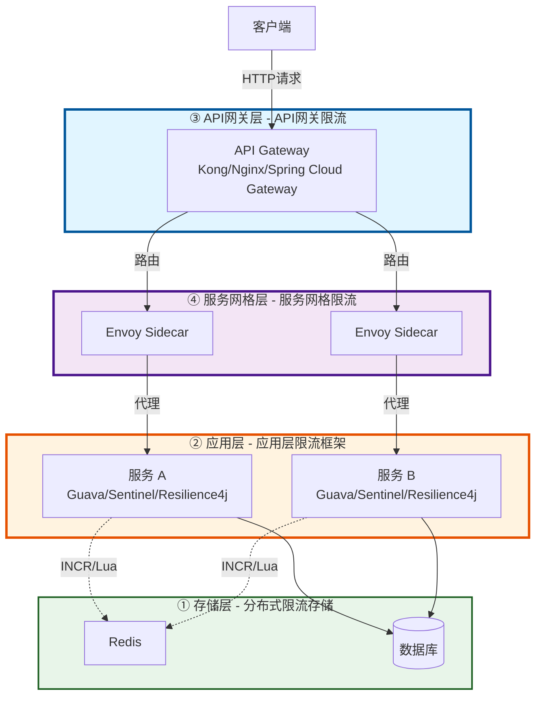
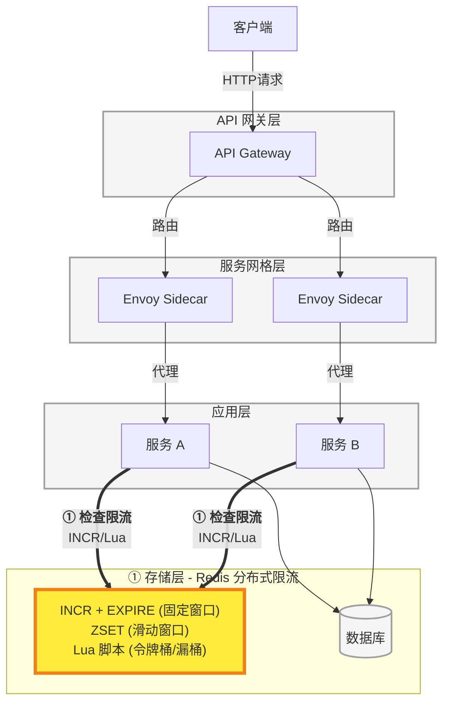
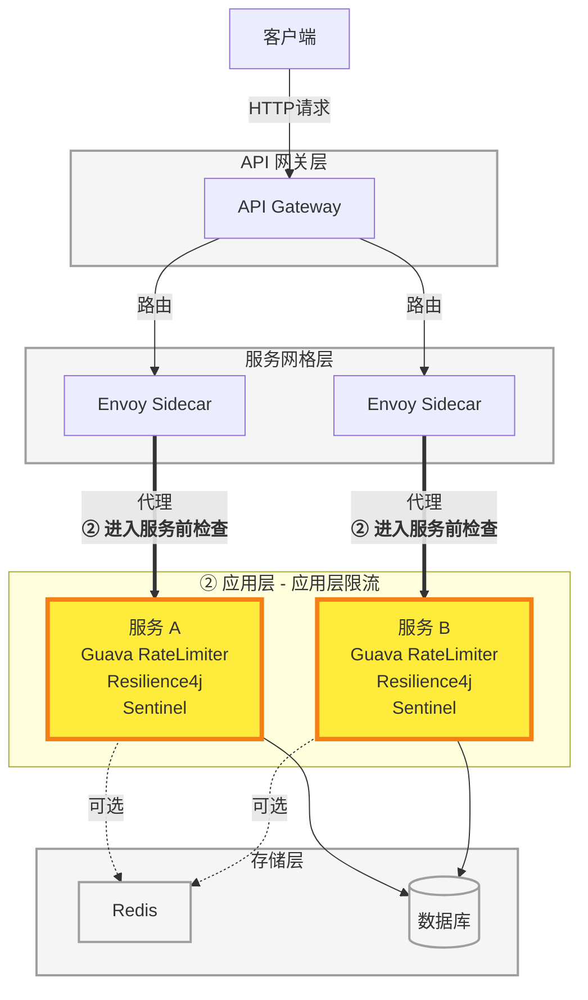
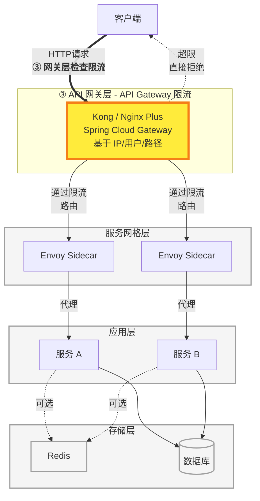
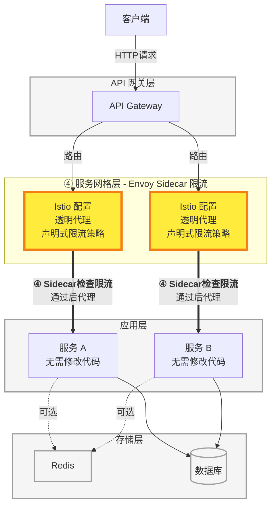
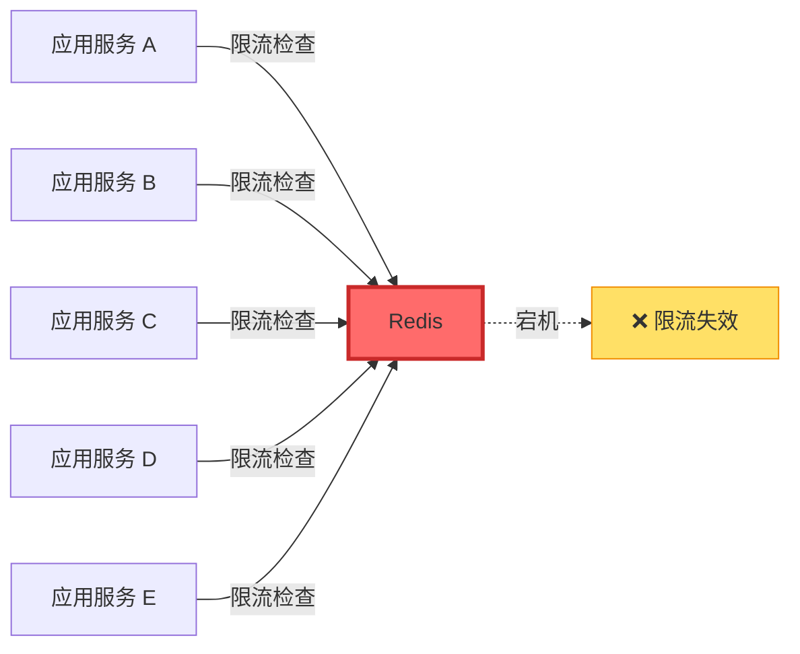
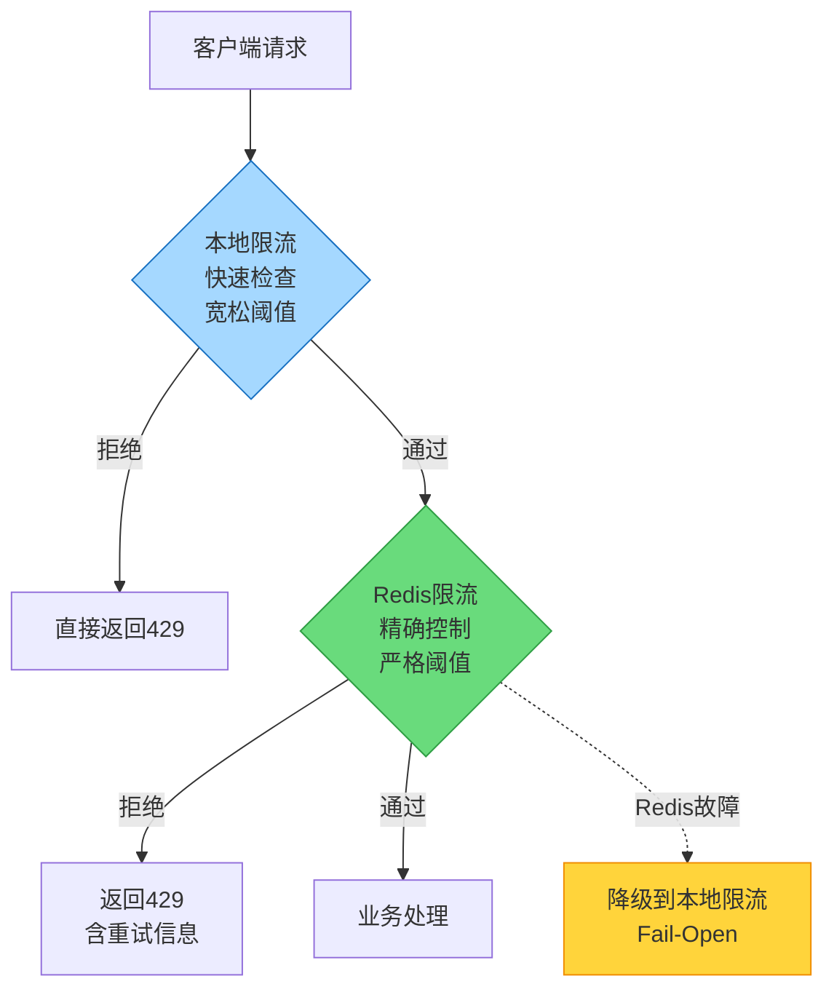
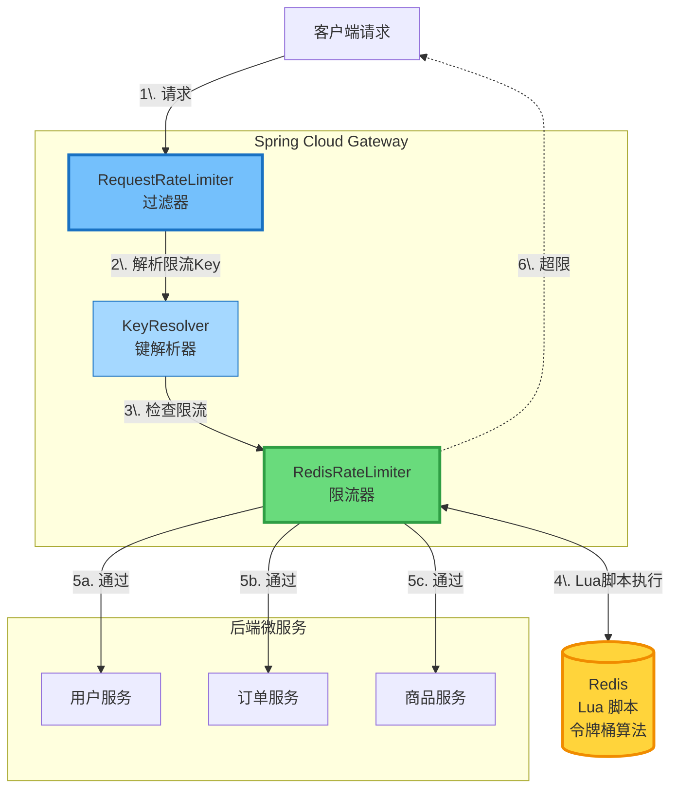
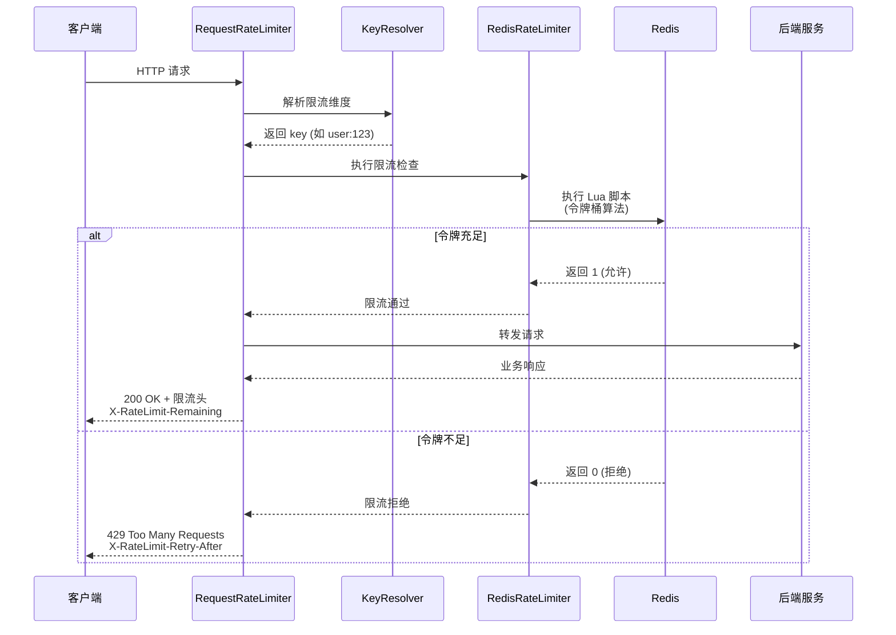

## 常见限流算法

### 1. 固定窗口计数器（Fixed Window Counter）

将时间划分为固定大小的窗口，在每个窗口内统计请求数量，当请求数超过阈值时拒绝后续请求。这种方法实现简单，但在窗口边界处可能出现流量突刺问题，即两个相邻窗口的边界时刻可能在短时间内处理双倍的请求量。

### 2. 滑动窗口计数器（Sliding Window Counter）

在固定窗口的基础上，采用滑动时间窗口来统计请求数量，通常将时间窗口分割成多个更小的子窗口。相比固定窗口，滑动窗口能更平滑地限流，有效缓解窗口边界的突刺问题，但实现复杂度和内存开销会相应增加。

### 3. 漏桶算法（Leaky Bucket）

请求进入一个固定容量的桶中，桶以恒定速率流出请求进行处理，当桶满时新请求会被丢弃。这种算法能够强制限定数据的传输速率，使流量更加平滑，但无法应对短时间的突发流量。

### 4. 令牌桶算法（Token Bucket）

系统以恒定速率向桶中添加令牌，请求需要消耗令牌才能被处理，桶有最大容量限制。相比漏桶算法，令牌桶允许一定程度的突发流量，因为可以累积未使用的令牌。这是工业界最常用的限流算法之一，在许多开源组件和云服务中都有应用。

## 超出限流的处理策略

当请求超出限流阈值时，系统需要采取适当的策略来处理这些请求。不同的处理策略会影响用户体验、系统稳定性和业务目标。

### 1. 直接拒绝（Reject）

立即拒绝超出限流的请求，返回 HTTP 429 错误响应，并通过响应头告知客户端限流信息和建议的重试时间。这是最简单直接的方式，能有效保护后端系统，但用户体验较差，且可能导致客户端盲目重试。适用于通用的 API 限流场景，建议配合友好的错误提示和客户端退避策略。

**标准响应头**：`X-RateLimit-Limit`（限流阈值）、`X-RateLimit-Remaining`（剩余配额）、`X-RateLimit-Reset`（重置时间）、`Retry-After`（建议重试等待时间）。

### 2. 排队等待（Queue）

将超出限流的请求放入队列，由后台任务以恒定速率处理。请求不会丢失，用户最终都能得到响应，但需要维护队列且响应时间变长。适合对实时性要求不高的异步场景，如报表生成、数据导出、后台任务处理等。不适合 HTTP 同步场景，因为长时间等待可能导致超时问题。

### 3. 服务降级（Degrade）

当限流触发时，返回降级后的服务而非完全拒绝。例如用户信息查询降级为返回缓存的基本信息、个性化推荐降级为通用热门榜单、高质量图片处理降级为低质量或原图。这种方式平衡了用户体验和系统保护，保证核心功能可用，但需要预先设计好降级逻辑，增加了系统复杂度。

**常见降级方案**：数据库查询 → 缓存读取、个性化服务 → 通用服务、实时计算 → 近似值/历史数据、全文搜索 → 简单匹配。

### 处理策略对比

| 策略     | 用户体验 | 实现复杂度 | 资源开销 | 适用场景                   |
| -------- | -------- | ---------- | -------- | -------------------------- |
| 直接拒绝 | ⭐        | ⭐          | ⭐        | 通用场景，API 限流         |
| 排队等待 | ⭐⭐⭐      | ⭐⭐⭐        | ⭐⭐⭐      | 异步任务，非实时场景       |
| 服务降级 | ⭐⭐⭐⭐     | ⭐⭐⭐        | ⭐⭐       | 读多写少，有降级方案的场景 |

## 限流实现概览

### 单机限流 vs 分布式限流

单机限流在应用进程内维护计数器状态，实现简单且性能高，但在多实例部署时无法精确控制全局流量。分布式限流通过 Redis 等共享存储来维护全局计数器，能够精确控制整体流量，但会引入网络开销和外部依赖，需要权衡准确性和性能。

### 限流的实现层次

下图展示了典型的微服务后端架构，以及四种常见限流实现方式所在的层次：



### 1. 基于 Redis 的分布式限流

利用 Redis 的原子性操作和过期机制来实现分布式限流，通常使用 `INCR` 命令配合 `EXPIRE` 实现固定窗口，或使用 `ZSET` 实现滑动窗口。更复杂的令牌桶或漏桶算法可以通过 Lua 脚本来保证操作的原子性。Redis 的高性能和集中式特性使其成为分布式限流的理想选择，但需要注意 Redis 的可用性和网络延迟问题。



### 2. 应用层限流框架

Java 生态中的 Guava RateLimiter 提供了基于令牌桶的单机限流实现，使用简单且性能优秀。Resilience4j 和 Sentinel 等框架不仅支持限流，还集成了熔断、降级等微服务治理功能，Sentinel 还提供了控制台进行动态规则配置。这些框架通常在服务内部集成，适合对特定方法或资源进行细粒度的限流控制。



### 3. API 网关限流

主流的 API 网关如 Kong、Nginx Plus、Spring Cloud Gateway 等都内置了限流功能，可以基于 IP、用户、API 路径等维度进行限流。网关层限流的优势在于统一管理和配置，能在流量进入系统前就进行拦截，减轻后端服务压力。对于使用云服务的场景，AWS API Gateway、阿里云 API 网关等也提供了开箱即用的限流能力。



### 4. 服务网格限流

在使用 Istio 等服务网格的架构中，可以通过 Envoy 代理实现透明的限流控制，无需修改应用代码。服务网格提供了基于配置的声明式限流，支持全局和局部限流策略，还能与其他流量管理功能（如负载均衡、熔断）无缝集成。这种方式特别适合大规模微服务集群，但引入了额外的基础设施复杂度。



## Redis 限流实现

### 1. 固定窗口计数器

**原理**：使用 `INCR` 命令对请求计数，配合 `EXPIRE` 设置窗口过期时间。

**优点**：实现简单，性能高  
**缺点**：窗口边界流量突刺问题

#### Java 直接实现

适合低并发场景，可接受极小概率的不精确。

```java
public boolean allowRequest_Simple(String userId, int limit, int windowSeconds) {
    String key = "rate_limit:" + userId + ":" + (System.currentTimeMillis() / 1000 / windowSeconds);
    
    // 使用 Redis 原子命令 INCR
    Long count = redisTemplate.opsForValue().increment(key);
    
    // ⚠️ 注意：INCR 和 EXPIRE 之间不是原子的，极端情况下可能丢失过期时间
    if (count == 1) {
        redisTemplate.expire(key, windowSeconds, TimeUnit.SECONDS);
    }
    
    return count <= limit;
}
```

#### 基于 Lua 实现 ✅ 推荐

保证原子性，生产环境推荐使用。

**Java 代码**：

```java
public boolean allowRequest(String userId, int limit, int windowSeconds) {
    String key = "rate_limit:" + userId + ":" + (System.currentTimeMillis() / 1000 / windowSeconds);
    
    DefaultRedisScript<Long> script = new DefaultRedisScript<>();
    script.setScriptText(luaScript);  // Lua 脚本见下方
    script.setResultType(Long.class);
    
    // ⭐ 调用 Lua 脚本（在 Redis 服务器端原子执行）
    Long result = redisTemplate.execute(
        script,
        Collections.singletonList(key),  // KEYS[1]
        String.valueOf(limit),           // ARGV[1]
        String.valueOf(windowSeconds)    // ARGV[2]
    );
    
    return result != null && result == 1L;
}
```

**Lua 脚本**：

```lua
-- Lua 脚本保证原子性
local key = KEYS[1]                  -- rate_limit:user:123:1641024000
local limit = tonumber(ARGV[1])      -- 100
local window = tonumber(ARGV[2])     -- 60秒

local current = redis.call('GET', key)
if current and tonumber(current) >= limit then
    return 0  -- 超过限制
end

redis.call('INCR', key)
if not current then
    redis.call('EXPIRE', key, window)
end
return 1  -- 允许通过
```

### 2. 滑动窗口计数器

**原理**：使用 `ZSET` 存储请求时间戳，根据时间范围统计请求数量。

**优点**：平滑限流，解决固定窗口边界问题  
**缺点**：内存开销较大，需要存储每个请求记录

#### Java 直接实现

⚠️ 注意：多个命令之间不是原子的，高并发下可能不精确。

```java
public boolean allowRequest_NonAtomic(String userId, int limit, int windowSeconds) {
    String key = "rate_limit:sliding:" + userId;
    long now = System.currentTimeMillis();
    long windowStart = now - windowSeconds * 1000L;
    
    // 步骤1: 移除过期数据
    redisTemplate.opsForZSet().removeRangeByScore(key, 0, windowStart);
    
    // 步骤2: 统计当前窗口请求数
    // ⚠️ 这三步之间可能被其他线程打断，导致计数不准
    Long count = redisTemplate.opsForZSet().zCard(key);
    if (count != null && count >= limit) {
        return false;
    }
    
    // 步骤3: 添加当前请求
    redisTemplate.opsForZSet().add(key, String.valueOf(now), now);
    redisTemplate.expire(key, windowSeconds, TimeUnit.SECONDS);
    return true;
}
```

#### 基于 Lua 实现 ✅ 推荐

保证原子性，高并发场景必须使用。

**Java 代码**：

```java
public boolean allowRequest(String userId, int limit, int windowSeconds) {
    String key = "rate_limit:sliding:" + userId;
    long now = System.currentTimeMillis();
    
    DefaultRedisScript<Long> script = new DefaultRedisScript<>();
    script.setScriptText(luaScript);  // Lua 脚本见下方
    script.setResultType(Long.class);
    
    // ⭐ 调用 Lua 脚本（在 Redis 服务器端原子执行）
    Long result = redisTemplate.execute(
        script,
        Collections.singletonList(key),     // KEYS[1]
        String.valueOf(limit),              // ARGV[1]
        String.valueOf(windowSeconds),      // ARGV[2]
        String.valueOf(now)                 // ARGV[3]
    );
    
    return result != null && result == 1L;
}
```

**Lua 脚本**：

```lua
-- Lua 脚本实现
local key = KEYS[1]              -- rate_limit:user:123
local limit = tonumber(ARGV[1])  -- 100
local window = tonumber(ARGV[2]) -- 60秒
local now = tonumber(ARGV[3])    -- 当前时间戳（毫秒）

-- 移除窗口外的旧记录
redis.call('ZREMRANGEBYSCORE', key, 0, now - window * 1000)

-- 统计当前窗口内的请求数
local current = redis.call('ZCARD', key)
if current >= limit then
    return 0  -- 超过限制
end

-- 添加当前请求
redis.call('ZADD', key, now, now)
redis.call('EXPIRE', key, window)
return 1  -- 允许通过
```

### 3. 漏桶算法

**原理**：模拟一个固定容量的桶，以恒定速率漏水（处理请求）。

**优点**：流量绝对平滑，恒定速率  
**缺点**：无法应对突发流量

**⚠️ Redis 不适合实现真正的漏桶算法**

**理论上的漏桶**：请求进入桶中排队，系统以恒定速率从桶中取出请求处理。即使长时间无请求后突然涌入大量请求，也只能以固定速率处理，真正做到"削峰填谷"。

**为什么 Redis 难以实现**：
- 需要维护一个请求队列（消耗大量内存）
- 需要后台定时任务以恒定速率处理队列
- 请求需要异步等待，影响响应时间
- HTTP 同步模型不适合请求排队等待
- 实现复杂度高，不适合纯 Redis 方案

**真正的漏桶实现**需要：

```java
// 真正的漏桶需要队列 + 后台任务（不适合 Redis）
public class TrueLeakyBucket {
    private final BlockingQueue<Request> queue = new LinkedBlockingQueue<>(capacity);
    
    // 请求进入队列等待
    public CompletableFuture<Response> handleRequest(Request req) {
        if (queue.offer(req)) {
            return req.getFuture();  // 异步等待处理
        } else {
            throw new RateLimitException("Bucket full");
        }
    }
    
    // 后台任务：以恒定速率10/s处理
    @Scheduled(fixedDelay = 100)  // 100ms = 10/s
    public void processRequest() {
        Request req = queue.poll();
        if (req != null) {
            process(req);  // 恒定速率处理
        }
    }
}
```

**如果需要真正的漏桶效果**（强制恒定速率），建议：
- 使用消息队列（RabbitMQ、Kafka）+ 消费者限速
- 使用专门的流量整形工具（如 Envoy）
- **或直接使用令牌桶算法**（工业界更常用，见下文）

> 💡 **实践建议**：大多数场景下，**令牌桶**已经足够。它允许一定的突发流量（提升用户体验），同时控制平均速率（保护系统）。只有在需要绝对恒定输出速率的场景（如视频流传输、硬件通信）才需要真正的漏桶。
{: .prompt-tip }

### 4. 令牌桶算法

**原理**：以恒定速率生成令牌放入桶中，请求需要消耗令牌，允许突发流量（桶满时累积令牌）。

**优点**：允许突发流量，更灵活  
**缺点**：实现相对复杂

> 令牌桶算法一般通过基于**懒惰求值**（Lazy Evaluation）的方式实现。懒惰求值是指不需要启动后台线程持续生成令牌，而是在每次请求到来时才计算从上次请求到现在应该生成多少令牌。这种方式避免了维护后台任务的复杂性，只需记录上次更新时间和当前令牌数，通过时间差乘以生成速率来计算新增令牌，实现简单且高效。
{: .prompt-info}

#### 基于 Lua 实现

⚠️ 令牌桶算法必须调用 Lua 脚本，原因：需要原子地完成"读取令牌→计算生成量→判断并扣减"。

**Java 代码**：

```java
public boolean allowRequest(String userId, int capacity, double rate, int requestedTokens) {
    String key = "rate_limit:token:" + userId;
    long now = System.currentTimeMillis() / 1000;
    
    DefaultRedisScript<Long> script = new DefaultRedisScript<>();
    script.setScriptText(luaScript);  // Lua 脚本见下方
    script.setResultType(Long.class);
    
    // ⭐ 调用 Lua 脚本（在 Redis 服务器端原子执行）
    Long result = redisTemplate.execute(
        script,
        Collections.singletonList(key),   // KEYS[1]
        String.valueOf(capacity),         // ARGV[1] - 桶容量
        String.valueOf(rate),             // ARGV[2] - 生成速率
        String.valueOf(requestedTokens),  // ARGV[3] - 请求令牌数
        String.valueOf(now)               // ARGV[4] - 当前时间
    );
    
    return result != null && result == 1L;
}
```

**Lua 脚本**：

```lua
-- Lua 脚本实现
local key = KEYS[1]                 -- rate_limit:token:user:123
local capacity = tonumber(ARGV[1])  -- 桶容量 100
local rate = tonumber(ARGV[2])      -- 生成速率 10/秒
local requested = tonumber(ARGV[3]) -- 请求令牌数 1
local now = tonumber(ARGV[4])       -- 当前时间戳（秒）

-- 获取上次更新时间和当前令牌数
local last_time = redis.call('HGET', key, 'last_time')
local tokens = redis.call('HGET', key, 'tokens')

if not last_time then
    last_time = now
    tokens = capacity
else
    last_time = tonumber(last_time)
    tokens = tonumber(tokens)
    
    -- 计算新增的令牌数
    local delta = (now - last_time) * rate
    tokens = math.min(capacity, tokens + delta)
end

-- 判断令牌是否足够
if tokens >= requested then
    tokens = tokens - requested
    redis.call('HSET', key, 'tokens', tokens)
    redis.call('HSET', key, 'last_time', now)
    redis.call('EXPIRE', key, 3600)  -- 1小时过期
    return 1  -- 允许
else
    return 0  -- 拒绝
end
```

### 四种算法对比

| 算法     | Redis实现     | 是否必须Lua | 内存开销 | 平滑性 | 突发流量 | 适用场景      |
| -------- | ------------- | ----------- | -------- | ------ | -------- | ------------- |
| 固定窗口 | String (INCR) | ⚠️ 推荐使用  | 最小     | 差     | ❌        | 简单限流      |
| 滑动窗口 | ZSET          | ⚠️ 推荐使用  | 大       | 好     | ❌        | 精确限流      |
| 漏桶     | ❌ 不适合Redis | -           | -        | 最好   | ❌        | 消息队列+限速 |
| 令牌桶   | Hash          | ✅ 必须      | 小       | 好     | ✅        | **推荐**      |

**说明**：
- **固定窗口**：可以不用 Lua，但生产环境推荐使用以保证原子性
- **滑动窗口**：高并发场景推荐使用 Lua 保证多步操作原子性
- **漏桶**：真正的漏桶需要队列+后台任务，Redis 无法很好实现，建议用消息队列或令牌桶替代
- **令牌桶**：必须使用 Lua 脚本，工业界最常用方案 ✅

### Redis 限流的缺点

虽然 Redis 是实现分布式限流的主流方案，但也存在一些需要注意的缺点。

#### 1. 单点故障风险

**问题描述**：Redis 作为中心化的限流服务，一旦宕机会导致整个限流功能失效。所有依赖 Redis 进行限流判断的应用服务都会受到影响，必须在"放行所有请求"和"拒绝所有请求"之间做出选择。



**两种故障处理策略的影响**：

| 策略                   | 行为             | 用户体验 | 系统风险     | 适用场景     |
| ---------------------- | ---------------- | -------- | ------------ | ------------ |
| 失败开放（Fail-Open）  | 放行所有请求     | 好       | 高（过载）   | 普通业务     |
| 失败关闭（Fail-Close） | 拒绝所有请求     | 差       | 低（拒绝）   | 关键防护     |
| 降级到本地限流（推荐） | 使用单机限流兜底 | 中       | 中（不精确） | 生产环境推荐 |

**缓解方案**：部署 Redis 主从复制配合哨兵模式实现自动故障转移，或使用 Redis Cluster 集群提高可用性。结合本地限流作为降级策略，当 Redis 不可用时自动切换到单机限流，虽然无法实现全局精确控制，但能保证基本的限流能力。

#### 2. 网络延迟开销

**问题描述**：每次限流判断都需要通过网络调用 Redis，相比本地内存访问会增加请求的整体延迟。在高并发场景下，网络往返时间会成为性能瓶颈，尤其是跨机房部署时延迟更加明显。

#### 3. 时钟同步问题

**问题描述**：一般的 redis 限流实现将 **时间戳的计算** 放在 **服务器端**，因此存在误差。时钟偏差会影响时间窗口的边界判断，尤其在滑动窗口、令牌桶等依赖时间计算的算法中更为明显。

**缓解方案**：

1. 在所有应用服务器上配置 NTP 服务定期同步时钟，将时间偏差控制在毫秒级
2. 在 Lua 脚本中优先使用 Redis 服务器时间而非客户端时间，避免不同客户端时钟不一致的问题
3. 在算法设计时容忍一定的误差范围，不追求绝对精确的限流效果。

### 总结与建议

#### Redis 限流的优缺点对比

| 维度   | 优点 ✅             | 缺点 ❌                     |
| ------ | ------------------ | -------------------------- |
| 功能性 | 全局统一，精确控制 | 依赖外部服务，存在单点风险 |
| 通用性 | 跨语言、跨服务通用 | 需要团队掌握 Redis 和 Lua  |
| 灵活性 | 支持多种限流算法   | 算法实现需要 Lua 脚本      |
| 性能   | 单机 10 万+ QPS    | 网络延迟开销（1-5ms）      |
| 运维   | 成熟的运维工具链   | 运维复杂度和成本增加       |
| 可靠性 | 可配置高可用方案   | 时钟同步问题               |

#### 实际生产环境的最佳实践

**混合限流策略**：结合本地限流和 Redis 限流的优势，形成多层防护体系。本地限流作为第一道快速检查（设置宽松阈值如 120%），Redis 限流作为精确控制的第二道防线（设置严格阈值如 100%），当 Redis 故障时降级到本地限流保证可用性。

**多层限流架构**：



## Spring Cloud 限流实现

### 核心架构

Spring Cloud 的限流主要通过 **Spring Cloud Gateway** 实现，基于 Redis + Lua 脚本的令牌桶算法。Gateway 作为微服务架构的统一入口，在请求到达后端服务之前进行限流控制。



### 核心组件

Spring Cloud Gateway 的限流机制由三个核心组件协同工作：

| 组件                   | 职责         | 说明                                                     |
| ---------------------- | ------------ | -------------------------------------------------------- |
| **RequestRateLimiter** | 限流过滤器   | Gateway 内置过滤器，拦截请求并执行限流检查               |
| **KeyResolver**        | 键解析器     | 定义限流的维度（按 IP、用户、路径等），生成 Redis 的 key |
| **RedisRateLimiter**   | 限流算法实现 | 基于 Redis + Lua 的令牌桶算法，实际执行限流判断          |

### 工作流程



### 限流维度

KeyResolver 决定了限流的粒度，Spring Cloud Gateway 支持多种限流维度：

| 维度类型     | 说明                | Redis Key 示例                              | 适用场景       |
| ------------ | ------------------- | ------------------------------------------- | -------------- |
| IP 限流      | 根据客户端 IP 限流  | `request_rate_limiter:192.168.1.1`          | 防止 IP 攻击   |
| 用户限流     | 根据用户 ID 限流    | `request_rate_limiter:user:123`             | 按用户配额控制 |
| 路径限流     | 根据 API 路径限流   | `request_rate_limiter:/api/users`           | 保护特定接口   |
| 组合维度限流 | 用户 + 路径组合限流 | `request_rate_limiter:user:123:/api/orders` | 精细化控制     |

### 参数配置说明

Spring Cloud Gateway 的限流参数决定了限流的行为特性：

| 参数              | 说明                 | 推荐值                | 影响                   |
| ----------------- | -------------------- | --------------------- | ---------------------- |
| `replenishRate`   | 令牌生成速率（每秒） | 10-100                | 控制平均 QPS           |
| `burstCapacity`   | 令牌桶容量           | replenishRate × 1.5-2 | 允许的突发流量大小     |
| `requestedTokens` | 每次请求消耗令牌数   | 1（默认）             | 不同接口可设置不同权重 |

### 限流响应处理

当请求被限流时，Spring Cloud Gateway 返回特定的 HTTP 响应和响应头：

**HTTP 响应**：

| 状态码 | 响应体示例          | 说明         |
| ------ | ------------------- | ------------ |
| 429    | `Too Many Requests` | 标准限流响应 |

**响应头信息**：

| 响应头                         | 说明                 | 示例值 |
| ------------------------------ | -------------------- | ------ |
| `X-RateLimit-Remaining`        | 剩余令牌数           | `5`    |
| `X-RateLimit-Replenish-Rate`   | 令牌生成速率（每秒） | `10`   |
| `X-RateLimit-Burst-Capacity`   | 令牌桶容量           | `20`   |
| `X-RateLimit-Requested-Tokens` | 本次请求消耗的令牌数 | `1`    |

### 适用场景

**Spring Cloud Gateway 限流适合**：

1. **微服务架构的统一入口**：所有外部流量通过 Gateway 进入，在网关层统一限流
2. **需要分布式全局限流**：多个 Gateway 实例通过 Redis 共享限流状态
3. **基于不同维度的限流**：灵活的 KeyResolver 支持 IP、用户、路径等多种维度
4. **与 Spring 生态集成**：无缝集成 Spring Cloud 配置中心、服务发现等组件

**不适合的场景**：

1. **需要实时动态调整规则**：建议使用 Sentinel 的动态控制台
2. **需要复杂的限流策略**：如基于系统负载、响应时间的自适应限流，Sentinel 更合适
3. **单体应用**：直接使用 Guava RateLimiter 或 Resilience4j 更简单
4. **极致性能要求**：Nginx/OpenResty 的 C 实现性能更高

### 总结

Spring Cloud Gateway 的限流实现是基于 **Redis + Lua 的令牌桶算法**，通过过滤器在网关层统一拦截和控制流量。其核心优势在于：

- **分布式支持**：多个 Gateway 实例共享 Redis 限流状态，实现全局精确限流
- **灵活的限流维度**：通过 KeyResolver 支持 IP、用户、路径等多种限流粒度
- **无侵入性**：在网关层限流，后端服务无需修改代码
- **Spring 生态集成**：与 Spring Cloud 配置中心、服务发现等无缝集成

但也需要注意：

- **依赖 Redis**：继承了 Redis 限流的所有缺点（单点风险、网络延迟、时钟同步）
- **配置相对静态**：动态调整规则不如 Sentinel 灵活
- **功能相对单一**：仅提供限流能力，不像 Sentinel 提供完整的微服务治理功能

