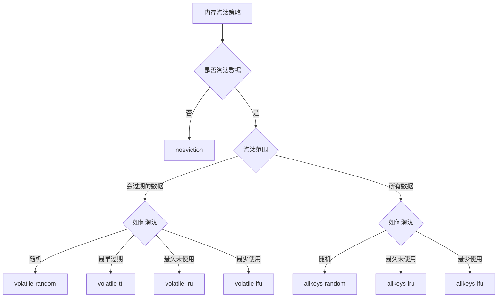

## 前言

全文参考[小林coding - 图解Redis介绍](https://www.xiaolincoding.com/redis/)

## 持久化

持久化有三种方式：
- **AOF 日志**：存储**命令**
- **RDB 日志**：存储**内存状态**
- 两者混合，RDB 日志负责存量、AOF 日志负责增量

其中，AOF 日志的写回和 RDB 快照的存储都用到了**写时复制**：子进程和父进程共用页表。只有当父进程进行了写入时，被写入的页表才在子进程的虚拟地址空间中复制一份。

## 内存管理

要减少 Redis 对内存的占用，主要有两点：
- **过期删除策略**：key 超过存活时长**被动**删除
- **内存淘汰策略**：占用超过最大内存时**主动**删除

### 过期删除策略

#### 三种过期删除策略

||做法|优点|缺点|
|:---|:---|:---|:---|
|**定时删除**|创建定时事件来删除key|及时删除|占用CPU|
|**惰性删除**|只在访问时删除|CPU时间友好|内存不友好|
|**定期删除**|随机取出一定数量key检查|既不占用CPU，又不占用内存|效果折中，但难以确定检查频率|

#### Redis 过期策略

**惰性删除** + **定期删除**
- 抽查频率：默认10hz，可修改
- 抽查数量：固定20个key

### 内存淘汰策略

#### Redis 使用的内存淘汰策略

noeviction 不会淘汰数据，而是禁止写入。

#### LRU 和 LFU 算法

从 LRU 到近似 LRU 再到 LFU，参考[文档](https://redis.ac.cn/docs/latest/develop/reference/eviction/?utm_source=openai)

||策略|实现|缺点|
|:---|:---|:---|:---|
|**LRU**|最久未使用|惰性链表|链表空间开销 更新时链表修改耗时|
|**近似 LRU**|近似最久未使用|添加字段记录最后一次访问时间 每次随机取5个值，淘汰最久未使用的|缓存污染 （只读取一次的数据也存在很久）|
|**LFU**|最少使用|添加字段记录访问频次 访问频次随时间衰减 同样随机选取|新key冷启动问题（已解决）|

#### LFU 的冷启动问题与解决方案

**问题场景**：

当 Redis 内存接近上限时，如果有若干个 key 需要被重复读取，但这些 key 刚读进来时访问次数还很少，就会立即触发内存淘汰。由于访问次数少，这些 key 被 LFU 算法删除，接着又需要重新加载，导致缓存完全失效。

**Redis LFU 的优化机制**：

Redis 的 LFU 实现已经考虑到了这个问题，采用了智能的计数策略：

1. **计数器衰减机制**
   - 访问频次不是永久累加的，而是会**随时间衰减**
   - 通过 `lfu-decay-time` 参数控制衰减速度（默认 1 分钟）
   - 作用：让长期不访问的"热key"逐渐降低优先级，给新key腾出空间

2. **对数增长算法**
   - 访问次数不是简单的 +1，而是使用**概率对数增长**
   - 通过 `lfu-log-factor` 参数控制增长速度（默认 10）
   - 作用：访问次数越高，增长越慢；新key更容易快速积累计数

3. **新key初始计数**
   - 新加入的 key 会有一个初始计数值（通常是 5）
   - 作用：防止新key一进来就被淘汰

## 三种崩溃

||现象|影响范围|核心解决思路|
|:---|:---|:---|:---|
|**缓存雪崩**|大量key同时过期|影响面广|分散过期时间|
|**缓存击穿**|单个热点key过期|影响单点|加锁重建|
|**缓存穿透**|查询不存在的数据|可能影响全局|过滤无效请求|

### 缓存雪崩

**问题描述**：大量缓存在同一时间过期，导致所有请求直接落到数据库上，造成数据库压力骤增。

**产生原因**：
- 大量key设置了相同的过期时间
- Redis服务器宕机或重启

**解决方案**：
1. **过期时间随机化**：为key设置过期时间时加上随机值，避免同时过期
2. **设置缓存不过期**：通过后台服务来更新缓存数据，从而避免因为缓存失效造成的缓存雪崩，也可以在一定程度上避免缓存并发问题
3. **熔断降级**：当数据库负载过高时，暂时返回默认值或错误页面
4. **预热机制**：在系统启动或流量高峰前提前加载热点数据

### 缓存击穿

**问题描述**：某个热点key突然过期，而此时有大量并发请求访问这个key，导致瞬间大量请求直接打到数据库。

**产生原因**：
- 热点key过期时间到了
- 高并发访问同一个不存在的key

**解决方案**：
1. **互斥锁**：使用分布式锁，只允许一个线程去重建缓存
2. **热点数据永不过期**：对于极热点的数据，设置永不过期，通过后台异步更新

### 缓存穿透

**问题描述**：查询一个根本不存在的数据，缓存和数据库都没有，每次查询都会直接打到数据库。

**产生原因**：
- 恶意攻击，故意查询不存在的数据
- 业务逻辑设计缺陷，产生大量无效查询

**解决方案**：
1. **空值缓存**：将查询结果为空的情况也缓存起来，设置较短过期时间
2. **布隆过滤器**：在缓存前加一层布隆过滤器，快速判断数据是否可能存在
4. **限流降级**：对异常请求进行限流处理