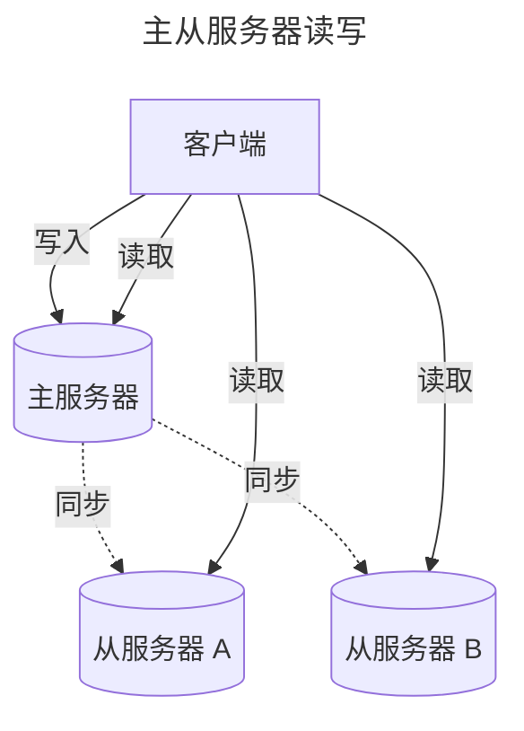
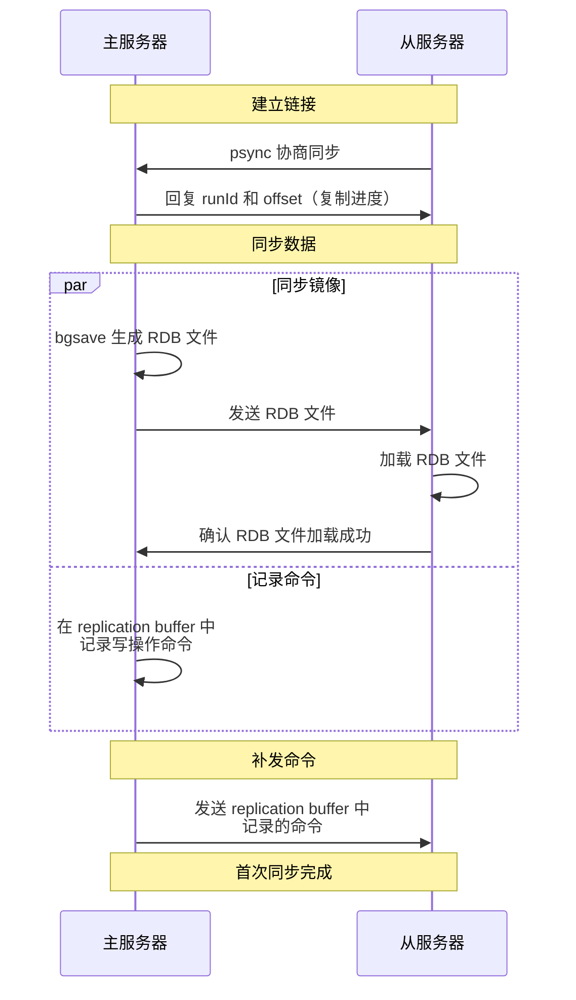
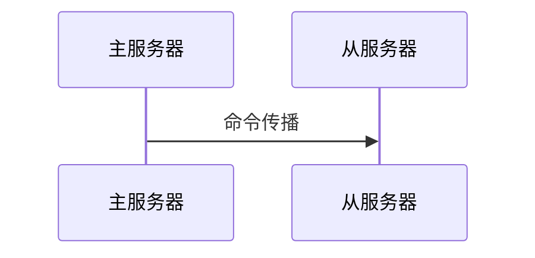
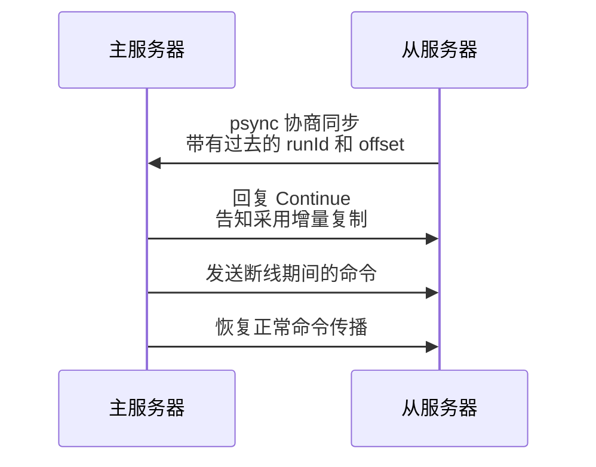
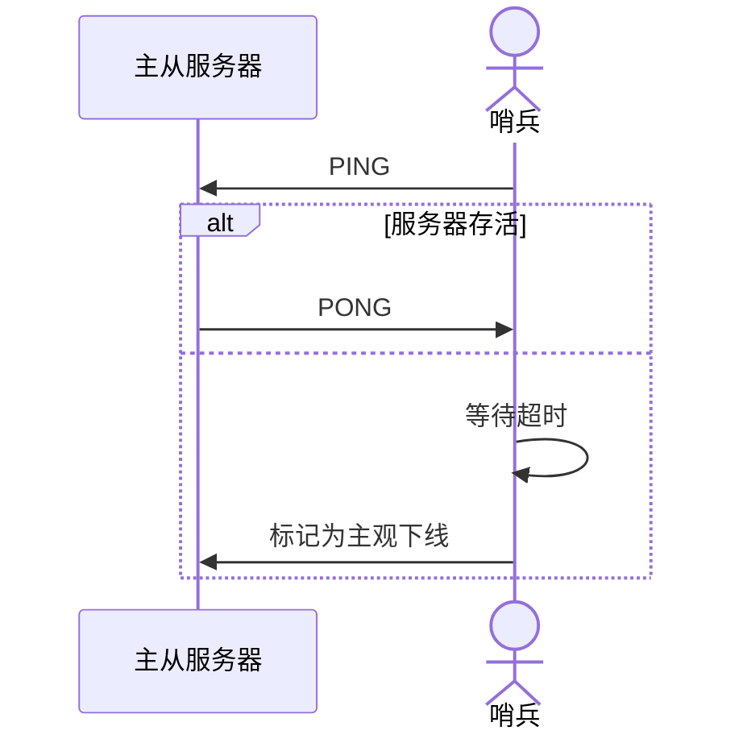
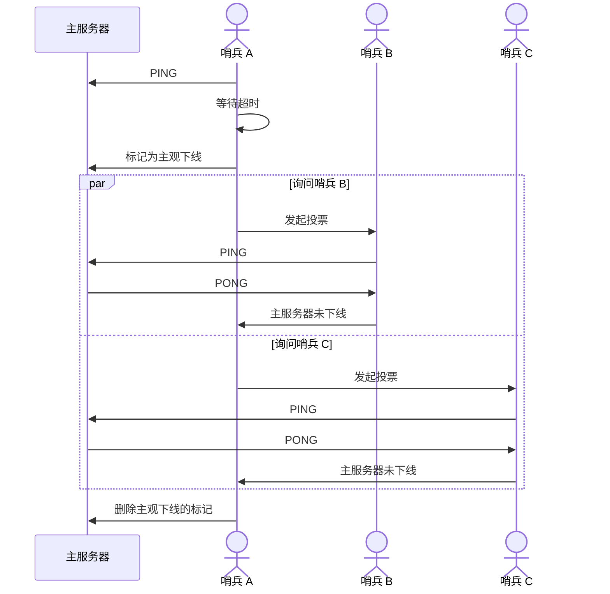

## 前言

本文将讨论以下两种保障 redis 的高可用性的方式：
- **主从复制**：多个服务器保存相同的数据，以防单个服务器故障影响服务
- **Cluster 集群**：多个服务器存储不同数据，实现在线扩容和大量数据缓存

本文参考 [小林coding - 图解Redis介绍](https://www.xiaolincoding.com/redis/)。

## 主从复制

在主从复制中，多个服务器保存相同的数据，会遇到以下问题：

| 问题       | 解决方式 |
| :--------- | :------- |
| 数据不一致 | 读写分离 |
| 服务器故障 | 哨兵机制 |

这两个问题的解决是我们理解主从复制的重要部分，一起来看看吧。

### 读写分离

服务器分为 **主服务器** 和 **从服务器** ，所有数据以主服务器为准。客户端只向主服务器发送写入请求，接着数据被同步到从服务器；客户端对主从服务器都可以发送读取请求。

#### 同步实现

读写分离是如何保证 **一致性** 的？由三种同步来实现：
- 首次同步：redis 服务启动或是新的从服务器加入服务器网络后的首次同步
- 命令传播：主从服务器连接建立后，持续进行命令传输
- 增量复制：主从服务器连接断开后进行的一致性恢复

> 主服务器向从服务器不仅要同步 **写入命令**，当某个键被淘汰后，还需要同步对应的 **删除命令**，将从服务器中的内存也释放。
{: .prompt-tip }

##### **首次同步**

分为三个阶段：建立链接，同步数据，补发命令

##### **命令传播**

首次同步后，主从服务器之间维护一条 **长连接的tcp连接**，来进行 **命令传播**。

> 主服务器会先将命令写入缓冲区中，再由其他线程 **异步** 地传播给从服务器。
{: .prompt-info }

##### **增量复制**

此时，如果主从服务器之间的连接断开，我们可以通过从服务器中保存的 offset 定位到复制进度，从而进行 **增量复制**，而不用从头 **全量复制**。

> **主服务器中将写入命令保存在哪里，来帮助从服务器恢复？** 
> &emsp;&emsp;命令保存在 repl_backlog_buffer 这个 **环形缓冲区** 中（默认 1MB），其中包含一个指针 master_repl_offset 记录主服务器写到的位置。 
> &emsp;&emsp;如果需要同步的数据已经不在 repl_backlog_buffer 中，就会 **降级到全量复制**。
{: .prompt-info }

#### 数据丢失

尽管我们做了同步措施，还是可能存在数据丢失，主要发生在以下两种情况：
- 异步复制前 **主节点崩溃**，主节点中的数据全部丢失
- 主节点失联后恢复，产生两个主节点，导致 **脑裂**

> **脑裂** 发生后，redis 会将较新的主节点作为当前主节点，将它的数据 **全量复制** 给旧的主节点，因此旧的主节点 **在失联后写入的数据** 会全部丢失。
{: .prompt-info }

以上两种情况都不能避免丢失数据，但是可以尽可能减少数据丢失量。

##### **主节点崩溃**

当主节点同步异常时阻止客户端写入。具体而言，主节点通过 **从节点的延迟时长** 来判断未同步的数据量，当延迟时长超过某个阈值（参数 min-slaves-max-lag）后，拒绝新的写入请求。

> 客户端发现 Redis 不可写入后，可以降级为存入本地内存、kafka或数据库。
{: .prompt-tip }

##### **脑裂**

当主节点连接异常时阻止客户端写入。具体而言，主节点通过 **延迟的从节点数** 来判断网络状况，当延迟个数超过某个阈值（参数 min-slaves-to-write）后，拒绝新的写入请求。

### 哨兵模式

Redis 通过哨兵机制来解决 **服务器故障** 的问题。具体而言，当主服务器故障后，哨兵将自动选举一个从节点切换为主节点。

为了确保哨兵可靠性，一般使用哨兵集群，它们通过 **投票** 来进行决策。

哨兵之间通过 Redis 的 **发布者/订阅者机制** 来联络。它们依赖 **主节点** 上的一个频道 \__sentinel__:hello 来相互发现（类似比特网的全局广播）。之后，它们通过 info 命令从主节点获取 **从节点列表**，再去与从节点建立连接。

接下来，我们来看看 **主从切换** 的四个步骤：**监控下线**，**选择 leader 哨兵**，**选择新的主节点**，**通知其余节点**。

#### 监控下线

单个哨兵通过 PING 命令询问是否存活，主从节点通过 PONG 命令回复。如果回复超时，该哨兵标记该节点为 **主观下线**。

针对 **主节点**，哨兵还会额外确认它是否 **客观下线**（避免单个哨兵因为自身网络原因误判）。当主节点被一个哨兵标记为主观下线后，其他哨兵会对结果投票，当赞同票数超过 quorum 后，主节点才会被标记为客观下线。

> quorum 一般被设置为 #sentinels / 2 + 1
{: .prompt-tip }

以下是 **哨兵 A 误判主服务器下线** 的流程：

#### 选择 leader 哨兵

考虑到可能 **同时有多个哨兵标记主服务器为主观下线**，选择 leader 也需要多个哨兵同步。同样地，通过 **投票** 来选择 leader。

投票角色：
- 候选者：将主服务器标记为主观下线的哨兵（可能有多个），可以把投票自己或别人。
- 投票者：其余哨兵，只能把票投给别人。

票数需要 $$\geq \max\{quorum, \frac{\#sentinels}{2}\}$$ 才能成为 leader。

#### 选择新的主节点

哨兵机制会先通过 **主从断连次数** 筛选掉网络连接不佳的从节点，再按以下优先级选出最优从节点作为新的主节点：

| 指标           | 解释                                      |
| :------------- | :---------------------------------------- |
| 优先级最高     | slave-priority 这一配置项手动指定的优先级 |
| 复制进度最靠前 | 内存中的数据最新                          |
| ID最小         | 从节点标识 ID                             |

选出从节点后，哨兵通过 SLAVEOF no one 命令将它设置为主节点，并通过高频（1秒1次）的 info 命令查询确认设置成功。

#### 通知其余节点

| 通知对象   | 通知方式                        |
| :--------- | :------------------------------ |
| 其他从节点 | 发送 SLAVEOF 命令               |
| 客户端     | Redis 的 **发布者/订阅者机制**  |
| 旧主节点   | 等待重新上线后发送 SLVAEOF 命令 |

## Cluster 集群

**TBD**