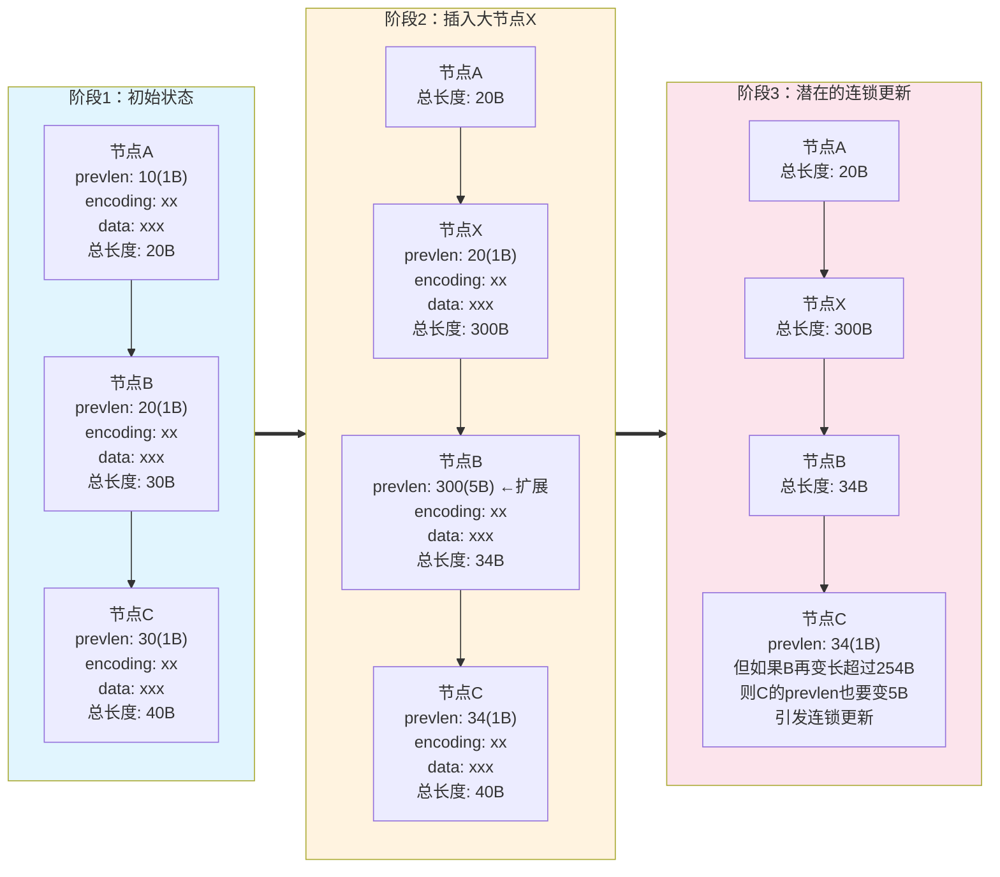
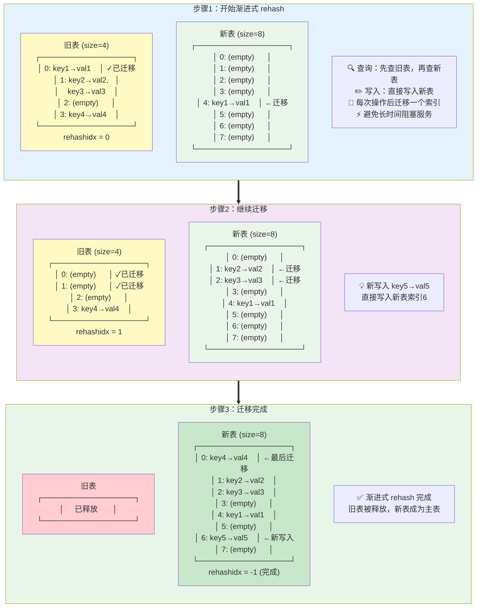

## 前言

Redis 中包含多种 <span style="color:red">数据类型</span>，对应于多种 <span style="color:blue">数据结构</span>。<span style="color:red">数据类型</span> 取决于具体业务场景，而 <span style="color:blue">数据结构</span> 指的是 Redis 底层如何实现某种 <span style="color:red">数据类型</span>。

我们将先从 <span style="color:blue">数据结构</span> 说起，再谈到每种 <span style="color:red">数据类型</span> 适用于哪些业务。

本文参考 [小林coding - 图解Redis介绍](https://www.xiaolincoding.com/redis/)，此外根据 **源码** 补充了一些细节。

## 数据结构

### SDS

SDS 即 simple dynamic string，由 Redis 自己封装来实现 **字符串**，与 c 的 `char*` 实现不同。

>`char*` 实现字符串有以下缺点：<br>
>- 不额外保存长度，计算长度的时间复杂度为 $$O(n)$$<br>
>- 通过 `\0` 来标注结尾，无法在字符串中存储 `\0`<br>
>- 不保证字符串操作的安全性，可能发生缓冲区溢出
{: .prompt-info }

SDS 中包含四部分：

| 名称  | 含义           | 功能                                 |
| :---- | :------------- |
| len   | 当前长度       | 直接得到长度                         |
| alloc | 分配空间的长度 | 修改时判断是否要扩容，防止缓冲区溢出 |
| flags | 类型           | 节省内存空间                         |
| buf[] | 字节数组       | 不仅能保存字符，还能保存二进制数据   |

SDS 扩容规则（[源码](#sds-扩容)）：`newlen = (newlen < 1MB) ? (newlen * 2) : (newlen + 1MB)`，其中 `newlen = (len+addlen)`

SDS 节省内存空间（[源码](#sds-结构)）：
- flags 分为 sdshdr5、sdshdr8、sdshdr16、sdshdr32 和 sdshdr64 类型，每个 len 和 alloc 不同（`uint16_t`, `uint32_t` 等等），根据字符串大小不同灵活分配。
- struct 声明 `__attribute__ ((packed))`，告诉编译器取消结构体在编译过程中的优化对齐，按照实际占用字节数进行对齐（会影响内存读写效率，但主要瓶颈在网络I/O）。

### 链表

Redis 使用 **双向链表**，并在此外封装了 list，包含 head，tail 和 len。特别地，链表节点存储的值都是 `void*`，也就是支持任意类型的值。

> 链表的劣势：<br>
> - 链表节点占用空间大<br>
> - 缓存不友好
{: .prompt-info }

虽然链表插入节点时间复杂度为 $$O(1)$$，但大部分场景搜索到插入位置也需要时间，因此链表的实际性能表现并不好。Redis 对 **list** 实现中，在数据量较小的情况下会选择 **压缩列表**，其余情况在 3.2 替换为了 **quicklist**，在 5.0 替换为了 **listpack**。

### 压缩列表

**压缩列表** 类似数组，在内存中连续存储，但是其中每一项 **大小不固定**。其存储结构（以从头到尾的顺序）：

| 字段    | 含义                   |
| :------ | :--------------------- |
| zlbytes | 整个压缩列表字节数     |
| zltail  | 压缩队列尾部偏移量     |
| zllen   | 内部节点数量           |
| entry1  | 节点1                  |
| entry2  | 节点2                  |
| ...     | ...                    |
| entryN  | 节点N                  |
| zlend   | 标识结尾，固定值`0xFF` |

> **为什么 zltail 必要？**<br>
> &emsp;&emsp;倒序遍历过程中，需要直接获取 entryN 的位置。通过 zlbytes 只能定位到 zlend，在不知道 entryN 大小的情况下，没有办法定位到 entryN。
{: .prompt-tip }

单个节点的构成：

| 字段     | 含义                      | 功能               |
| :------- | :------------------------ | :----------------- |
| prevlen  | 前一个节点的长度          | 倒序遍历           |
| encoding | 类型（字符串/整数）和长度 | 正序遍历、便于解析 |
| data     | 实际数据                  | 要存储的数据       |

从上面的实现中可以看到：压缩列表只适合存储少量数据，当插入节点后，所有后续节点都要移动，时间复杂度为 $$O(n)$$。更糟的是，可能出现 **连锁更新** 的问题。

**连锁更新** 发生在节点插入时。当节点插入后，所有后续节点移动，接着，插入的节点后继的节点需要更新 prevlen 字段。问题就出在这！当 prevlen 的值小于 254 时，只占用 1 Byte 的空间；但是当它更新后大于等于 254 时，将占用 5 Byte 的空间，导致这个后继节点长度增大，需要重新移动后续节点，并且再后面的节点也需要调整 prevlen。最终一连串的节点像多米诺骨牌一样地进入调整，导致时间复杂度达到 $$O(k*n)$$，其中 $$k$$ 为进入连锁更新的节点数。

下面用三个节点的例子演示连锁更新的过程：



### 哈希表

redis 的哈希表采用基础的 **链式哈希** 解决哈希冲突（数组 $$+$$ 链表）。

关键让我们来看看它是如何扩展哈希表大小的，也就是 **rehash**。

#### 阻塞式 rehash

在 redis 的实现中存在两张哈希表，正常工作时只读写其中一张。扩容时，为另一张哈希表申请双倍的空间，随后将工作哈希表中的值移动到新的哈希表中，最后释放旧表，扩容便完成了。这个期间是阻塞的，不能读写其中的数据。

#### 渐进式 rehash

在 rehash 的过程中，不阻塞正常节点操作，而是在操作后将这个索引的键值对迁移到新表上。

特别地，这个过程中，节点写入到新表；节点查询优先查询旧表，再查询新表。

> **Redis 单线程模型**<br>
> &emsp;&emsp;Redis 的主执行线程是 **单线程** 的，所以渐进式 rehash 的设计目的 **不是** 为了解决并发问题，而是为了 **避免阻塞**。如果采用阻塞式 rehash，当哈希表很大时，一次性迁移所有数据可能需要很长时间，在这段时间内 Redis 无法处理任何其他命令，导致服务暂停。<br>
> &emsp;&emsp;渐进式 rehash 通过 **分摊** 迁移工作到多个命令执行过程中，确保每次命令执行的延迟都在可控范围内。<br><br>
> **迁移操作顺序**<br>
> &emsp;&emsp;单个键值对的迁移过程：① 先将键值对复制到新表 → ② 再从旧表删除。这样保证数据不会丢失，因为单线程模型下这两步是原子的。
{: .prompt-info }



#### rehash 触发条件

| 条件               | 行为                                               |
| :----------------- | :------------------------------------------------- |
| 负载因子$$\geq 1$$ | 如果没有在备份（RDB 快照或 AOF 重写），进行 rehash |
| 负载因子$$\geq 5$$ | 立刻 rehash                                        |

{: .prompt-tip }
> **为什么在 RDB 快照或 AOF 重写时避免rehash？**
> 
> 在进行 RDB 快照或 AOF 重写期间进行 rehash 会带来以下缺点：
> 
> 1. **写时复制 (COW) 机制失效**：rehash 需要大量修改内存页面，导致 fork 出的子进程无法有效利用写时复制机制，父子进程需要复制更多内存页面
> 
> 2. **内存占用激增**：rehash 过程中新旧哈希表并存，加上 COW 机制的内存复制，可能导致内存使用量翻倍，增加 OOM 风险
> 
> 3. **性能影响**：大量内存页面复制和 rehash 操作会显著影响 Redis 性能，延长快照/重写时间
> 
> 4. **系统资源竞争**：rehash 与备份操作同时进行会加剧 CPU 和内存资源竞争，影响整体系统稳定性

### 整数集合

**TBD**

## 数据类型

在说明特定数据类型前，让我们先看看 Redis 整体提供的 **键值对** 服务是如何实现的。

**TBD**

## 附录

### SDS 源码

#### [SDS 扩容](https://github.com/redis/redis/blob/unstable/src/sds.c#L252)

```c
/* Enlarge the free space at the end of the sds string so that the caller
 * is sure that after calling this function can overwrite up to addlen
 * bytes after the end of the string, plus one more byte for nul term.
 * If there's already sufficient free space, this function returns without any
 * action, if there isn't sufficient free space, it'll allocate what's missing,
 * and possibly more:
 * When greedy is 1, enlarge more than needed, to avoid need for future reallocs
 * on incremental growth.
 * When greedy is 0, enlarge just enough so that there's free space for 'addlen'.
 *
 * Note: this does not change the *length* of the sds string as returned
 * by sdslen(), but only the free buffer space we have. */
sds _sdsMakeRoomFor(sds s, size_t addlen, int greedy) {
    void *sh, *newsh;
    size_t avail = sdsavail(s);
    size_t len, newlen, reqlen;
    char type, oldtype = sdsType(s);
    int hdrlen;
    size_t bufsize, usable;
    int use_realloc;

    /* Return ASAP if there is enough space left. */
    if (avail >= addlen) return s;

    len = sdslen(s);
    sh = (char*)s-sdsHdrSize(oldtype);
    reqlen = newlen = (len+addlen);
    assert(newlen > len);   /* Catch size_t overflow */
    if (greedy == 1) {
        if (newlen < SDS_MAX_PREALLOC)
            newlen *= 2;
        else
            newlen += SDS_MAX_PREALLOC;
    }

    type = sdsReqType(newlen);

    /* Don't use type 5: the user is appending to the string and type 5 is
     * not able to remember empty space, so sdsMakeRoomFor() must be called
     * at every appending operation. */
    if (type == SDS_TYPE_5) type = SDS_TYPE_8;

    hdrlen = sdsHdrSize(type);
    assert(hdrlen + newlen + 1 > reqlen);  /* Catch size_t overflow */
    use_realloc = (oldtype == type);
    if (use_realloc) {
        newsh = s_realloc_usable(sh, hdrlen + newlen + 1, &bufsize, NULL);
        if (newsh == NULL) return NULL;
        s = (char*)newsh + hdrlen;
        if (adjustTypeIfNeeded(&type, &hdrlen, bufsize)) {
            memmove((char *)newsh + hdrlen, s, len + 1);
            s = (char *)newsh + hdrlen;
            s[-1] = type;
            sdssetlen(s, len);
        }
    } else {
        /* Since the header size changes, need to move the string forward,
         * and can't use realloc */
        newsh = s_malloc_usable(hdrlen + newlen + 1, &bufsize);
        if (newsh == NULL) return NULL;
        adjustTypeIfNeeded(&type, &hdrlen, bufsize);
        memcpy((char*)newsh+hdrlen, s, len+1);
        s_free(sh);
        s = (char*)newsh+hdrlen;
        s[-1] = type;
        sdssetlen(s, len);
    }
    usable = bufsize - hdrlen - 1;
    assert(type == SDS_TYPE_5 || usable <= sdsTypeMaxSize(type));
    sdssetalloc(s, usable);
    return s;
}

```

#### [SDS 结构](https://github.com/redis/redis/blob/8.4/src/sds.h#L26)

```c
/* Note: sdshdr5 is never used, we just access the flags byte directly.
 * However is here to document the layout of type 5 SDS strings. */
struct __attribute__ ((__packed__)) sdshdr5 {
    unsigned char flags; /* 3 lsb of type, and 5 msb of string length */
    char buf[];
};
struct __attribute__ ((__packed__)) sdshdr8 {
    uint8_t len; /* used */
    uint8_t alloc; /* excluding the header and null terminator */
    unsigned char flags; /* 3 lsb of type, 5 unused bits */
    char buf[];
};
struct __attribute__ ((__packed__)) sdshdr16 {
    uint16_t len; /* used */
    uint16_t alloc; /* excluding the header and null terminator */
    unsigned char flags; /* 3 lsb of type, 5 unused bits */
    char buf[];
};
struct __attribute__ ((__packed__)) sdshdr32 {
    uint32_t len; /* used */
    uint32_t alloc; /* excluding the header and null terminator */
    unsigned char flags; /* 3 lsb of type, 5 unused bits */
    char buf[];
};
struct __attribute__ ((__packed__)) sdshdr64 {
    uint64_t len; /* used */
    uint64_t alloc; /* excluding the header and null terminator */
    unsigned char flags; /* 3 lsb of type, 5 unused bits */
    char buf[];
};
```