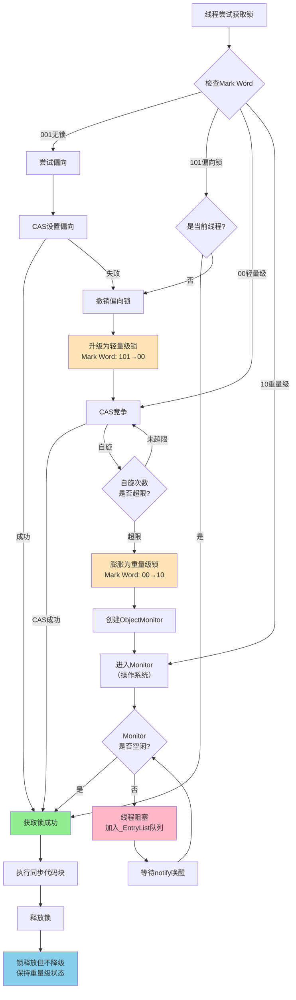
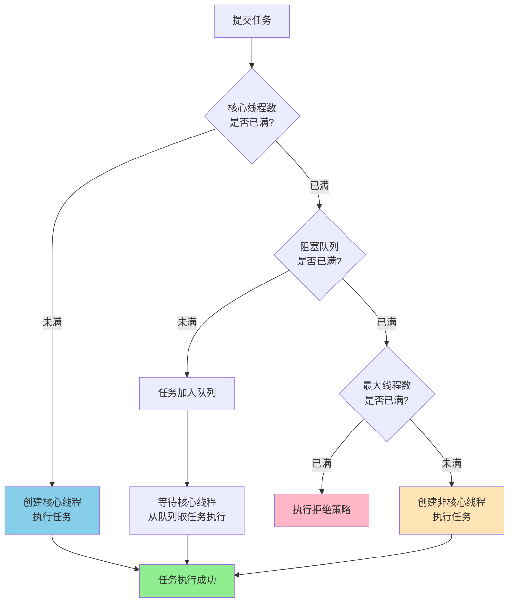

## 数据结构

### ConcurrentHashMap

弱一致性；对头结点加读写锁（非传统，写时也可读）；扩容时多线程协助。

使用红黑树的同时维护双向链表，读操作时如果有写操作正在进行，则选择查询双向链表。

#### 在 jdk 1.8 的优化

新增红黑树，分段锁 -> 头结点锁，协助扩容

#### 初始化

类似单例 DCL

#### hash 函数

(hash ^ (hash \>>> 16)) & HASH_BITS：充分打散，确保正数（也导致数组大小必须为 2 的幂）

#### 计算元素数量

并发量很大时，不同线程通过 CAS 在不同的 counterCell 上计数，求值时再做统计

## 锁

### 可重入

支持同一线程多次获取同一把锁。

### 悲观、乐观

悲观：先拿锁，再操作。乐观：先操作，再拿锁。

### 公平、非公平

公平：先休眠排队，再获取锁。非公平：先尝试获取锁，失败再休眠排队。

### synchronized

悲观，可重入，非公平。

JDK 1.6 的优化：锁消除（优化掉不用的锁）、锁膨胀（扩大锁的范围）、锁优化（见下图）

### AQS

AQS 是一个框架：状态 + 队列（双向链表） + 方法

#### 队列插入

为确保原子性，AQS 插入 node 时：先设置 node 的 prev，再通过 CAS 将 tail 替换为 node，最后补齐剩余指针。因此唤醒节点时一般从尾向头找，以免遗漏。

### ReentrantLock

基于 AQS 实现，可选公平或非公平、等待时间。

### ReentrantReadWriteLock

AQS 状态高位存读操作，低位存写操作。

读操作额外通过 ThreadLocal 记录线程持有哪些锁。

为避免写锁饥饿，读锁获取时先查询是否有写锁在等待。

## 线程池

### JDK 线程池

newFixedThreadPool（固定线程数：k/k）

newFixedThreadPool（单线程：1/1）

newCachedThreadPool（无核心线程：0/k）

newScheduledThreadPool（定时任务）

newWorkingStealingPool（每个线程一个自己的阻塞队列，手动分配）

### 核心参数

核心工作线程数、最大工作线程数、非核心工作线程最大生存时间（及单位）

阻塞队列、线程工厂、拒绝策略（抛异常、调用者处理、直接丢弃、丢弃最旧任务）

### 核心参数设置

通过压测观察 CPU 占用率决定（线程池参数支持动态修改）

### 添加任务流程

### 空任务的非核心线程

避免情况：阻塞队列里有任务，但没有工作线程。

这种情况的产生原因：核心线程数设置为 0，或设置核心线程也有生存时间

### 线程池状态

running（正常）

shutdown（停止接收新的任务）、stop（线程全部中断，队列中的任务忽略）

tidying（过渡）

terminated（被销毁）

### 线程池关闭（shutdown/shutdownNow）

目的：释放内存

实现：更新状态，唤醒挂起的工作线程（shutdown）/直接中断（shutdownNow）

### 异常处理

execute 提交：工作线程直接异常结束。submit 提交：捕获异常。