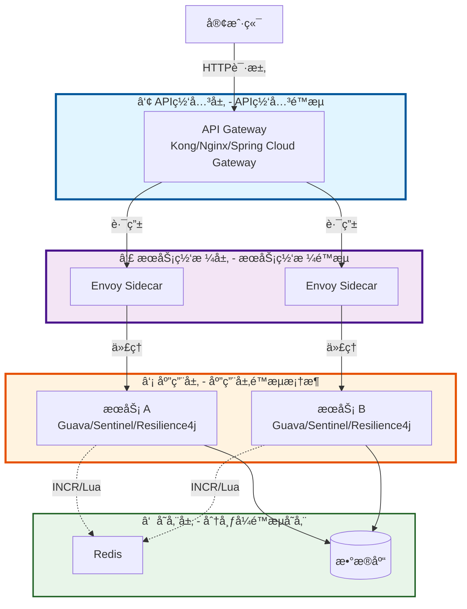
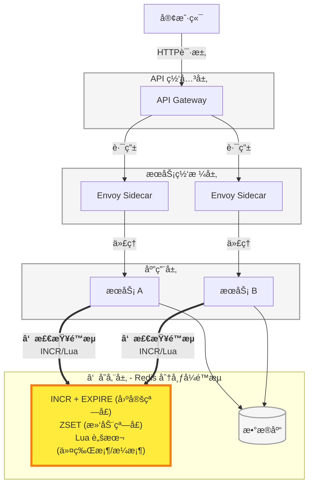
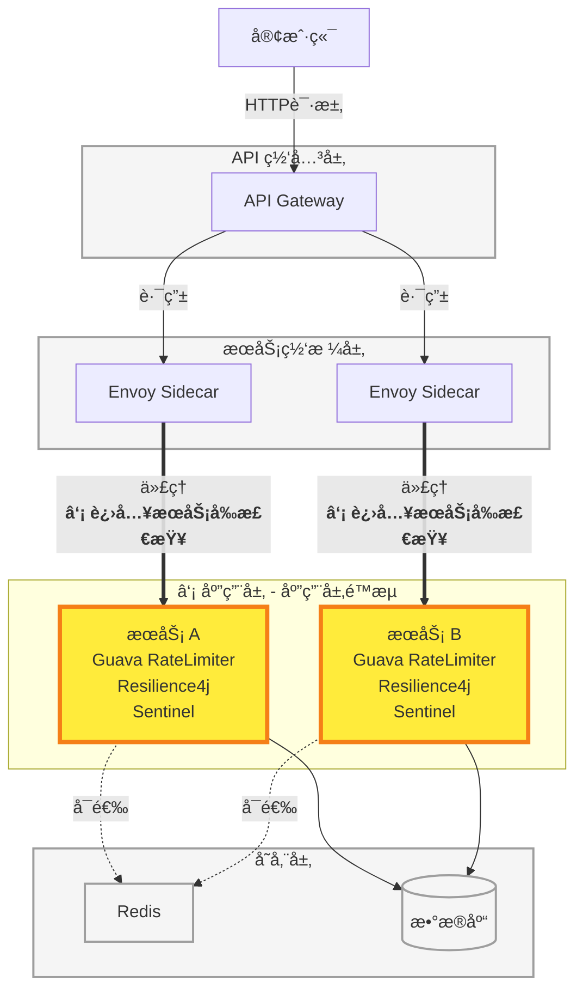
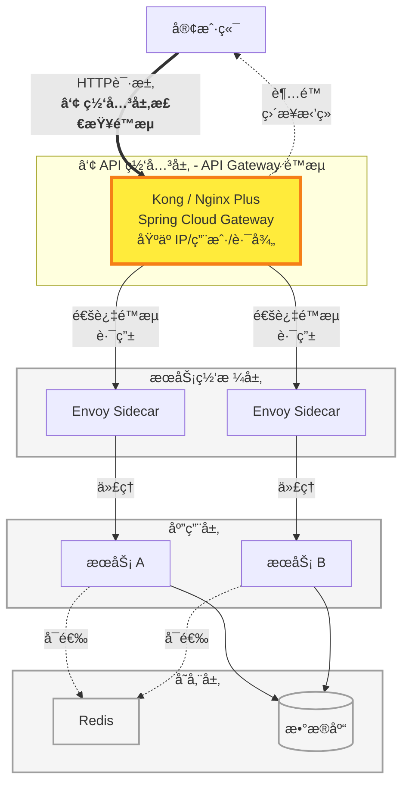
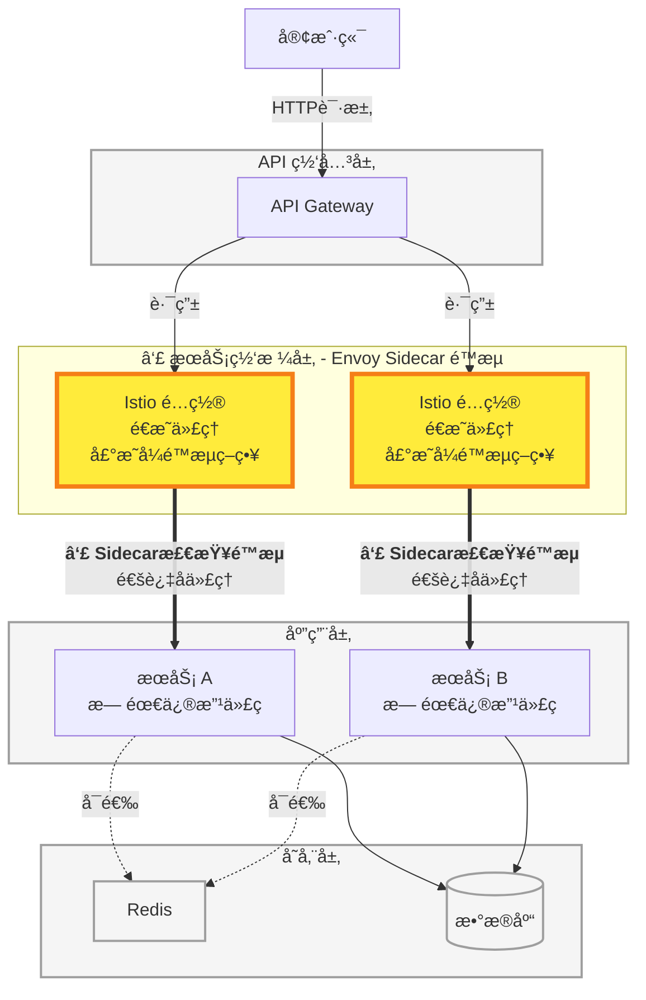
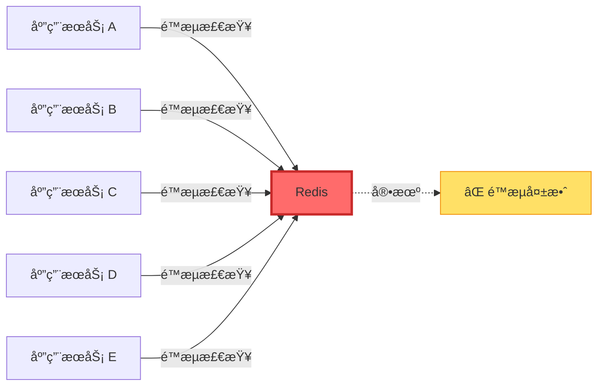
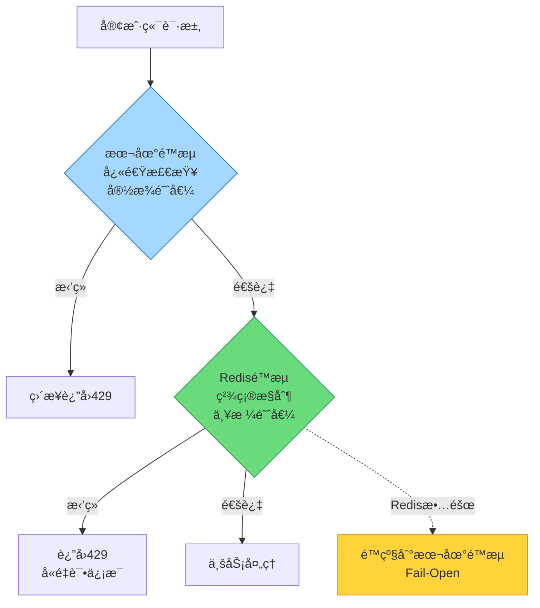
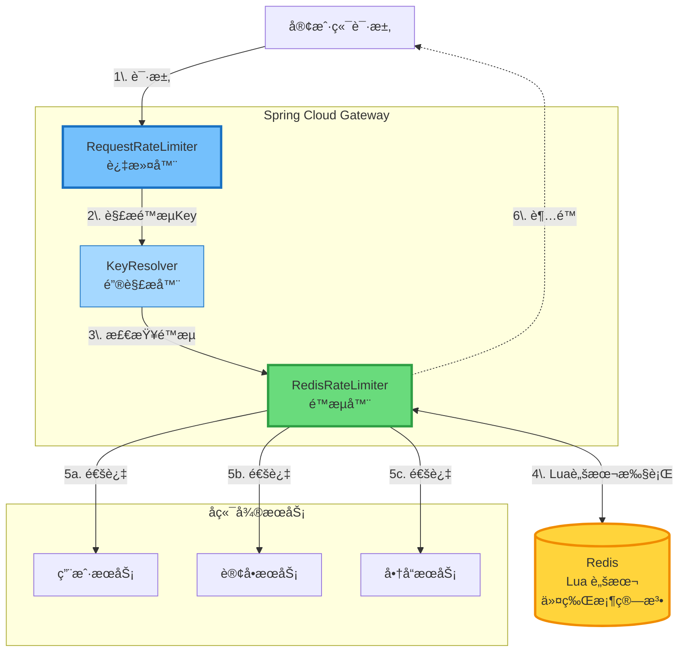
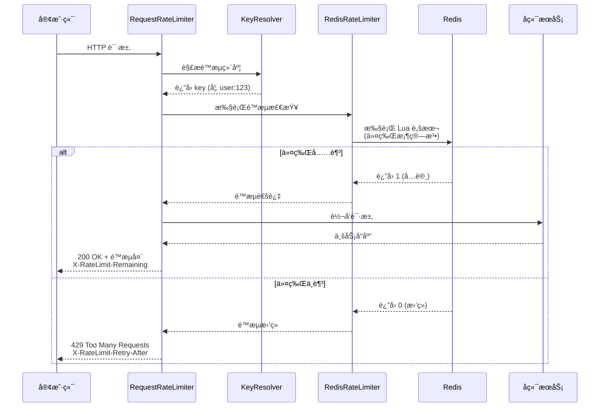

## 常è§é™æµç®—法

### 1. 固定窗å£è®¡æ•°å™¨ï¼ˆFixed Window Counter）

将时间划分为固定大å°çš„窗å£ï¼Œåœ¨æ¯ä¸ªçª—å£å†…统计请求数é‡ï¼Œå½“请求数超过阈值时拒ç»å续请求。这ç§æ–¹æ³•å®ç°ç®€å•ï¼Œä½†åœ¨çª—å£è¾¹ç•Œå¤„å¯èƒ½å‡ºç°æµé‡çªåˆºé—®é¢˜ï¼Œå³ä¸¤ä¸ªç›¸é‚»çª—å£çš„边界时刻å¯èƒ½åœ¨çŸ­æ—¶é—´å†…处ç†åŒå€çš„请求é‡ã€‚

### 2. 滑动窗å£è®¡æ•°å™¨ï¼ˆSliding Window Counter）

在固定窗å£çš„基础上，采用滑动时间窗å£æ¥ç»Ÿè®¡è¯·æ±‚æ•°é‡ï¼Œé€šå¸¸å°†æ—¶é—´çª—å£åˆ†å‰²æˆå¤šä¸ªæ›´å°çš„å­çª—å£ã€‚相比固定窗å£ï¼Œæ»‘动窗å£èƒ½æ›´å¹³æ»‘地é™æµï¼Œæœ‰æ•ˆç¼“解窗å£è¾¹ç•Œçš„çªåˆºé—®é¢˜ï¼Œä½†å®ç°å¤æ‚度和内存开销会相应å¢åŠ ã€‚

### 3. æ¼æ¡¶ç®—法（Leaky Bucket）

请求进入一个固定容é‡çš„桶中，桶以æ’定速ç‡æµå‡ºè¯·æ±‚进行处ç†ï¼Œå½“桶满时新请求会被丢弃。这ç§ç®—法能够强制é™å®šæ•°æ®çš„传输速ç‡ï¼Œä½¿æµé‡æ›´åŠ å¹³æ»‘，但无法应对短时间的çªå‘æµé‡ã€‚

### 4. 令牌桶算法（Token Bucket）

系统以æ’定速ç‡å‘桶中添加令牌，请求需è¦æ¶ˆè€—令牌æ‰èƒ½è¢«å¤„ç†ï¼Œæ¡¶æœ‰æœ€å¤§å®¹é‡é™åˆ¶ã€‚相比æ¼æ¡¶ç®—法，令牌桶å…许一定程度的çªå‘æµé‡ï¼Œå› ä¸ºå¯ä»¥ç´¯ç§¯æœªä½¿ç”¨çš„令牌。这是工业界最常用的é™æµç®—法之一，在许多开æºç»„件和云æœåŠ¡ä¸­éƒ½æœ‰åº”用。

## 超出é™æµçš„处ç†ç­–ç•¥

当请求超出é™æµé˜ˆå€¼æ—¶ï¼Œç³»ç»Ÿéœ€è¦é‡‡å–适当的策略æ¥å¤„ç†è¿™äº›è¯·æ±‚。ä¸åŒçš„处ç†ç­–略会影å“用户体验ã€ç³»ç»Ÿç¨³å®šæ€§å’Œä¸šåŠ¡ç›®æ ‡ã€‚

### 1. ç›´æ¥æ‹’ç»ï¼ˆReject）

ç«‹å³æ‹’ç»è¶…出é™æµçš„è¯·æ±‚ï¼Œè¿”å› HTTP 429 错误å“应，并通过å“应头告知客户端é™æµä¿¡æ¯å’Œå»ºè®®çš„é‡è¯•æ—¶é—´ã€‚这是最简å•ç›´æ¥çš„æ–¹å¼ï¼Œèƒ½æœ‰æ•ˆä¿æŠ¤å端系统，但用户体验较差，且å¯èƒ½å¯¼è‡´å®¢æˆ·ç«¯ç›²ç›®é‡è¯•ã€‚适用äºé€šç”¨çš„ API é™æµåœºæ™¯ï¼Œå»ºè®®é…åˆå‹å¥½çš„错误æ示和客户端退é¿ç­–略。

**标准å“应头**：`X-RateLimit-Limit`（é™æµé˜ˆå€¼ï¼‰ã€`X-RateLimit-Remaining`（剩余é…é¢ï¼‰ã€`X-RateLimit-Reset`（é‡ç½®æ—¶é—´ï¼‰ã€`Retry-After`（建议é‡è¯•ç­‰å¾…时间）。

### 2. æ’队等待（Queue）

将超出é™æµçš„请求放入队列，由åå°ä»»åŠ¡ä»¥æ’定速ç‡å¤„ç†ã€‚请求ä¸ä¼šä¸¢å¤±ï¼Œç”¨æˆ·æœ€ç»ˆéƒ½èƒ½å¾—到å“应，但需è¦ç»´æŠ¤é˜Ÿåˆ—且å“应时间å˜é•¿ã€‚适åˆå¯¹å®æ—¶æ€§è¦æ±‚ä¸é«˜çš„异步场景，如报表生æˆã€æ•°æ®å¯¼å‡ºã€åå°ä»»åŠ¡å¤„ç†ç­‰ã€‚ä¸é€‚åˆ HTTP åŒæ­¥åœºæ™¯ï¼Œå› ä¸ºé•¿æ—¶é—´ç­‰å¾…å¯èƒ½å¯¼è‡´è¶…时问题。

### 3. æœåŠ¡é™çº§ï¼ˆDegrade）

当é™æµè§¦å‘时，返å›é™çº§åçš„æœåŠ¡è€Œé完全拒ç»ã€‚例如用户信æ¯æŸ¥è¯¢é™çº§ä¸ºè¿”å›ç¼“存的基本信æ¯ã€ä¸ªæ€§åŒ–æ¨èé™çº§ä¸ºé€šç”¨çƒ­é—¨æ¦œå•ã€é«˜è´¨é‡å›¾ç‰‡å¤„ç†é™çº§ä¸ºä½è´¨é‡æˆ–åŸå›¾ã€‚è¿™ç§æ–¹å¼å¹³è¡¡äº†ç”¨æˆ·ä½“验和系统ä¿æŠ¤ï¼Œä¿è¯æ ¸å¿ƒåŠŸèƒ½å¯ç”¨ï¼Œä½†éœ€è¦é¢„先设计好é™çº§é€»è¾‘，å¢åŠ äº†ç³»ç»Ÿå¤æ‚度。

**常è§é™çº§æ–¹æ¡ˆ**：数æ®åº“查询 → 缓存读å–ã€ä¸ªæ€§åŒ–æœåŠ¡ → 通用æœåŠ¡ã€å®æ—¶è®¡ç®— → 近似值/å†å²æ•°æ®ã€å…¨æ–‡æœç´¢ → 简å•åŒ¹é…。

### 处ç†ç­–略对比

| ç­–ç•¥     | 用户体验 | å®ç°å¤æ‚度 | 资æºå¼€é”€ | 适用场景                   |
| -------- | -------- | ---------- | -------- | -------------------------- |
| ç›´æ¥æ‹’ç» | â­        | â­          | â­        | 通用场景，API é™æµ         |
| æ’队等待 | â­â­â­      | â­â­â­        | â­â­â­      | 异步任务，éå®æ—¶åœºæ™¯       |
| æœåŠ¡é™çº§ | â­â­â­â­     | â­â­â­        | â­â­       | 读多写少，有é™çº§æ–¹æ¡ˆçš„场景 |

## é™æµå®ç°æ¦‚览

### å•æœºé™æµ vs 分布å¼é™æµ

å•æœºé™æµåœ¨åº”用进程内维护计数器状æ€ï¼Œå®ç°ç®€å•ä¸”性能高，但在多å®ä¾‹éƒ¨ç½²æ—¶æ— æ³•ç²¾ç¡®æ§åˆ¶å…¨å±€æµé‡ã€‚分布å¼é™æµé€šè¿‡ Redis 等共享存储æ¥ç»´æŠ¤å…¨å±€è®¡æ•°å™¨ï¼Œèƒ½å¤Ÿç²¾ç¡®æ§åˆ¶æ•´ä½“æµé‡ï¼Œä½†ä¼šå¼•å…¥ç½‘络开销和外部ä¾èµ–，需è¦æƒè¡¡å‡†ç¡®æ€§å’Œæ€§èƒ½ã€‚

### é™æµçš„å®ç°å±‚次

下图展示了典å‹çš„å¾®æœåŠ¡å端æ¶æ„，以åŠå››ç§å¸¸è§é™æµå®ç°æ–¹å¼æ‰€åœ¨çš„层次：


```mermaid
graph TB
    Client[客户端]
    
    subgraph Gateway["â‘¢ API网关层 - API网关é™æµ"]
        APIGateway[API Gateway<br/>Kong/Nginx/Spring Cloud Gateway]
    end
    
    subgraph ServiceMesh["â‘£ æœåŠ¡ç½‘格层 - æœåŠ¡ç½‘æ ¼é™æµ"]
        Envoy1[Envoy Sidecar]
        Envoy2[Envoy Sidecar]
    end
    
    subgraph AppLayer["â‘¡ 应用层 - 应用层é™æµæ¡†æ¶"]
        Service1[æœåŠ¡ A<br/>Guava/Sentinel/Resilience4j]
        Service2[æœåŠ¡ B<br/>Guava/Sentinel/Resilience4j]
    end
    
    subgraph Storage["â‘  存储层 - 分布å¼é™æµå­˜å‚¨"]
        Redis[Redis]
        DB[(æ•°æ®åº“)]
    end
    
    Client -->|HTTP请求| APIGateway
    APIGateway -->|路由| Envoy1
    APIGateway -->|路由| Envoy2
    Envoy1 -->|代ç†| Service1
    Envoy2 -->|代ç†| Service2
    Service1 -.->|INCR/Lua| Redis
    Service2 -.->|INCR/Lua| Redis
    Service1 --> DB
    Service2 --> DB
    
    classDef gatewayStyle fill:#e1f5ff,stroke:#01579b,stroke-width:3px
    classDef meshStyle fill:#f3e5f5,stroke:#4a148c,stroke-width:3px
    classDef appStyle fill:#fff3e0,stroke:#e65100,stroke-width:3px
    classDef storageStyle fill:#e8f5e9,stroke:#1b5e20,stroke-width:2px
    
    class Gateway gatewayStyle
    class ServiceMesh meshStyle
    class AppLayer appStyle
    class Storage storageStyle
```

### 1. åŸºäº Redis 的分布å¼é™æµ

利用 Redis çš„åŸå­æ€§æ“作和过期机制æ¥å®ç°åˆ†å¸ƒå¼é™æµï¼Œé€šå¸¸ä½¿ç”¨ `INCR` 命令é…åˆ `EXPIRE` å®ç°å›ºå®šçª—å£ï¼Œæˆ–使用 `ZSET` å®ç°æ»‘动窗å£ã€‚æ›´å¤æ‚的令牌桶或æ¼æ¡¶ç®—法å¯ä»¥é€šè¿‡ Lua 脚本æ¥ä¿è¯æ“作的åŸå­æ€§ã€‚Redis 的高性能和集中å¼ç‰¹æ€§ä½¿å…¶æˆä¸ºåˆ†å¸ƒå¼é™æµçš„ç†æƒ³é€‰æ‹©ï¼Œä½†éœ€è¦æ³¨æ„ Redis çš„å¯ç”¨æ€§å’Œç½‘络延迟问题。


```mermaid
graph TB
    Client[客户端]
    
    subgraph Gateway["API 网关层"]
        APIGateway[API Gateway]
    end
    
    subgraph ServiceMesh["æœåŠ¡ç½‘格层"]
        Envoy1[Envoy Sidecar]
        Envoy2[Envoy Sidecar]
    end
    
    subgraph AppLayer["应用层"]
        Service1[æœåŠ¡ A]
        Service2[æœåŠ¡ B]
    end
    
    subgraph Storage["â‘  存储层 - Redis 分布å¼é™æµ"]
        Redis["INCR + EXPIRE (固定窗å£)<br/>ZSET (滑动窗å£)<br/>Lua 脚本 (令牌桶/æ¼æ¡¶)"]
        DB[(æ•°æ®åº“)]
    end
    
    Client -->|HTTP请求| APIGateway
    APIGateway -->|路由| Envoy1
    APIGateway -->|路由| Envoy2
    Envoy1 -->|代ç†| Service1
    Envoy2 -->|代ç†| Service2
    Service1 ==>|"<b>â‘  检查é™æµ</b><br/>INCR/Lua"| Redis
    Service2 ==>|"<b>â‘  检查é™æµ</b><br/>INCR/Lua"| Redis
    Service1 --> DB
    Service2 --> DB
    
    classDef redisHighlight fill:#ffeb3b,stroke:#f57f17,stroke-width:4px
    classDef normalStyle fill:#f5f5f5,stroke:#9e9e9e,stroke-width:2px
    
    class Redis redisHighlight
    class Gateway,ServiceMesh,AppLayer,DB normalStyle
```

### 2. 应用层é™æµæ¡†æ¶

Java 生æ€ä¸­çš„ Guava RateLimiter æ供了基äºä»¤ç‰Œæ¡¶çš„å•æœºé™æµå®ç°ï¼Œä½¿ç”¨ç®€å•ä¸”性能优秀。Resilience4j å’Œ Sentinel 等框æ¶ä¸ä»…支æŒé™æµï¼Œè¿˜é›†æˆäº†ç†”æ–­ã€é™çº§ç­‰å¾®æœåŠ¡æ²»ç†åŠŸèƒ½ï¼ŒSentinel 还æ供了æ§åˆ¶å°è¿›è¡ŒåŠ¨æ€è§„则é…置。这些框æ¶é€šå¸¸åœ¨æœåŠ¡å†…部集æˆï¼Œé€‚åˆå¯¹ç‰¹å®šæ–¹æ³•æˆ–资æºè¿›è¡Œç»†ç²’度的é™æµæ§åˆ¶ã€‚


```mermaid
graph TB
    Client[客户端]
    
    subgraph Gateway["API 网关层"]
        APIGateway[API Gateway]
    end
    
    subgraph ServiceMesh["æœåŠ¡ç½‘格层"]
        Envoy1[Envoy Sidecar]
        Envoy2[Envoy Sidecar]
    end
    
    subgraph AppLayer["â‘¡ 应用层 - 应用层é™æµ"]
        Service1["æœåŠ¡ A<br/>Guava RateLimiter<br/>Resilience4j<br/>Sentinel"]
        Service2["æœåŠ¡ B<br/>Guava RateLimiter<br/>Resilience4j<br/>Sentinel"]
    end
    
    subgraph Storage["存储层"]
        Redis[Redis]
        DB[(æ•°æ®åº“)]
    end
    
    Client -->|HTTP请求| APIGateway
    APIGateway -->|路由| Envoy1
    APIGateway -->|路由| Envoy2
    Envoy1 ==>|"代ç†<br/><b>â‘¡ 进入æœåŠ¡å‰æ£€æŸ¥</b>"| Service1
    Envoy2 ==>|"代ç†<br/><b>â‘¡ 进入æœåŠ¡å‰æ£€æŸ¥</b>"| Service2
    Service1 -.->|å¯é€‰| Redis
    Service2 -.->|å¯é€‰| Redis
    Service1 --> DB
    Service2 --> DB
    
    classDef appHighlight fill:#ffeb3b,stroke:#f57f17,stroke-width:4px
    classDef normalStyle fill:#f5f5f5,stroke:#9e9e9e,stroke-width:2px
    
    class Service1,Service2 appHighlight
    class Gateway,ServiceMesh,Storage,Redis,DB normalStyle
```

### 3. API 网关é™æµ

主æµçš„ API 网关如 Kongã€Nginx Plusã€Spring Cloud Gateway 等都内置了é™æµåŠŸèƒ½ï¼Œå¯ä»¥åŸºäº IPã€ç”¨æˆ·ã€API 路径等维度进行é™æµã€‚网关层é™æµçš„优势在äºç»Ÿä¸€ç®¡ç†å’Œé…置，能在æµé‡è¿›å…¥ç³»ç»Ÿå‰å°±è¿›è¡Œæ‹¦æˆªï¼Œå‡è½»å端æœåŠ¡å‹åŠ›ã€‚对äºä½¿ç”¨äº‘æœåŠ¡çš„场景，AWS API Gatewayã€é˜¿é‡Œäº‘ API 网关等也æ供了开箱å³ç”¨çš„é™æµèƒ½åŠ›ã€‚


```mermaid
graph TB
    Client[客户端]
    
    subgraph Gateway["â‘¢ API 网关层 - API Gateway é™æµ"]
        APIGateway["Kong / Nginx Plus<br/>Spring Cloud Gateway<br/>åŸºäº IP/用户/路径"]
    end
    
    subgraph ServiceMesh["æœåŠ¡ç½‘格层"]
        Envoy1[Envoy Sidecar]
        Envoy2[Envoy Sidecar]
    end
    
    subgraph AppLayer["应用层"]
        Service1[æœåŠ¡ A]
        Service2[æœåŠ¡ B]
    end
    
    subgraph Storage["存储层"]
        Redis[Redis]
        DB[(æ•°æ®åº“)]
    end
    
    Client ==>|"HTTP请求<br/><b>â‘¢ 网关层检查é™æµ</b>"| APIGateway
    APIGateway -->|"通过é™æµ<br/>路由"| Envoy1
    APIGateway -->|"通过é™æµ<br/>路由"| Envoy2
    APIGateway -.->|"超é™<br/>ç›´æ¥æ‹’ç»"| Client
    Envoy1 -->|代ç†| Service1
    Envoy2 -->|代ç†| Service2
    Service1 -.->|å¯é€‰| Redis
    Service2 -.->|å¯é€‰| Redis
    Service1 --> DB
    Service2 --> DB
    
    classDef gatewayHighlight fill:#ffeb3b,stroke:#f57f17,stroke-width:4px
    classDef normalStyle fill:#f5f5f5,stroke:#9e9e9e,stroke-width:2px
    
    class APIGateway gatewayHighlight
    class ServiceMesh,AppLayer,Storage,Redis,DB normalStyle
```

### 4. æœåŠ¡ç½‘æ ¼é™æµ

在使用 Istio ç­‰æœåŠ¡ç½‘格的æ¶æ„中，å¯ä»¥é€šè¿‡ Envoy 代ç†å®ç°é€æ˜çš„é™æµæ§åˆ¶ï¼Œæ— éœ€ä¿®æ”¹åº”用代ç ã€‚æœåŠ¡ç½‘æ ¼æ供了基äºé…置的声æ˜å¼é™æµï¼Œæ”¯æŒå…¨å±€å’Œå±€éƒ¨é™æµç­–略，还能ä¸å…¶ä»–æµé‡ç®¡ç†åŠŸèƒ½ï¼ˆå¦‚è´Ÿè½½å‡è¡¡ã€ç†”断）无ç¼é›†æˆã€‚è¿™ç§æ–¹å¼ç‰¹åˆ«é€‚åˆå¤§è§„模微æœåŠ¡é›†ç¾¤ï¼Œä½†å¼•å…¥äº†é¢å¤–的基础设施å¤æ‚度。


```mermaid
graph TB
    Client[客户端]
    
    subgraph Gateway["API 网关层"]
        APIGateway[API Gateway]
    end
    
    subgraph ServiceMesh["â‘£ æœåŠ¡ç½‘格层 - Envoy Sidecar é™æµ"]
        Envoy1["Istio é…ç½®<br/>é€æ˜ä»£ç†<br/>声æ˜å¼é™æµç­–ç•¥"]
        Envoy2["Istio é…ç½®<br/>é€æ˜ä»£ç†<br/>声æ˜å¼é™æµç­–ç•¥"]
    end
    
    subgraph AppLayer["应用层"]
        Service1[æœåŠ¡ A<br/>无需修改代ç ]
        Service2[æœåŠ¡ B<br/>无需修改代ç ]
    end
    
    subgraph Storage["存储层"]
        Redis[Redis]
        DB[(æ•°æ®åº“)]
    end
    
    Client -->|HTTP请求| APIGateway
    APIGateway -->|路由| Envoy1
    APIGateway -->|路由| Envoy2
    Envoy1 ==>|"<b>â‘£ Sidecar检查é™æµ</b><br/>通过å代ç†"| Service1
    Envoy2 ==>|"<b>â‘£ Sidecar检查é™æµ</b><br/>通过å代ç†"| Service2
    Service1 -.->|å¯é€‰| Redis
    Service2 -.->|å¯é€‰| Redis
    Service1 --> DB
    Service2 --> DB
    
    classDef meshHighlight fill:#ffeb3b,stroke:#f57f17,stroke-width:4px
    classDef normalStyle fill:#f5f5f5,stroke:#9e9e9e,stroke-width:2px
    
    class Envoy1,Envoy2 meshHighlight
    class Gateway,AppLayer,Storage,Redis,DB normalStyle
```

## Redis é™æµå®ç°

### 1. 固定窗å£è®¡æ•°å™¨

**åŸç†**：使用 `INCR` 命令对请求计数，é…åˆ `EXPIRE` 设置窗å£è¿‡æœŸæ—¶é—´ã€‚

**优点**：å®ç°ç®€å•ï¼Œæ€§èƒ½é«˜  
**缺点**：窗å£è¾¹ç•Œæµé‡çªåˆºé—®é¢˜

#### Java ç›´æ¥å®ç°

适åˆä½å¹¶å‘场景，å¯æ¥å—æå°æ¦‚ç‡çš„ä¸ç²¾ç¡®ã€‚

```java
public boolean allowRequest_Simple(String userId, int limit, int windowSeconds) {
    String key = "rate_limit:" + userId + ":" + (System.currentTimeMillis() / 1000 / windowSeconds);
    
    // 使用 Redis åŸå­å‘½ä»¤ INCR
    Long count = redisTemplate.opsForValue().increment(key);
    
    // âš ï¸ æ³¨æ„：INCR å’Œ EXPIRE 之间ä¸æ˜¯åŸå­çš„，æ端情况下å¯èƒ½ä¸¢å¤±è¿‡æœŸæ—¶é—´
    if (count == 1) {
        redisTemplate.expire(key, windowSeconds, TimeUnit.SECONDS);
    }
    
    return count <= limit;
}
```

#### åŸºäº Lua å®ç° ✅ æ¨è

ä¿è¯åŸå­æ€§ï¼Œç”Ÿäº§ç¯å¢ƒæ¨è使用。

**Java 代ç **：

```java
public boolean allowRequest(String userId, int limit, int windowSeconds) {
    String key = "rate_limit:" + userId + ":" + (System.currentTimeMillis() / 1000 / windowSeconds);
    
    DefaultRedisScript<Long> script = new DefaultRedisScript<>();
    script.setScriptText(luaScript);  // Lua 脚本è§ä¸‹æ–¹
    script.setResultType(Long.class);
    
    // ⭠调用 Lua 脚本（在 Redis æœåŠ¡å™¨ç«¯åŸå­æ‰§è¡Œï¼‰
    Long result = redisTemplate.execute(
        script,
        Collections.singletonList(key),  // KEYS[1]
        String.valueOf(limit),           // ARGV[1]
        String.valueOf(windowSeconds)    // ARGV[2]
    );
    
    return result != null && result == 1L;
}
```

**Lua 脚本**：

```lua
-- Lua 脚本ä¿è¯åŸå­æ€§
local key = KEYS[1]                  -- rate_limit:user:123:1641024000
local limit = tonumber(ARGV[1])      -- 100
local window = tonumber(ARGV[2])     -- 60秒

local current = redis.call('GET', key)
if current and tonumber(current) >= limit then
    return 0  -- 超过é™åˆ¶
end

redis.call('INCR', key)
if not current then
    redis.call('EXPIRE', key, window)
end
return 1  -- å…许通过
```

### 2. 滑动窗å£è®¡æ•°å™¨

**åŸç†**：使用 `ZSET` 存储请求时间戳，根æ®æ—¶é—´èŒƒå›´ç»Ÿè®¡è¯·æ±‚æ•°é‡ã€‚

**优点**：平滑é™æµï¼Œè§£å†³å›ºå®šçª—å£è¾¹ç•Œé—®é¢˜  
**缺点**：内存开销较大，需è¦å­˜å‚¨æ¯ä¸ªè¯·æ±‚记录

#### Java ç›´æ¥å®ç°

âš ï¸ æ³¨æ„：多个命令之间ä¸æ˜¯åŸå­çš„，高并å‘下å¯èƒ½ä¸ç²¾ç¡®ã€‚

```java
public boolean allowRequest_NonAtomic(String userId, int limit, int windowSeconds) {
    String key = "rate_limit:sliding:" + userId;
    long now = System.currentTimeMillis();
    long windowStart = now - windowSeconds * 1000L;
    
    // 步骤1: 移除过期数æ®
    redisTemplate.opsForZSet().removeRangeByScore(key, 0, windowStart);
    
    // 步骤2: 统计当å‰çª—å£è¯·æ±‚æ•°
    // âš ï¸ è¿™ä¸‰æ­¥ä¹‹é—´å¯èƒ½è¢«å…¶ä»–线程打断，导致计数ä¸å‡†
    Long count = redisTemplate.opsForZSet().zCard(key);
    if (count != null && count >= limit) {
        return false;
    }
    
    // 步骤3: 添加当å‰è¯·æ±‚
    redisTemplate.opsForZSet().add(key, String.valueOf(now), now);
    redisTemplate.expire(key, windowSeconds, TimeUnit.SECONDS);
    return true;
}
```

#### åŸºäº Lua å®ç° ✅ æ¨è

ä¿è¯åŸå­æ€§ï¼Œé«˜å¹¶å‘场景必须使用。

**Java 代ç **：

```java
public boolean allowRequest(String userId, int limit, int windowSeconds) {
    String key = "rate_limit:sliding:" + userId;
    long now = System.currentTimeMillis();
    
    DefaultRedisScript<Long> script = new DefaultRedisScript<>();
    script.setScriptText(luaScript);  // Lua 脚本è§ä¸‹æ–¹
    script.setResultType(Long.class);
    
    // ⭠调用 Lua 脚本（在 Redis æœåŠ¡å™¨ç«¯åŸå­æ‰§è¡Œï¼‰
    Long result = redisTemplate.execute(
        script,
        Collections.singletonList(key),     // KEYS[1]
        String.valueOf(limit),              // ARGV[1]
        String.valueOf(windowSeconds),      // ARGV[2]
        String.valueOf(now)                 // ARGV[3]
    );
    
    return result != null && result == 1L;
}
```

**Lua 脚本**：

```lua
-- Lua 脚本å®ç°
local key = KEYS[1]              -- rate_limit:user:123
local limit = tonumber(ARGV[1])  -- 100
local window = tonumber(ARGV[2]) -- 60秒
local now = tonumber(ARGV[3])    -- 当å‰æ—¶é—´æˆ³ï¼ˆæ¯«ç§’）

-- 移除窗å£å¤–的旧记录
redis.call('ZREMRANGEBYSCORE', key, 0, now - window * 1000)

-- 统计当å‰çª—å£å†…的请求数
local current = redis.call('ZCARD', key)
if current >= limit then
    return 0  -- 超过é™åˆ¶
end

-- 添加当å‰è¯·æ±‚
redis.call('ZADD', key, now, now)
redis.call('EXPIRE', key, window)
return 1  -- å…许通过
```

### 3. æ¼æ¡¶ç®—法

**åŸç†**：模拟一个固定容é‡çš„桶，以æ’定速ç‡æ¼æ°´ï¼ˆå¤„ç†è¯·æ±‚）。

**优点**：æµé‡ç»å¯¹å¹³æ»‘，æ’å®šé€Ÿç‡  
**缺点**：无法应对çªå‘æµé‡

**âš ï¸ Redis ä¸é€‚åˆå®ç°çœŸæ­£çš„æ¼æ¡¶ç®—法**

**ç†è®ºä¸Šçš„æ¼æ¡¶**：请求进入桶中æ’队，系统以æ’定速ç‡ä»æ¡¶ä¸­å–出请求处ç†ã€‚å³ä½¿é•¿æ—¶é—´æ— è¯·æ±‚åçªç„¶æ¶Œå…¥å¤§é‡è¯·æ±‚，也åªèƒ½ä»¥å›ºå®šé€Ÿç‡å¤„ç†ï¼ŒçœŸæ­£åšåˆ°"削峰填谷"。

**为什么 Redis 难以å®ç°**：
- 需è¦ç»´æŠ¤ä¸€ä¸ªè¯·æ±‚队列（消耗大é‡å†…存）
- 需è¦åå°å®šæ—¶ä»»åŠ¡ä»¥æ’定速ç‡å¤„ç†é˜Ÿåˆ—
- 请求需è¦å¼‚步等待，影å“å“应时间
- HTTP åŒæ­¥æ¨¡å‹ä¸é€‚åˆè¯·æ±‚æ’队等待
- å®ç°å¤æ‚度高，ä¸é€‚åˆçº¯ Redis 方案

**真正的æ¼æ¡¶å®ç°**需è¦ï¼š

```java
// 真正的æ¼æ¡¶éœ€è¦é˜Ÿåˆ— + åå°ä»»åŠ¡ï¼ˆä¸é€‚åˆ Redis）
public class TrueLeakyBucket {
    private final BlockingQueue<Request> queue = new LinkedBlockingQueue<>(capacity);
    
    // 请求进入队列等待
    public CompletableFuture<Response> handleRequest(Request req) {
        if (queue.offer(req)) {
            return req.getFuture();  // 异步等待处ç†
        } else {
            throw new RateLimitException("Bucket full");
        }
    }
    
    // åå°ä»»åŠ¡ï¼šä»¥æ’定速ç‡10/s处ç†
    @Scheduled(fixedDelay = 100)  // 100ms = 10/s
    public void processRequest() {
        Request req = queue.poll();
        if (req != null) {
            process(req);  // æ’定速ç‡å¤„ç†
        }
    }
}
```

**如æœéœ€è¦çœŸæ­£çš„æ¼æ¡¶æ•ˆæœ**（强制æ’定速ç‡ï¼‰ï¼Œå»ºè®®ï¼š
- 使用消æ¯é˜Ÿåˆ—（RabbitMQã€Kafka）+ 消费者é™é€Ÿ
- 使用专门的æµé‡æ•´å½¢å·¥å…·ï¼ˆå¦‚ Envoy）
- **或直æ¥ä½¿ç”¨ä»¤ç‰Œæ¡¶ç®—法**（工业界更常用，è§ä¸‹æ–‡ï¼‰

> 💡 **å®è·µå»ºè®®**：大多数场景下，**令牌桶**å·²ç»è¶³å¤Ÿã€‚它å…许一定的çªå‘æµé‡ï¼ˆæå‡ç”¨æˆ·ä½“验），åŒæ—¶æ§åˆ¶å¹³å‡é€Ÿç‡ï¼ˆä¿æŠ¤ç³»ç»Ÿï¼‰ã€‚åªæœ‰åœ¨éœ€è¦ç»å¯¹æ’定输出速ç‡çš„场景（如视频æµä¼ è¾“ã€ç¡¬ä»¶é€šä¿¡ï¼‰æ‰éœ€è¦çœŸæ­£çš„æ¼æ¡¶ã€‚
{: .prompt-tip }

### 4. 令牌桶算法

**åŸç†**：以æ’定速ç‡ç”Ÿæˆä»¤ç‰Œæ”¾å…¥æ¡¶ä¸­ï¼Œè¯·æ±‚需è¦æ¶ˆè€—令牌，å…许çªå‘æµé‡ï¼ˆæ¡¶æ»¡æ—¶ç´¯ç§¯ä»¤ç‰Œï¼‰ã€‚

**优点**：å…许çªå‘æµé‡ï¼Œæ›´çµæ´»  
**缺点**：å®ç°ç›¸å¯¹å¤æ‚

> 令牌桶算法一般通过基äº**懒惰求值**（Lazy Evaluation）的方å¼å®ç°ã€‚懒惰求值是指ä¸éœ€è¦å¯åŠ¨åå°çº¿ç¨‹æŒç»­ç”Ÿæˆä»¤ç‰Œï¼Œè€Œæ˜¯åœ¨æ¯æ¬¡è¯·æ±‚到æ¥æ—¶æ‰è®¡ç®—ä»ä¸Šæ¬¡è¯·æ±‚到ç°åœ¨åº”该生æˆå¤šå°‘令牌。这ç§æ–¹å¼é¿å…了维护åå°ä»»åŠ¡çš„å¤æ‚性，åªéœ€è®°å½•ä¸Šæ¬¡æ›´æ–°æ—¶é—´å’Œå½“å‰ä»¤ç‰Œæ•°ï¼Œé€šè¿‡æ—¶é—´å·®ä¹˜ä»¥ç”Ÿæˆé€Ÿç‡æ¥è®¡ç®—æ–°å¢ä»¤ç‰Œï¼Œå®ç°ç®€å•ä¸”高效。
{: .prompt-info}

#### åŸºäº Lua å®ç°

âš ï¸ ä»¤ç‰Œæ¡¶ç®—æ³•å¿…é¡»è°ƒç”¨ Lua 脚本，åŸå› ï¼šéœ€è¦åŸå­åœ°å®Œæˆ"读å–令牌→计算生æˆé‡â†’判断并扣å‡"。

**Java 代ç **：

```java
public boolean allowRequest(String userId, int capacity, double rate, int requestedTokens) {
    String key = "rate_limit:token:" + userId;
    long now = System.currentTimeMillis() / 1000;
    
    DefaultRedisScript<Long> script = new DefaultRedisScript<>();
    script.setScriptText(luaScript);  // Lua 脚本è§ä¸‹æ–¹
    script.setResultType(Long.class);
    
    // ⭠调用 Lua 脚本（在 Redis æœåŠ¡å™¨ç«¯åŸå­æ‰§è¡Œï¼‰
    Long result = redisTemplate.execute(
        script,
        Collections.singletonList(key),   // KEYS[1]
        String.valueOf(capacity),         // ARGV[1] - 桶容é‡
        String.valueOf(rate),             // ARGV[2] - 生æˆé€Ÿç‡
        String.valueOf(requestedTokens),  // ARGV[3] - 请求令牌数
        String.valueOf(now)               // ARGV[4] - 当å‰æ—¶é—´
    );
    
    return result != null && result == 1L;
}
```

**Lua 脚本**：

```lua
-- Lua 脚本å®ç°
local key = KEYS[1]                 -- rate_limit:token:user:123
local capacity = tonumber(ARGV[1])  -- æ¡¶å®¹é‡ 100
local rate = tonumber(ARGV[2])      -- 生æˆé€Ÿç‡ 10/秒
local requested = tonumber(ARGV[3]) -- 请求令牌数 1
local now = tonumber(ARGV[4])       -- 当å‰æ—¶é—´æˆ³ï¼ˆç§’）

-- è·å–上次更新时间和当å‰ä»¤ç‰Œæ•°
local last_time = redis.call('HGET', key, 'last_time')
local tokens = redis.call('HGET', key, 'tokens')

if not last_time then
    last_time = now
    tokens = capacity
else
    last_time = tonumber(last_time)
    tokens = tonumber(tokens)
    
    -- 计算新å¢çš„令牌数
    local delta = (now - last_time) * rate
    tokens = math.min(capacity, tokens + delta)
end

-- 判断令牌是å¦è¶³å¤Ÿ
if tokens >= requested then
    tokens = tokens - requested
    redis.call('HSET', key, 'tokens', tokens)
    redis.call('HSET', key, 'last_time', now)
    redis.call('EXPIRE', key, 3600)  -- 1å°æ—¶è¿‡æœŸ
    return 1  -- å…许
else
    return 0  -- æ‹’ç»
end
```

### å››ç§ç®—法对比

| 算法     | Rediså®ç°     | 是å¦å¿…é¡»Lua | 内存开销 | 平滑性 | çªå‘æµé‡ | 适用场景      |
| -------- | ------------- | ----------- | -------- | ------ | -------- | ------------- |
| å›ºå®šçª—å£ | String (INCR) | âš ï¸ æ¨è使用  | æœ€å°     | å·®     | ⌠       | 简å•é™æµ      |
| æ»‘åŠ¨çª—å£ | ZSET          | âš ï¸ æ¨è使用  | 大       | 好     | ⌠       | 精确é™æµ      |
| æ¼æ¡¶     | ⌠ä¸é€‚åˆRedis | -           | -        | 最好   | ⌠       | 消æ¯é˜Ÿåˆ—+é™é€Ÿ |
| 令牌桶   | Hash          | ✅ å¿…é¡»      | å°       | 好     | ✅        | **æ¨è**      |

**说æ˜**：
- **固定窗å£**：å¯ä»¥ä¸ç”¨ Lua，但生产ç¯å¢ƒæ¨è使用以ä¿è¯åŸå­æ€§
- **滑动窗å£**：高并å‘场景æ¨è使用 Lua ä¿è¯å¤šæ­¥æ“作åŸå­æ€§
- **æ¼æ¡¶**：真正的æ¼æ¡¶éœ€è¦é˜Ÿåˆ—+åå°ä»»åŠ¡ï¼ŒRedis 无法很好å®ç°ï¼Œå»ºè®®ç”¨æ¶ˆæ¯é˜Ÿåˆ—或令牌桶替代
- **令牌桶**：必须使用 Lua 脚本，工业界最常用方案 ✅

### Redis é™æµçš„缺点

虽然 Redis 是å®ç°åˆ†å¸ƒå¼é™æµçš„主æµæ–¹æ¡ˆï¼Œä½†ä¹Ÿå­˜åœ¨ä¸€äº›éœ€è¦æ³¨æ„的缺点。

#### 1. å•ç‚¹æ•…éšœé£é™©

**问题æè¿°**：Redis 作为中心化的é™æµæœåŠ¡ï¼Œä¸€æ—¦å®•æœºä¼šå¯¼è‡´æ•´ä¸ªé™æµåŠŸèƒ½å¤±æ•ˆã€‚所有ä¾èµ– Redis 进行é™æµåˆ¤æ–­çš„应用æœåŠ¡éƒ½ä¼šå—到影å“，必须在"放行所有请求"å’Œ"æ‹’ç»æ‰€æœ‰è¯·æ±‚"之间åšå‡ºé€‰æ‹©ã€‚


```mermaid
graph LR
    A[应用æœåŠ¡ A] -->|é™æµæ£€æŸ¥| R[Redis]
    B[应用æœåŠ¡ B] -->|é™æµæ£€æŸ¥| R
    C[应用æœåŠ¡ C] -->|é™æµæ£€æŸ¥| R
    D[应用æœåŠ¡ D] -->|é™æµæ£€æŸ¥| R
    E[应用æœåŠ¡ E] -->|é™æµæ£€æŸ¥| R
    R -.->|宕机| X[⌠é™æµå¤±æ•ˆ]
    
    style R fill:#ff6b6b,stroke:#c92a2a,stroke-width:3px
    style X fill:#ffe066,stroke:#f08c00
```

**两ç§æ•…障处ç†ç­–略的影å“**：

| ç­–ç•¥                   | 行为             | 用户体验 | 系统é£é™©     | 适用场景     |
| ---------------------- | ---------------- | -------- | ------------ | ------------ |
| 失败开放（Fail-Open）  | 放行所有请求     | 好       | 高（过载）   | 普通业务     |
| 失败关闭（Fail-Close） | æ‹’ç»æ‰€æœ‰è¯·æ±‚     | å·®       | ä½ï¼ˆæ‹’ç»ï¼‰   | 关键防护     |
| é™çº§åˆ°æœ¬åœ°é™æµï¼ˆæ¨è） | 使用å•æœºé™æµå…œåº• | 中       | 中（ä¸ç²¾ç¡®ï¼‰ | 生产ç¯å¢ƒæ¨è |

**缓解方案**：部署 Redis 主ä»å¤åˆ¶é…åˆå“¨å…µæ¨¡å¼å®ç°è‡ªåŠ¨æ•…障转移，或使用 Redis Cluster 集群æ高å¯ç”¨æ€§ã€‚结åˆæœ¬åœ°é™æµä½œä¸ºé™çº§ç­–略，当 Redis ä¸å¯ç”¨æ—¶è‡ªåŠ¨åˆ‡æ¢åˆ°å•æœºé™æµï¼Œè™½ç„¶æ— æ³•å®ç°å…¨å±€ç²¾ç¡®æ§åˆ¶ï¼Œä½†èƒ½ä¿è¯åŸºæœ¬çš„é™æµèƒ½åŠ›ã€‚

#### 2. 网络延迟开销

**问题æè¿°**：æ¯æ¬¡é™æµåˆ¤æ–­éƒ½éœ€è¦é€šè¿‡ç½‘络调用 Redis，相比本地内存访问会å¢åŠ è¯·æ±‚的整体延迟。在高并å‘场景下，网络往返时间会æˆä¸ºæ€§èƒ½ç“¶é¢ˆï¼Œå°¤å…¶æ˜¯è·¨æœºæˆ¿éƒ¨ç½²æ—¶å»¶è¿Ÿæ›´åŠ æ˜æ˜¾ã€‚

#### 3. 时钟åŒæ­¥é—®é¢˜

**问题æè¿°**：一般的 redis é™æµå®ç°å°† **时间戳的计算** 放在 **æœåŠ¡å™¨ç«¯**，因此存在误差。时钟å差会影å“时间窗å£çš„边界判断，尤其在滑动窗å£ã€ä»¤ç‰Œæ¡¶ç­‰ä¾èµ–时间计算的算法中更为æ˜æ˜¾ã€‚

**缓解方案**：

1. 在所有应用æœåŠ¡å™¨ä¸Šé…ç½® NTP æœåŠ¡å®šæœŸåŒæ­¥æ—¶é’Ÿï¼Œå°†æ—¶é—´åå·®æ§åˆ¶åœ¨æ¯«ç§’级
2. 在 Lua 脚本中优先使用 Redis æœåŠ¡å™¨æ—¶é—´è€Œé客户端时间，é¿å…ä¸åŒå®¢æˆ·ç«¯æ—¶é’Ÿä¸ä¸€è‡´çš„问题
3. 在算法设计时容å¿ä¸€å®šçš„误差范围，ä¸è¿½æ±‚ç»å¯¹ç²¾ç¡®çš„é™æµæ•ˆæœã€‚

### 总结ä¸å»ºè®®

#### Redis é™æµçš„优缺点对比

| 维度   | 优点 ✅             | 缺点 ⌠                    |
| ------ | ------------------ | -------------------------- |
| 功能性 | 全局统一，精确æ§åˆ¶ | ä¾èµ–外部æœåŠ¡ï¼Œå­˜åœ¨å•ç‚¹é£é™© |
| 通用性 | 跨语言ã€è·¨æœåŠ¡é€šç”¨ | 需è¦å›¢é˜ŸæŒæ¡ Redis å’Œ Lua  |
| çµæ´»æ€§ | 支æŒå¤šç§é™æµç®—法   | 算法å®ç°éœ€è¦ Lua 脚本      |
| 性能   | å•æœº 10 万+ QPS    | 网络延迟开销（1-5ms）      |
| è¿ç»´   | æˆç†Ÿçš„è¿ç»´å·¥å…·é“¾   | è¿ç»´å¤æ‚度和æˆæœ¬å¢åŠ        |
| å¯é æ€§ | å¯é…置高å¯ç”¨æ–¹æ¡ˆ   | 时钟åŒæ­¥é—®é¢˜               |

#### å®é™…生产ç¯å¢ƒçš„最佳å®è·µ

**æ··åˆé™æµç­–ç•¥**：结åˆæœ¬åœ°é™æµå’Œ Redis é™æµçš„优势，形æˆå¤šå±‚防护体系。本地é™æµä½œä¸ºç¬¬ä¸€é“快速检查（设置宽æ¾é˜ˆå€¼å¦‚ 120%），Redis é™æµä½œä¸ºç²¾ç¡®æ§åˆ¶çš„第二é“防线（设置严格阈值如 100%），当 Redis 故障时é™çº§åˆ°æœ¬åœ°é™æµä¿è¯å¯ç”¨æ€§ã€‚

**多层é™æµæ¶æ„**：


```mermaid
graph TB
    A[客户端请求] --> B{本地é™æµ<br/>快速检查<br/>宽æ¾é˜ˆå€¼}
    B -->|æ‹’ç»| C[ç›´æ¥è¿”å›429]
    B -->|通过| D{Redisé™æµ<br/>精确æ§åˆ¶<br/>严格阈值}
    D -->|æ‹’ç»| E[è¿”å›429<br/>å«é‡è¯•ä¿¡æ¯]
    D -->|通过| F[业务处ç†]
    D -.->|Redisæ•…éšœ| G[é™çº§åˆ°æœ¬åœ°é™æµ<br/>Fail-Open]
    
    style B fill:#a5d8ff,stroke:#1971c2
    style D fill:#69db7c,stroke:#2f9e44
    style G fill:#ffd43b,stroke:#f08c00
```

## Spring Cloud é™æµå®ç°

### 核心æ¶æ„

Spring Cloud çš„é™æµä¸»è¦é€šè¿‡ **Spring Cloud Gateway** å®ç°ï¼ŒåŸºäº Redis + Lua 脚本的令牌桶算法。Gateway 作为微æœåŠ¡æ¶æ„的统一入å£ï¼Œåœ¨è¯·æ±‚到达å端æœåŠ¡ä¹‹å‰è¿›è¡Œé™æµæ§åˆ¶ã€‚


```mermaid
graph TB
    Client[客户端请求]
    
    subgraph Gateway["Spring Cloud Gateway"]
        Filter[RequestRateLimiter<br/>过滤器]
        KeyResolver[KeyResolver<br/>键解æ器]
        RateLimiter[RedisRateLimiter<br/>é™æµå™¨]
    end
    
    subgraph Backend["å端微æœåŠ¡"]
        ServiceA[用户æœåŠ¡]
        ServiceB[订å•æœåŠ¡]
        ServiceC[商å“æœåŠ¡]
    end
    
    Client -->|1\. 请求| Filter
    Filter -->|2\. 解æé™æµKey| KeyResolver
    KeyResolver -->|3\. 检查é™æµ| RateLimiter
    RateLimiter <-->|4\. Lua脚本执行| Redis[(Redis<br/>Lua 脚本<br/>令牌桶算法)]
    RateLimiter -->|5a. 通过| ServiceA
    RateLimiter -->|5b. 通过| ServiceB
    RateLimiter -->|5c. 通过| ServiceC
    RateLimiter -.->|6\. 超é™| Client
    
    style Filter fill:#74c0fc,stroke:#1971c2,stroke-width:3px
    style KeyResolver fill:#a5d8ff,stroke:#1971c2
    style RateLimiter fill:#69db7c,stroke:#2f9e44,stroke-width:3px
    style Redis fill:#ffd43b,stroke:#f08c00,stroke-width:3px
```

### 核心组件

Spring Cloud Gateway çš„é™æµæœºåˆ¶ç”±ä¸‰ä¸ªæ ¸å¿ƒç»„件ååŒå·¥ä½œï¼š

| 组件                   | èŒè´£         | è¯´æ˜                                                     |
| ---------------------- | ------------ | -------------------------------------------------------- |
| **RequestRateLimiter** | é™æµè¿‡æ»¤å™¨   | Gateway 内置过滤器，拦截请求并执行é™æµæ£€æŸ¥               |
| **KeyResolver**        | 键解æ器     | 定义é™æµçš„维度（按 IPã€ç”¨æˆ·ã€è·¯å¾„ç­‰ï¼‰ï¼Œç”Ÿæˆ Redis çš„ key |
| **RedisRateLimiter**   | é™æµç®—法å®ç° | åŸºäº Redis + Lua 的令牌桶算法，å®é™…执行é™æµåˆ¤æ–­          |

### 工作æµç¨‹


```mermaid
sequenceDiagram
    participant C as 客户端
    participant GW as RequestRateLimiter
    participant KR as KeyResolver
    participant RL as RedisRateLimiter
    participant R as Redis
    participant S as å端æœåŠ¡
    
    C->>GW: HTTP 请求
    GW->>KR: 解æé™æµç»´åº¦
    KR-->>GW: è¿”å› key (如 user:123)
    
    GW->>RL: 执行é™æµæ£€æŸ¥
    RL->>R: 执行 Lua 脚本<br/>(令牌桶算法)
    
    alt 令牌充足
        R-->>RL: è¿”å› 1 (å…许)
        RL-->>GW: é™æµé€šè¿‡
        GW->>S: 转å‘请求
        S-->>GW: 业务å“应
        GW-->>C: 200 OK + é™æµå¤´<br/>X-RateLimit-Remaining
    else 令牌ä¸è¶³
        R-->>RL: è¿”å› 0 (æ‹’ç»)
        RL-->>GW: é™æµæ‹’ç»
        GW-->>C: 429 Too Many Requests<br/>X-RateLimit-Retry-After
    end
```

### é™æµç»´åº¦

KeyResolver 决定了é™æµçš„粒度，Spring Cloud Gateway 支æŒå¤šç§é™æµç»´åº¦ï¼š

| ç»´åº¦ç±»å‹     | è¯´æ˜                | Redis Key 示例                              | 适用场景       |
| ------------ | ------------------- | ------------------------------------------- | -------------- |
| IP é™æµ      | æ ¹æ®å®¢æˆ·ç«¯ IP é™æµ  | `request_rate_limiter:192.168.1.1`          | 防止 IP 攻击   |
| 用户é™æµ     | æ ¹æ®ç”¨æˆ· ID é™æµ    | `request_rate_limiter:user:123`             | 按用户é…é¢æ§åˆ¶ |
| 路径é™æµ     | æ ¹æ® API 路径é™æµ   | `request_rate_limiter:/api/users`           | ä¿æŠ¤ç‰¹å®šæ¥å£   |
| 组åˆç»´åº¦é™æµ | 用户 + 路径组åˆé™æµ | `request_rate_limiter:user:123:/api/orders` | 精细化æ§åˆ¶     |

### å‚æ•°é…置说æ˜

Spring Cloud Gateway çš„é™æµå‚数决定了é™æµçš„行为特性：

| å‚æ•°              | è¯´æ˜                 | æ¨è值                | å½±å“                   |
| ----------------- | -------------------- | --------------------- | ---------------------- |
| `replenishRate`   | 令牌生æˆé€Ÿç‡ï¼ˆæ¯ç§’） | 10-100                | æ§åˆ¶å¹³å‡ QPS           |
| `burstCapacity`   | ä»¤ç‰Œæ¡¶å®¹é‡           | replenishRate × 1.5-2 | å…许的çªå‘æµé‡å¤§å°     |
| `requestedTokens` | æ¯æ¬¡è¯·æ±‚消耗令牌数   | 1（默认）             | ä¸åŒæ¥å£å¯è®¾ç½®ä¸åŒæƒé‡ |

### é™æµå“应处ç†

当请求被é™æµæ—¶ï¼ŒSpring Cloud Gateway è¿”å›ç‰¹å®šçš„ HTTP å“应和å“应头：

**HTTP å“应**：

| 状æ€ç  | å“应体示例          | è¯´æ˜         |
| ------ | ------------------- | ------------ |
| 429    | `Too Many Requests` | 标准é™æµå“应 |

**å“应头信æ¯**：

| å“应头                         | è¯´æ˜                 | 示例值 |
| ------------------------------ | -------------------- | ------ |
| `X-RateLimit-Remaining`        | 剩余令牌数           | `5`    |
| `X-RateLimit-Replenish-Rate`   | 令牌生æˆé€Ÿç‡ï¼ˆæ¯ç§’） | `10`   |
| `X-RateLimit-Burst-Capacity`   | ä»¤ç‰Œæ¡¶å®¹é‡           | `20`   |
| `X-RateLimit-Requested-Tokens` | 本次请求消耗的令牌数 | `1`    |

### 适用场景

**Spring Cloud Gateway é™æµé€‚åˆ**：

1. **å¾®æœåŠ¡æ¶æ„的统一入å£**：所有外部æµé‡é€šè¿‡ Gateway 进入，在网关层统一é™æµ
2. **需è¦åˆ†å¸ƒå¼å…¨å±€é™æµ**：多个 Gateway å®ä¾‹é€šè¿‡ Redis 共享é™æµçŠ¶æ€
3. **基äºä¸åŒç»´åº¦çš„é™æµ**：çµæ´»çš„ KeyResolver æ”¯æŒ IPã€ç”¨æˆ·ã€è·¯å¾„等多ç§ç»´åº¦
4. **ä¸ Spring 生æ€é›†æˆ**：无ç¼é›†æˆ Spring Cloud é…置中心ã€æœåŠ¡å‘ç°ç­‰ç»„件

**ä¸é€‚åˆçš„场景**：

1. **需è¦å®æ—¶åŠ¨æ€è°ƒæ•´è§„则**：建议使用 Sentinel 的动æ€æ§åˆ¶å°
2. **需è¦å¤æ‚çš„é™æµç­–ç•¥**：如基äºç³»ç»Ÿè´Ÿè½½ã€å“应时间的自适应é™æµï¼ŒSentinel æ›´åˆé€‚
3. **å•ä½“应用**：直æ¥ä½¿ç”¨ Guava RateLimiter 或 Resilience4j 更简å•
4. **æ致性能è¦æ±‚**：Nginx/OpenResty çš„ C å®ç°æ€§èƒ½æ›´é«˜

### 总结

Spring Cloud Gateway çš„é™æµå®ç°æ˜¯åŸºäº **Redis + Lua 的令牌桶算法**，通过过滤器在网关层统一拦截和æ§åˆ¶æµé‡ã€‚其核心优势在äºï¼š

- **分布å¼æ”¯æŒ**：多个 Gateway å®ä¾‹å…±äº« Redis é™æµçŠ¶æ€ï¼Œå®ç°å…¨å±€ç²¾ç¡®é™æµ
- **çµæ´»çš„é™æµç»´åº¦**：通过 KeyResolver æ”¯æŒ IPã€ç”¨æˆ·ã€è·¯å¾„等多ç§é™æµç²’度
- **无侵入性**：在网关层é™æµï¼Œå端æœåŠ¡æ— éœ€ä¿®æ”¹ä»£ç 
- **Spring 生æ€é›†æˆ**ï¼šä¸ Spring Cloud é…置中心ã€æœåŠ¡å‘ç°ç­‰æ— ç¼é›†æˆ

但也需è¦æ³¨æ„：

- **ä¾èµ– Redis**：继承了 Redis é™æµçš„所有缺点（å•ç‚¹é£é™©ã€ç½‘络延迟ã€æ—¶é’ŸåŒæ­¥ï¼‰
- **é…置相对é™æ€**：动æ€è°ƒæ•´è§„则ä¸å¦‚ Sentinel çµæ´»
- **功能相对å•ä¸€**：仅æä¾›é™æµèƒ½åŠ›ï¼Œä¸åƒ Sentinel æ供完整的微æœåŠ¡æ²»ç†åŠŸèƒ½

